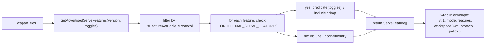
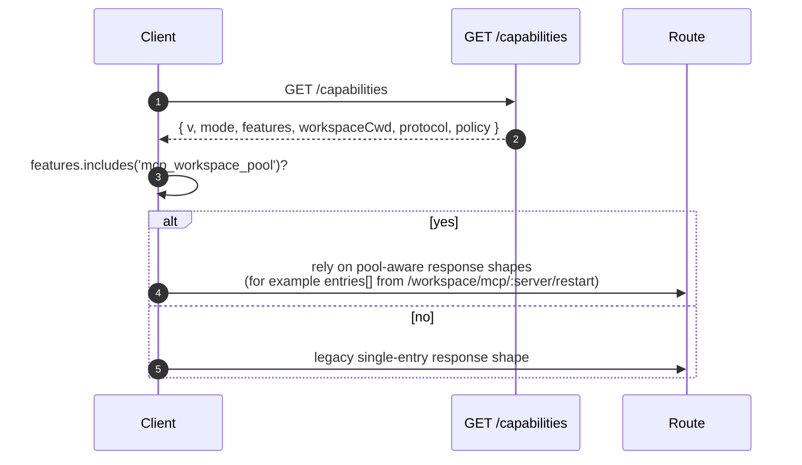

# 能力与协议版本管理

## 概述

`GET /capabilities` 是 daemon 的预检端点。每个 SDK 客户端在调用任何其他路由之前都应先读取它，以了解 daemon 使用的协议版本、哪些 feature tag 已启用，以及 daemon 绑定的工作区。约定如下：

- **只有一个协议版本：`v1`。** `SERVE_PROTOCOL_VERSION = 'v1'`，`SUPPORTED_SERVE_PROTOCOL_VERSIONS = ['v1']`。v1 在内部是向后兼容的；破坏性的帧结构变更留给 v2。
- **每个 tag 都有 `since` 版本。** 未来的 v2 daemon 可以同时声明 v1 和 v2 的 tag。
- **部分 tag 是条件性的。** 十个 tag（`require_auth`、`mcp_workspace_pool`、`mcp_pool_restart`、`allow_origin`、`prompt_absolute_deadline`、`writer_idle_timeout`、`workspace_settings`、`session_shell_command`、`rate_limit`、`workspace_reload`）仅在对应的部署开关启用时才会被声明。tag 存在即代表该行为存在。
- **Capability tag = 行为契约。** 在已有 tag 下添加新行为可能会静默破坏已预检该 tag 的客户端。新行为需要新 tag。

完整注册表位于 `packages/cli/src/serve/capabilities.ts`。

## 职责

- 声明 daemon 可能声明的每项功能。
- 按协议版本和部署开关过滤已声明的功能。
- 暴露 `getRegisteredServeFeatures()`（所有键，无过滤）、`getAdvertisedServeFeatures(version, toggles)`（已过滤）和 `getServeProtocolVersions()`（envelope `{ current, supported }`）。
- 维护"tag 存在即行为存在"的不变量。`server.test.ts` 包含一个测试：每个条件 tag 在其开关开启时都会被声明；添加条件 tag 但没有对应谓词会导致该测试失败。

## 架构

### Capability envelope

`/capabilities` 返回：

```ts
{
  v: 1,                    // CAPABILITIES_SCHEMA_VERSION
  mode: 'http-bridge',
  features: ServeFeature[],
  workspaceCwd: string,
  protocol?: { current: 'v1', supported: ['v1'] },
  policy?: { permission: PermissionPolicy },
}
```

`workspaceCwd` 是 daemon 启动时绑定的标准工作区（参见 [`02-serve-runtime.md`](./02-serve-runtime.md)）。`policy.permission` 是当前生效的 mediator 策略。

### `ServeCapabilityDescriptor`

```ts
interface ServeCapabilityDescriptor {
  since: ServeProtocolVersion; // current = 'v1'
  modes?: readonly string[]; // 当功能有多种模式时列出操作模式
}
```

两个 v1 tag 使用了 `modes`：

- `mcp_guardrails: { since: 'v1', modes: ['warn', 'enforce'] }` - 客户端在依赖拒绝行为前应预检 `'enforce'`。
- `permission_mediation: { since: 'v1', modes: ['first-responder', 'designated', 'consensus', 'local-only'] }` - 这是构建时支持的模式集；当前生效的策略在 `policy.permission` 中。

### 条件 tag

```ts
export const CONDITIONAL_SERVE_FEATURES: ReadonlyMap<
  ServeFeature,
  (toggles: AdvertiseFeatureToggles) => boolean
> = new Map([
  ['require_auth', (t) => t.requireAuth === true],
  ['mcp_workspace_pool', (t) => t.mcpPoolActive === true],
  ['mcp_pool_restart', (t) => t.mcpPoolActive === true],
  ['allow_origin', (t) => t.allowOriginActive === true],
  [
    'prompt_absolute_deadline',
    (t) => typeof t.promptDeadlineMs === 'number' && t.promptDeadlineMs > 0,
  ],
  [
    'writer_idle_timeout',
    (t) =>
      typeof t.writerIdleTimeoutMs === 'number' && t.writerIdleTimeoutMs > 0,
  ],
  ['workspace_settings', (t) => t.persistSettingAvailable === true],
  ['session_shell_command', (t) => t.sessionShellCommandEnabled === true],
  ['rate_limit', (t) => t.rateLimit === true],
  ['workspace_reload', (t) => t.reloadAvailable === true],
]);
```

`Map` 将成员关系和谓词存储在一起。添加新的条件 tag 需要两个协调的变更：

1. 在 `SERVE_CAPABILITY_REGISTRY` 中注册 tag 及其 `since` 版本。
2. 在 `CONDITIONAL_SERVE_FEATURES` 中添加其谓词。

基线 tag 不在 `Map` 中，会被无条件声明。这里有意用"缺席"来表示，而不是用独立的 Set。

### 67 个 tag（v1，按领域分组）

Foundation：`health`、`capabilities`。

Sessions：`session_create`、`session_scope_override`、`session_load`、`session_resume`、`unstable_session_resume`、`session_list`、`session_prompt`、`session_cancel`、`session_events`、`session_set_model`、`session_close`、`session_metadata`、`session_context`、`session_context_usage`、`session_supported_commands`、`session_tasks`、`session_stats`、`session_lsp`、`session_approval_mode_control`、`session_recap`、`session_btw`、**`session_shell_command`**（条件）、`session_language`、`session_rewind`、`session_hooks`、`session_branch`。

Streaming：`slow_client_warning`、`typed_event_schema`。

Identity 和 heartbeat：`client_identity`、`client_heartbeat`。

Permissions：`session_permission_vote`、`permission_vote`、**`permission_mediation`**（`modes: ['first-responder', 'designated', 'consensus', 'local-only']`）。

工作区只读快照：`workspace_mcp`、`workspace_skills`、`workspace_providers`、`workspace_env`、`workspace_preflight`、`workspace_hooks`、`workspace_extensions`。

工作区变更（Wave 4+）：`workspace_memory`、`workspace_agents`、`workspace_agent_generate`、`workspace_tool_toggle`、**`workspace_settings`**（条件）、`workspace_init`、`workspace_mcp_restart`、`workspace_mcp_manage`、`workspace_file_read`、`workspace_file_bytes`、`workspace_file_write`、**`workspace_reload`**（条件）。

MCP guardrails：**`mcp_guardrails`**（`modes: ['warn', 'enforce']`）、`mcp_guardrail_events`、`mcp_server_runtime_mutation`、**`mcp_workspace_pool`**（条件）、**`mcp_pool_restart`**（条件）。

Prompt 控制：**`prompt_absolute_deadline`**（条件）、**`writer_idle_timeout`**（条件）、`non_blocking_prompt`。

Auth：`auth_provider_install`、`auth_device_flow`、**`require_auth`**（条件）、**`allow_origin`**（条件）。

Rate limiting：**`rate_limit`**（条件）。

加粗的 tag 具有 `modes` 或为条件性 tag。

## 流程

### Daemon 侧：组装 envelope



### 客户端侧：feature 预检



## 状态与生命周期

- `CAPABILITIES_SCHEMA_VERSION` 是 wire envelope 的结构版本，当前为 `1`。仅在 envelope 结构变更时才需要更新。
- `SERVE_PROTOCOL_VERSION = 'v1'` 是协议功能版本。在 v1 内添加功能是向后兼容的；旧客户端不会收到新行为，除非它们预检了新 tag。移除功能属于 v2 破坏性变更。
- `EVENT_SCHEMA_VERSION = 1` 是 SSE 帧的 `v` 字段（参见 [`09-event-schema.md`](./09-event-schema.md)）。它是独立的版本轴；更新 event schema 不意味着更新协议版本，反之亦然。
- `session_resume` 是 `POST /session/:id/resume` 的稳定 daemon 能力。`unstable_session_resume` 作为已废弃的别名仍然被声明，因为底层 ACP 方法仍命名为 `connection.unstable_resumeSession`；新客户端应检测 `session_resume`。

## 依赖

- 由 `packages/cli/src/serve/server.ts` 在构建 `/capabilities` 响应时读取。
- Toggle 输入来自 `runQwenServe` / `createServeApp`：`{ requireAuth, mcpPoolActive, allowOriginActive, promptDeadlineMs, writerIdleTimeoutMs, persistSettingAvailable, sessionShellCommandEnabled, rateLimit, reloadAvailable }`。
- envelope 中的 `permission` 策略来自 `BridgeOptions.permissionPolicy`，后者读取 `settings.json` 中的 `policy.permissionStrategy`。

## 配置

| 来源                       | 配置项                                                          | 对 capabilities 的影响                                                                                                        |
| -------------------------- | --------------------------------------------------------------- | ----------------------------------------------------------------------------------------------------------------------------- |
| CLI flag                   | `--require-auth`                                                | 声明 `require_auth`。                                                                                                         |
| 环境变量                   | `QWEN_SERVE_NO_MCP_POOL=1`                                      | 停止声明 `mcp_workspace_pool` 和 `mcp_pool_restart`；MCP 事件不再标注 `scope: 'workspace'`。                                   |
| CLI flag                   | `--mcp-client-budget=N`, `--mcp-budget-mode={off,warn,enforce}` | 不改变 tag 集合（`mcp_guardrails` 始终被声明），但会改变每个 server 的预留和拒绝行为。                                         |
| CLI flag / 环境变量        | `--rate-limit` / `QWEN_SERVE_RATE_LIMIT=1`                      | 声明 `rate_limit`。                                                                                                           |
| 嵌入式选项                 | `persistSettingAvailable`                                       | 声明 `workspace_settings`。                                                                                                   |
| CLI flag / 嵌入式选项      | `--enable-session-shell` / `sessionShellCommandEnabled`         | 声明 `session_shell_command`。                                                                                                |
| 嵌入式选项                 | `reloadAvailable`                                               | 声明 `workspace_reload`。                                                                                                     |
| `settings.json`            | `policy.permissionStrategy`                                     | 设置 envelope 的 `policy.permission`。                                                                                        |

## 注意事项与已知限制

- **`--require-auth` 隐藏预检。** 使用 `--require-auth` 时，包括 `/capabilities` 在内的所有路由都需要 bearer 认证。未认证的客户端无法预检 `caps.features.require_auth`；401 响应体是发现入口。`require_auth` tag 是为强化部署审计 UI 提供的已认证确认信息。
- **tag 存在即行为存在。** 如果未来的贡献者在现有 tag 下添加行为而不更新 `since`，已预检旧 tag 的客户端可能会静默收到新行为。约定是：新行为使用新 tag。
- **`unstable_*` tag 可能在版本之间改变结构**，而不触发协议版本更新。依赖这些 tag 时请锁定 SDK 版本。
- 路由目录位于 [`../qwen-serve-protocol.md`](../qwen-serve-protocol.md)；本页有意不重复其内容。

## 参考

- `packages/cli/src/serve/capabilities.ts`
- `packages/cli/src/serve/types.ts`（`ServeOptions`、`CapabilitiesEnvelope`）
- `packages/cli/src/serve/server.ts`（envelope 组装）
- `packages/acp-bridge/src/eventBus.ts`（`EVENT_SCHEMA_VERSION`）
- Wire 参考：[`../qwen-serve-protocol.md`](../qwen-serve-protocol.md)
- Auth 与部署 guardrails：[`12-auth-security.md`](./12-auth-security.md)
