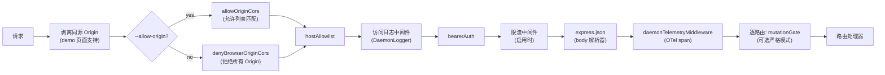
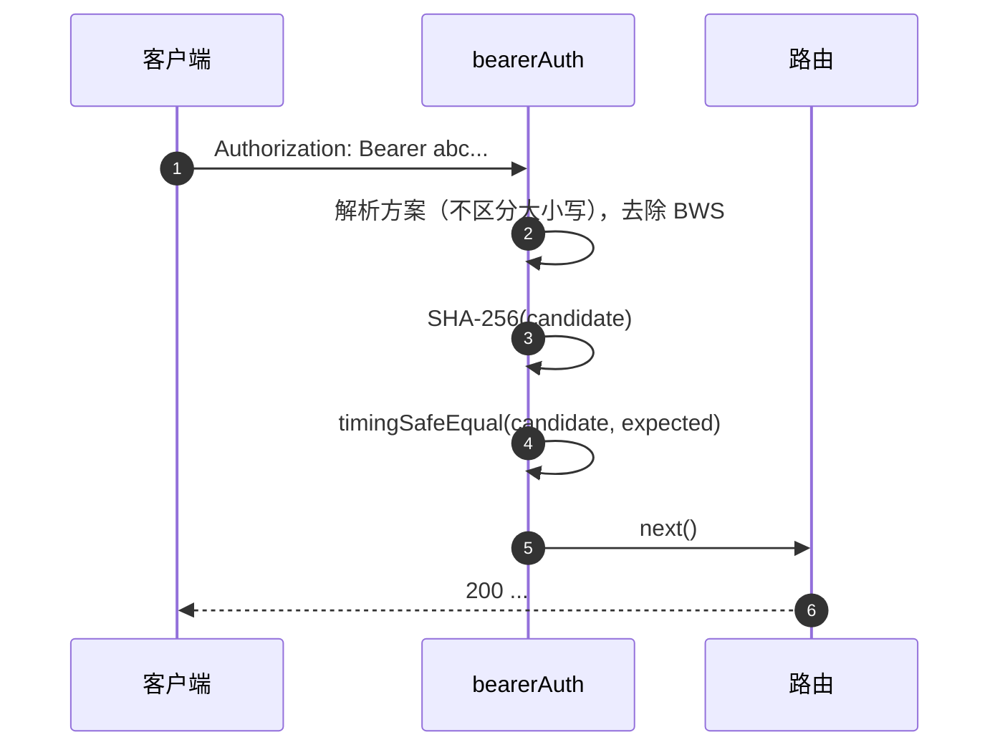
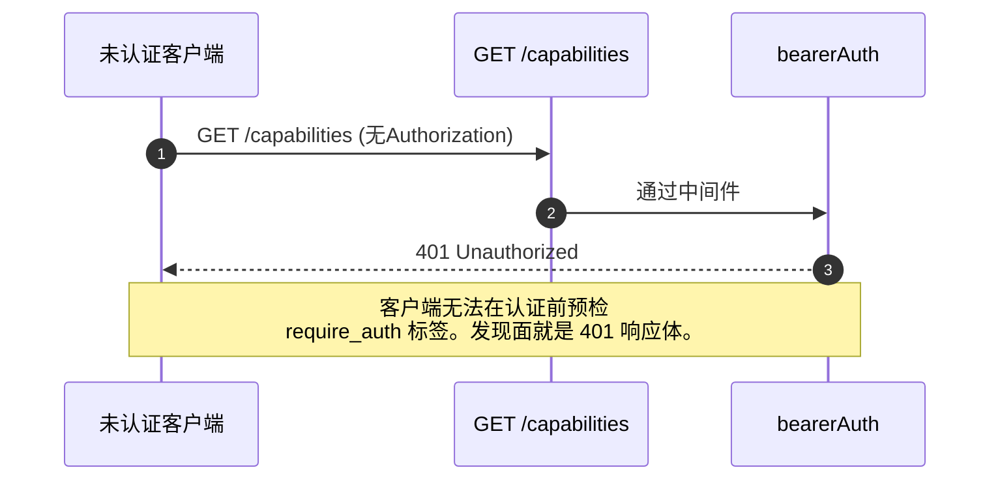

# 认证与安全模型

## 概述

`qwen serve` 默认是一个本地守护进程，在错误配置下会成为暴露面。它的安全模型是 **分层** 的，以便错误配置时安全失效（fails closed）：

1. **绑定（Bind）** — 非回环绑定且没有 bearer 令牌时 **拒绝启动**。
2. **Bearer 认证** — `bearerAuth` 中间件使用常量时间 SHA-256 比较保护除回环上 `/health` 之外的所有路由（`require_auth` 会将其扩展到回环和 `/health`）。
3. **主机头允许列表** — 在回环上，只接受 `localhost`、`127.0.0.1`、`[::1]`、`host.docker.internal`（加端口号）；防止 DNS 重绑定攻击。
4. **来源控制** — 默认情况下，任何携带 `Origin` 头的请求都会被拒绝并返回 403。当配置了 `--allow-origin <pattern>` 时，守护进程会切换到 CORS 允许列表模式（`allowOriginCors`），只允许匹配的来源。
5. **逐路由变更门控** — Wave 4 的变更路由可以选择即使在回环上也返回 `401` 响应（当未配置令牌时），使用独特的 `code: 'token_required'` 错误。
6. **设备流认证** — 为提供商提供独立的 OAuth 表面（`POST /workspace/auth/device-flow` + GET/DELETE 于 `/:id`）。

本文档将逐一介绍每个层次以及启动路径强制执行的显式不变量。

## 职责

- 拒绝在不安全的配置下启动。
- 对每个 HTTP 请求执行 bearer（如果已配置）+ 主机（回环）+ 来源检查。
- 提供逐路由变更门控，供 Wave 4 路由选择启用。
- 托管设备流注册表，驱动提供商 OAuth 流程，并通过 SSE 事件可见。

## 架构

### 启动时的拒绝规则

在 `run-qwen-serve.ts` 中：

```ts
if (!isLoopbackBind(opts.hostname) && !token) {
  throw new Error('Refusing to bind <host>:<port> without a bearer token. ...');
}
if (opts.requireAuth && !token) {
  throw new Error(
    'Refusing to start with --require-auth set but no bearer token configured. ...',
  );
}
```

允许来源通配符有其自身的拒绝规则：

```ts
const parsed = parseAllowOriginPatterns(opts.allowOrigins);
if (parsed.allowAny && !token) {
  throw new Error(
    "Refusing to start with --allow-origin '*' but no bearer token configured. ...",
  );
}
```

所有三条拒绝都是显式的启动失败（显示在 stderr / 抛给嵌入式调用者），绝不会静默忽略。#3803 中的威胁模型明确禁止允许守护进程在没有保护的情况下绑定到回环之外。

### 中间件链（HTTP 请求顺序）



`mutationGate` 是一个逐路由的中间件工厂（`createMutationGate` 返回 `mutate()`）；路由在注册时调用 `mutate()` 或 `mutate({strict: true})`。它不是全局 `app.use()` 中间件。访问日志在 `bearerAuth` 之前注册，因此 401 拒绝也会被记录。限流在 `bearerAuth` 之后、`express.json()` 之前运行，因此只有经过认证的请求才会被计数，并且在超出限制时，大体积 body 会在解析前被拒绝。

### `bearerAuth`

- **未配置令牌** → 中间件是无操作（回环开发者默认配置）。
- **配置了令牌** → 在构造时对配置的令牌进行一次 SHA-256 哈希；在每个请求上对候选令牌进行哈希并与 `timingSafeEqual` 比较。没有字符串相等短路；没有时间泄露。
- **方案解析**：根据 RFC 7235 §2.1，不区分大小写地解析 `Bearer`；根据 RFC 7230 §3.2.6 BWS，容忍方案与凭证之间的 `SP\tHTAB`；拒绝纯 `HTAB` 作为分隔符。
- **CodeQL 加固**：手工编写的 `indexOf` 解析，而不是使用带有 `\s+` / `.+` 重叠的正则表达式（无多项式正则风险）。

### `hostAllowlist`

仅限回环。维护一个按端口键控的 `Set<string>`。允许的主机：

- `localhost:<port>`、`127.0.0.1:<port>`、`[::1]:<port>`、`host.docker.internal:<port>`。
- 另外，仅在绑定到端口 80 时，包含无端口形式（`localhost`、`127.0.0.1`、`[::1]`、`host.docker.internal`）（根据 RFC 7230 §5.4 默认端口省略）。

主机比较是**不区分大小写**的——Express 会标准化头名称但不会标准化值，因此 Docker 代理将 Host 大写（如 `Localhost:4170`、`HOST.docker.internal`）时，如果使用精确字符串比较会返回 403。

非回环绑定会绕过此中间件（操作员选择了暴露面；bearer 令牌会阻止主机伪造）。

### `denyBrowserOriginCors`

拒绝任何带有 `Origin` 头的请求。CLI/SDK 从不设置 Origin；只有浏览器会设置。返回确定性的 `403 { error: 'Request denied by CORS policy' }`，而不是 `cors` 包的 error-callback 会产生的 500 HTML。

例外：demo 页面的同源 XHR 由单独中间件（在 `server.ts` 中）处理，该中间件在 `Origin` 与守护进程自身地址匹配时将其剥离。

### `allowOriginCors`（`--allow-origin` 模式）

当配置了 `--allow-origin <pattern>` 时，`denyBrowserOriginCors` 被替换为 `allowOriginCors(parsedPatterns)`：

- 匹配的 `Origin` 值会收到 `Access-Control-Allow-Origin`、`Access-Control-Allow-Headers` 和 `Access-Control-Allow-Methods`；`OPTIONS` 预检返回 `204`。
- 不匹配的 `Origin` 值会收到与拒绝模式相同的确定性 `403 { error: 'Request denied by CORS policy' }`。
- `--allow-origin '*'` 需要 `--token`；否则启动拒绝。
- `parseAllowOriginPatterns()` 在启动时验证模式语法。
- 只有在配置此模式时，才会公布 `allow_origin` 能力标签。

### `createMutationGate`

逐路由的可选门控。行为矩阵：

| 守护进程配置           | 路由选项         | 结果                           |
| ---------------------- | ---------------- | ------------------------------ |
| `requireAuth=true`     | 任意             | 透传¹                          |
| 配置了 `token`         | 任意             | 透传²                          |
| 无令牌（回环开发）     | `strict: false`  | 透传                           |
| 无令牌（回环开发）     | `strict: true`   | `401 { code: 'token_required' }` |

¹ `--require-auth` 仅在配置令牌时启动，因此全局的 `bearerAuth` 已经对未认证的调用方返回了 401。
² 任何令牌配置都会使全局的 `bearerAuth` 强制要求所有地方都携带 bearer；该门控是多余的但无害。

`code: 'token_required'` 的形式与 `bearerAuth` 的纯 `Unauthorized` 不同，因此 SDK 客户端可以渲染"配置 --token / --require-auth"提示，而不是通用的 401。

**Wave 4+ 严格路由**：`/workspace/memory`、`/workspace/agents/*`、`/workspace/agents/generate`、`/file/write`、`/file/edit`、`/workspace/tools/:name/enable`、`/workspace/mcp/:server/restart`、`/workspace/mcp/:server/{enable,disable,authenticate,clear-auth}`、`/workspace/mcp/servers`（POST/DELETE）、`/workspace/auth/device-flow`、`/workspace/init`、`/session/:id/approval-mode`。

### `/health` 豁免

在回环绑定上，`/health` 在 bearer 中间件**之前**注册，因此 Pod 内的存活探针不需要携带令牌。非回环绑定将 `/health` 也置于 bearer 之后，与其他路由一样。`--require-auth` 会移除豁免：回环上的 `/health` 也需要 `Authorization: Bearer <token>`。

### v1 客户端标识（`X-Qwen-Client-Id`）是自报告的

守护进程只验证 `X-Qwen-Client-Id` 的格式（`[A-Za-z0-9._:-]{1,128}`），并在每个会话中追踪附着的客户端 ID。它目前不执行持有证明（proof-of-possession）。一个在 SSE 上观察到 `originatorClientId` 的客户端可以重新注册相同的 ID，并在后续请求中冒充该发起方。

影响：

- `designated` — 远程调用方可以冒充发起方，并对仅针对 prompt 发起方的请求进行投票。
- `consensus` — 如果伪造的 ID 已经存在于 `votersAtIssue` 快照中，它就可以投票。
- `local-only` 不受影响，因为它基于 `fromLoopback` 进行门控，而守护进程从连接远程地址中标记 `fromLoopback`。
- `first-responder` 不受影响，因为它不依赖身份标识。

未来的配对令牌机制将从 `POST /session` 发放每个会话的秘密；`designated` / `consensus` 投票将需要出示该秘密。在此之前，需要强化 designated 策略的部署应绑定回环或在认证的反向代理后面运行。有关策略级别的详细信息，请参阅 [`04-permission-mediation.md`](./04-permission-mediation.md)。

### 设备流认证

为提供商认证提供独立的 OAuth 表面。v1 提供商标识符是 `qwen-oauth`，但 Qwen OAuth 免费层已于 2026-04-15 停止；新的设置应使用当前受支持的认证提供商（如果有）。

- `POST /workspace/auth/device-flow` — 启动一个流程；返回 `{deviceFlowId, providerId, expiresAt, verificationUrl, userCode}`。
- `GET /workspace/auth/device-flow/:id` — 轮询状态。
- `DELETE /workspace/auth/device-flow/:id` — 取消。
- `GET /workspace/auth/status` — 当前账户/提供商快照。

SSE 事件 `auth_device_flow_{started, throttled, authorized, failed, cancelled}` 将流程状态广播给所有订阅者，使多客户端 UI 保持同步。参见 [`09-event-schema.md`](./09-event-schema.md)。

实现：`packages/cli/src/serve/auth/device-flow.ts` + `qwen-device-flow-provider.ts`。

**日志注入 / Trojan Source 防御**：`sanitizeForStderr(value)`（`device-flow.ts`）将 ASCII 控制字符和 Unicode 控制字符替换为 `?`。否则恶意 IdP 可以伪造日志行或隐藏载荷：

| 范围                            | 为何被剥离                                                                                                                                                                                                                                                  |
| ------------------------------- | ----------------------------------------------------------------------------------------------------------------------------------------------------------------------------------------------------------------------------------------------------------- |
| `\x00–\x1f`、`\x7f`、`\x80–\x9f` | ASCII C0 / DEL / C1 控制符、终端转义以及日志行伪造。                                                                                                                                                                                                       |
| U+200B-U+200F                   | 零宽度字符加上 LRM / RLM；不可见但可以改变终端渲染。                                                                                                                                                                                                       |
| U+2028-U+2029                   | 行分隔符 / 段落分隔符；许多支持 Unicode 的终端将它们视为换行符。                                                                                                                                                                                            |
| U+202A-U+202E                   | 双向嵌入 / 覆盖控制符。                                                                                                                                                                                                                                   |
| U+2066-U+2069                   | 双向隔离控制符（LRI / RLI / FSI / PDI），是 [CVE-2021-42574 "Trojan Source"](https://trojansource.codes/) 的主要攻击向量。使用 U+2066 (LRI) 而不是 U+202D (LRO) 的 IdP 可以绕过仅过滤嵌入/覆盖的过滤器，实现类似的视觉重排。 |
| U+FEFF                          | BOM / 零宽度不间断空格。                                                                                                                                                                                                                                   |

长度保持不变：每个被剥离的码点被替换为 `?` 而不是删除，因此操作员仍然可以看到该索引处存在某些内容。两个层都使用了该清理器：`qwenDeviceFlowProvider` 清理 IdP 的 `oauthError`，而注册表的延迟轮询观察器清理插入到审计提示中的提供商控制的值（`latePollResult.kind` / `lateErr.name`）。

`auth_device_flow` 能力标签**无条件**地公布；如果守护进程无法满足特定提供商，路由本身会返回 `400 unsupported_provider`。受支持的提供商列表位于 `/workspace/auth/status` 而不是 `/capabilities`，以保持描述符形式统一。

## 工作流程

### Bearer 认证成功请求



### Bearer 认证失败模式

所有失败都返回 `401 { error: 'Unauthorized' }`（`missing header` / `wrong scheme` / `wrong token` 统一，因此无法通过探测区分）。

### `--require-auth` 阴影



认证后，`caps.features.includes('require_auth')` 确认部署已经加固。

### Wave 4 变更门控在无令牌回环上


## 状态与生命周期

- Bearer 令牌在启动时读取并去除首尾空格（否则 `cat token.txt` 中的换行符会静默破坏比较）。
- 允许主机集合按端口缓存；在端口更改时重建（临时端口 `0` → `listen` 后的实际端口）。
- 变更门控在每次应用构建时构造 `passthrough` 和 `strictDenier`；每个路由调用返回缓存的闭包（无每次请求分配）。
- 设备流注册表在 `shutdown()` 的第 1 阶段释放，因此待处理的流在 HTTP 拆除前解析为 `cancelled`。

## 依赖

- `node:crypto` — `createHash`、`timingSafeEqual`。
- `packages/cli/src/serve/loopback-binds.ts` — `isLoopbackBind`。
- `packages/cli/src/serve/auth/device-flow.ts` — 设备流状态机。
- `@qwen-code/acp-bridge` — 在每会话 SSE 总线上发布设备流事件。

## 配置

| 来源         | 配置项                                                                               | 效果                                                                    |
| ------------ | ------------------------------------------------------------------------------------ | ----------------------------------------------------------------------- |
| 环境变量     | `QWEN_SERVER_TOKEN`                                                                  | Bearer 令牌（去除首尾空格）。                                            |
| 标志         | `--token`                                                                            | Bearer 令牌（覆盖环境变量）。                                            |
| 标志         | `--require-auth`                                                                     | 将 bearer 扩展到回环 + `/health`。仅在有令牌时启动。                     |
| 标志         | `--hostname`                                                                         | 非回环绑定需要 `--token`（或环境变量）。                                  |
| 标志         | `--allow-origin <pattern>`                                                           | 切换到 CORS 允许列表模式。`'*'` 需要令牌。                                |
| 能力标签     | `require_auth`（条件性）、`auth_device_flow`（始终）、`allow_origin`（条件性）       | 参见 [`11-capabilities-versioning.md`](./11-capabilities-versioning.md)。 |

## 注意事项与已知限制

- **`--require-auth` 遮蔽了特性预检。** 未认证的客户端无法发现 `require_auth` 标签；它们的发现面就是 401 响应体本身。
- **变更门控的 body 解析顺序**：`mutationGate({strict: true})` 的 401 响应在 `express.json()` 解析 body **之后** 触发。在饱和的回环监听器上的最坏情况：`--max-connections × express.json({limit: '10mb'})` ≈ 2.5 GB 瞬时内存。这是故意接受的仅回环攻击面。
- **同源 Origin 剥离** 在 `server.ts` 中发生在 `denyBrowserOriginCors` _之前_。如果未来的改动将剥离移到其他地方，demo 页面将失效。
- **令牌比较是基于 SHA-256 摘要**，而不是原始令牌。通过将可变长度的令牌比较缩减为固定大小的摘要比较，减少了时间泄露。
- 守护进程目前**不**支持 mTLS、请求签名或配对令牌持有证明。`--rate-limit` 提供基于 client-id / IP 键的 HTTP 限流；它不是客户端身份认证。

## 参考

- `packages/cli/src/serve/auth.ts`（整个文件）
- `packages/cli/src/serve/run-qwen-serve.ts`（拒绝规则）
- `packages/cli/src/serve/loopback-binds.ts`
- `packages/cli/src/serve/auth/device-flow.ts`
- `packages/cli/src/serve/auth/qwen-device-flow-provider.ts`
- 面向用户的威胁模型：[`../../users/qwen-serve.md`](../../users/qwen-serve.md)。
- 协议参考：[`../qwen-serve-protocol.md`](../qwen-serve-protocol.md)。