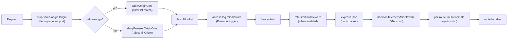
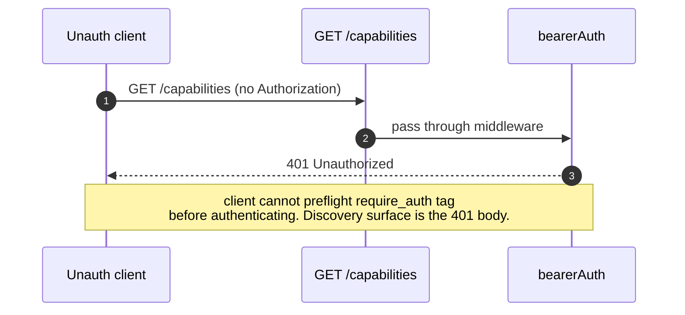
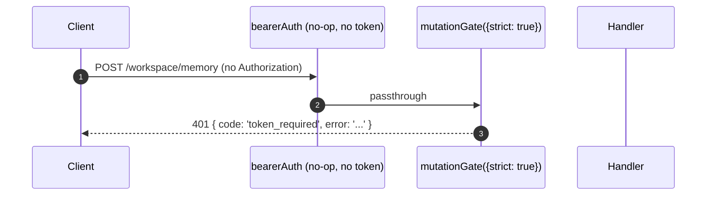

# 认证与安全模型

## 概述

`qwen serve` 默认是一个本地 daemon，在配置不当时会暴露攻击面。其安全模型采用**分层**设计，确保配置错误时以拒绝访问作为默认行为：

1. **绑定地址** — 在没有 bearer token 的情况下绑定非 loopback 地址时**拒绝启动**。
2. **Bearer 认证** — `bearerAuth` 中间件使用常量时间 SHA-256 比较保护所有路由（loopback 上的 `/health` 除外）；`require_auth` 将此保护扩展至 loopback 和 `/health`。
3. **Host 头白名单** — 在 loopback 上，仅接受 `localhost`、`127.0.0.1`、`[::1]`、`host.docker.internal`（含端口）；防御 DNS 重绑定攻击。
4. **Origin 控制** — 默认情况下，携带 `Origin` 头的任何请求均返回 403。配置 `--allow-origin <pattern>` 后，daemon 切换至 CORS 白名单模式（`allowOriginCors`），仅允许匹配的 origin。
5. **路由级变更门控** — Wave 4 变更类路由可在无 token 配置时对 loopback 请求返回 `401`，使用独立的 `code: 'token_required'` 错误。
6. **Device-flow 认证** — 用于 provider 认证的独立 OAuth 接口（`POST /workspace/auth/device-flow` + GET/DELETE `/:id`）。

本文介绍各安全层的实现细节以及启动过程中强制执行的不变量。

## 职责

- 拒绝在不安全配置下启动。
- 对所有 HTTP 请求执行 bearer 认证（已配置时）、host（loopback）以及 origin 检查。
- 为 Wave 4 路由提供路由级变更门控（可选接入）。
- 托管驱动 provider OAuth 流程的 device-flow 注册表，并通过 SSE 事件对外暴露。

## 架构

### 启动时拒绝规则

在 `run-qwen-serve.ts` 中：

```ts
if (!isLoopbackBind(opts.hostname) && !token) {
  throw new Error('Refusing to bind <host>:<port> without a bearer token. ...');
}
if (opts.requireAuth && !token) {
  throw new Error(
    'Refusing to start with --require-auth set but no bearer token configured. ...',
  );
}
```

`--allow-origin` 通配符也有对应的拒绝规则：

```ts
const parsed = parseAllowOriginPatterns(opts.allowOrigins);
if (parsed.allowAny && !token) {
  throw new Error(
    "Refusing to start with --allow-origin '*' but no bearer token configured. ...",
  );
}
```

三条拒绝规则均为显式启动失败（输出至 stderr 或抛给调用方），绝不静默失败。#3803 的威胁模型明确禁止在未配置安全措施的情况下静默允许 daemon 绑定非 loopback 地址。

### 中间件链（HTTP 请求处理顺序）



`mutationGate` 是路由级中间件工厂（`createMutationGate` 返回 `mutate()`）；路由在注册时调用 `mutate()` 或 `mutate({strict: true})`，不是全局 `app.use()` 中间件。访问日志在 `bearerAuth` 之前注册，因此 401 拒绝的请求仍会被记录。频率限制在 `bearerAuth` 之后、`express.json()` 之前运行，确保只有已认证的请求才被计数，且超过限制时大请求体在解析前即被拒绝。

### `bearerAuth`

- **未配置 token** → 中间件为空操作（loopback 开发默认值）。
- **已配置 token** → 构造时对配置的 token 进行一次 SHA-256 哈希；每次请求时对候选 token 哈希并使用 `timingSafeEqual` 比较。无字符串相等短路，无时序泄漏。
- **scheme 解析**：按 RFC 7235 §2.1 进行大小写不敏感的 `Bearer` 匹配；按 RFC 7230 §3.2.6 BWS 容忍 scheme 和凭据之间的 `SP\tHTAB`；拒绝纯 HTAB 作为分隔符。
- **CodeQL 加固**：手写 `indexOf` 解析，而非使用 `\s+` / `.+` 重叠的正则表达式（无多项式正则风险）。

### `hostAllowlist`

仅限 loopback。以端口为键维护一个 `Set<string>`。允许的 Host 值：

- `localhost:<port>`、`127.0.0.1:<port>`、`[::1]:<port>`、`host.docker.internal:<port>`。
- **仅**在绑定 80 端口时（按 RFC 7230 §5.4 默认端口省略规则）还接受不带端口的形式（`localhost`、`127.0.0.1`、`[::1]`、`host.docker.internal`）。

Host 比较**大小写不敏感** — Express 会规范化请求头名称但不规范化其值，若使用精确字符串比较，Docker 代理大写的 Host（如 `Localhost:4170`、`HOST.docker.internal`）会返回 403。

非 loopback 绑定绕过此中间件（操作者自行选择了暴露面；bearer token 负责防御 Host 欺骗）。

### `denyBrowserOriginCors`

拒绝所有携带 `Origin` 头的请求。CLI/SDK 从不设置 Origin；只有浏览器才会设置。返回确定性的 `403 { error: 'Request denied by CORS policy' }`，而非 `cors` 包的错误回调产生的 500 HTML。

例外：demo 页面的同源 XHR 由 `server.ts` 中独立的中间件处理，该中间件会在 Origin 与 daemon 自身地址匹配时将其剥离。

### `allowOriginCors`（`--allow-origin` 模式）

配置 `--allow-origin <pattern>` 后，`denyBrowserOriginCors` 被替换为 `allowOriginCors(parsedPatterns)`：

- 匹配的 `Origin` 值会收到 `Access-Control-Allow-Origin`、`Access-Control-Allow-Headers` 和 `Access-Control-Allow-Methods`；`OPTIONS` 预检请求返回 `204`。
- 不匹配的 `Origin` 值返回与拒绝模式相同的确定性 `403 { error: 'Request denied by CORS policy' }`。
- `--allow-origin '*'` 需配合 `--token`；否则启动时拒绝。
- `parseAllowOriginPatterns()` 在启动时验证 pattern 语法。
- `allow_origin` capability 标签仅在此模式下才对外公告。

### `createMutationGate`

路由级可选门控。行为矩阵：

| daemon 配置              | 路由选项         | 结果                             |
| ------------------------ | ---------------- | -------------------------------- |
| `requireAuth=true`       | 任意             | 透传¹                            |
| 已配置 `token`           | 任意             | 透传²                            |
| 无 token（loopback 开发）| `strict: false`  | 透传                             |
| 无 token（loopback 开发）| `strict: true`   | `401 { code: 'token_required' }` |

¹ `--require-auth` 仅在有 token 时才能启动，全局 `bearerAuth` 已对未认证调用者返回 401。
² 任何 token 配置都会使全局 `bearerAuth` 强制要求 bearer 认证；门控冗余但无害。

`code: 'token_required'` 与 `bearerAuth` 的普通 `Unauthorized` 形状有所区别，SDK 客户端可据此提示用户"配置 --token / --require-auth"，而非展示通用 401。

**Wave 4+ 严格路由**：`/workspace/memory`、`/workspace/agents/*`、`/workspace/agents/generate`、`/file/write`、`/file/edit`、`/workspace/tools/:name/enable`、`/workspace/mcp/:server/restart`、`/workspace/mcp/:server/{enable,disable,authenticate,clear-auth}`、`/workspace/mcp/servers`（POST/DELETE）、`/workspace/auth/device-flow`、`/workspace/init`、`/session/:id/approval-mode`。

### `/health` 豁免

在 loopback 绑定下，`/health` 在 bearer 中间件**之前**注册，因此 pod 内部的存活探针无需携带 token。非 loopback 绑定的 `/health` 与其他路由一样受 bearer 保护。`--require-auth` 取消豁免：loopback 上的 `/health` 也需要 `Authorization: Bearer <token>`。

### v1 客户端标识（`X-Qwen-Client-Id`）为自报告值

daemon 仅验证 `X-Qwen-Client-Id` 的格式（`[A-Za-z0-9._:-]{1,128}`）并跟踪每个会话中已附加的客户端 id，当前不执行所有权证明。观察到 SSE 上 `originatorClientId` 的客户端可重新注册相同的 id，并在后续请求中冒充该发起方。

影响：

- `designated` — 远程调用者可冒充发起方，对仅面向提示发起方的请求投票。
- `consensus` — 若被冒充的 id 已在 `votersAtIssue` 快照中，可参与投票。
- `local-only` 不受影响，因为它基于 `fromLoopback` 进行门控，而该值由 daemon 从连接的远程地址打上标记。
- `first-responder` 不受影响，因为它与身份无关。

未来的 pair-token 机制将在 `POST /session` 时颁发每会话密钥；`designated` / `consensus` 投票需凭此密钥。在此之前，需要强化 designated 策略的部署应绑定 loopback 或在经过认证的反向代理后运行。策略层面的详情参见 [`04-permission-mediation.md`](./04-permission-mediation.md)。

### Device-flow 认证

用于 provider 认证的独立 OAuth 接口。v1 provider 标识符为 `qwen-oauth`，但 Qwen OAuth 免费层已于 2026-04-15 停止服务；新部署应在有可用的受支持认证 provider 时使用它。

- `POST /workspace/auth/device-flow` — 启动流程；返回 `{deviceFlowId, providerId, expiresAt, verificationUrl, userCode}`。
- `GET /workspace/auth/device-flow/:id` — 轮询状态。
- `DELETE /workspace/auth/device-flow/:id` — 取消。
- `GET /workspace/auth/status` — 当前账户 / provider 快照。

SSE 事件 `auth_device_flow_{started, throttled, authorized, failed, cancelled}` 将流程状态广播至所有订阅者，使多客户端 UI 保持同步。参见 [`09-event-schema.md`](./09-event-schema.md)。

实现：`packages/cli/src/serve/auth/device-flow.ts` + `qwen-device-flow-provider.ts`。

**日志注入 / Trojan Source 防御**：`sanitizeForStderr(value)`（`device-flow.ts`）将 ASCII 控制字符和 Unicode 控制字符替换为 `?`。恶意 IdP 否则可伪造日志行或隐藏载荷：

| 范围                              | 剥离原因                                                                                                                                                                                                                                                             |
| --------------------------------- | -------------------------------------------------------------------------------------------------------------------------------------------------------------------------------------------------------------------------------------------------------------------- |
| `\x00–\x1f`、`\x7f`、`\x80–\x9f` | ASCII C0 / DEL / C1 控制字符、终端转义序列及日志行伪造。                                                                                                                                                                                                            |
| U+200B-U+200F                     | 零宽字符及 LRM / RLM；不可见但可改变终端渲染效果。                                                                                                                                                                                                                  |
| U+2028-U+2029                     | LINE / PARAGRAPH SEPARATOR；许多支持 Unicode 的终端将其视为换行符。                                                                                                                                                                                                 |
| U+202A-U+202E                     | 双向 EMBEDDING / OVERRIDE 控制字符。                                                                                                                                                                                                                                 |
| U+2066-U+2069                     | 双向 ISOLATE 控制字符（LRI / RLI / FSI / PDI），[CVE-2021-42574 "Trojan Source"](https://trojansource.codes/) 的主要攻击向量。IdP 使用 U+2066（LRI）代替 U+202D（LRO）可绕过仅过滤 EMBEDDING/OVERRIDE 的过滤器，同样实现视觉重排。                               |
| U+FEFF                            | BOM / 零宽不换行空格。                                                                                                                                                                                                                                               |

替换时以 `?` 代替被剥离的码点而非直接删除，以便操作者仍能看到该位置曾有内容。两层均使用 sanitizer：`qwenDeviceFlowProvider` 对 IdP 的 `oauthError` 进行净化，注册表的延迟轮询观察者对插入审计提示的 provider 可控值（`latePollResult.kind` / `lateErr.name`）进行净化。

`auth_device_flow` capability 标签**无条件**对外公告；若 daemon 无法满足特定 provider 的请求，路由本身返回 `400 unsupported_provider`。支持的 provider 列表位于 `/workspace/auth/status` 而非 `/capabilities`，以保持描述符形状一致。

## 工作流

### Bearer 认证请求成功


### Bearer 认证失败模式

所有失败均返回 `401 { error: 'Unauthorized' }`（`header 缺失` / `scheme 错误` / `token 错误` 返回相同响应，防止探测区分）。

### `--require-auth` 遮蔽效果



认证后，`caps.features.includes('require_auth')` 可确认该部署已进行强化。

### 无 token loopback 下的 Wave 4 变更门控



## 状态与生命周期

- Bearer token 在启动时读取并修剪（否则 `cat token.txt` 引入的换行符会静默地破坏比较）。
- 允许的 Host Set 按端口缓存；端口变更时重建（临时 `0` → `listen` 后的实际端口）。
- 变更门控在应用构建时一次性构造 `passthrough` 和 `strictDenier`；路由级调用返回缓存的闭包（无每请求分配）。
- Device-flow 注册表在 `shutdown()` 第 1 阶段销毁，使待处理流程在 HTTP 拆卸前以 `cancelled` 状态结束。

## 依赖

- `node:crypto` — `createHash`、`timingSafeEqual`。
- `packages/cli/src/serve/loopback-binds.ts` — `isLoopbackBind`。
- `packages/cli/src/serve/auth/device-flow.ts` — device-flow 状态机。
- `@qwen-code/acp-bridge` — 在每会话 SSE 总线上暴露 device-flow 事件。

## 配置

| 来源           | 配置项                                                                                   | 效果                                                                     |
| -------------- | ---------------------------------------------------------------------------------------- | ------------------------------------------------------------------------ |
| 环境变量       | `QWEN_SERVER_TOKEN`                                                                      | Bearer token（已修剪）。                                                 |
| Flag           | `--token`                                                                                | Bearer token（覆盖环境变量）。                                           |
| Flag           | `--require-auth`                                                                         | 将 bearer 扩展至 loopback 和 `/health`。仅在有 token 时才能启动。        |
| Flag           | `--hostname`                                                                             | 非 loopback 绑定需要 `--token`（或环境变量）。                           |
| Flag           | `--allow-origin <pattern>`                                                               | 切换至 CORS 白名单模式。`'*'` 需要 token。                               |
| Capability 标签 | `require_auth`（条件性）、`auth_device_flow`（始终）、`allow_origin`（条件性）           | 参见 [`11-capabilities-versioning.md`](./11-capabilities-versioning.md)。 |

## 注意事项与已知限制

- **`--require-auth` 遮蔽 feature 预检。** 未认证的客户端无法发现 `require_auth` 标签；其发现途径仅为 401 响应体本身。
- **变更门控 body-parser 顺序**：`mutationGate({strict: true})` 的 401 响应在 `express.json()` 解析请求体**之后**触发。在饱和的 loopback 监听器上，最坏情况下：`--max-connections × express.json({limit: '10mb'})` ≈ 2.5 GB 瞬时内存。仅限 loopback 攻击面，已被有意接受。
- **`server.ts` 中的同源 Origin 剥离**发生在 `denyBrowserOriginCors` _之前_。若未来某次修改将剥离逻辑移至其他位置，demo 页面将无法正常工作。
- **Token 比较基于 SHA-256 摘要**，而非原始 token。通过将可变长度 token 比较折叠为固定大小摘要比较，减少时序泄漏。
- daemon 目前**不**支持 mTLS、请求签名或 pair-token 所有权证明。`--rate-limit` 按 client-id / IP 键提供 HTTP 频率限制；这不是客户端身份认证。

## 参考

- `packages/cli/src/serve/auth.ts`（完整文件）
- `packages/cli/src/serve/run-qwen-serve.ts`（拒绝规则）
- `packages/cli/src/serve/loopback-binds.ts`
- `packages/cli/src/serve/auth/device-flow.ts`
- `packages/cli/src/serve/auth/qwen-device-flow-provider.ts`
- 面向用户的威胁模型：[`../../users/qwen-serve.md`](../../users/qwen-serve.md)。
- 协议参考：[`../qwen-serve-protocol.md`](../qwen-serve-protocol.md)。
