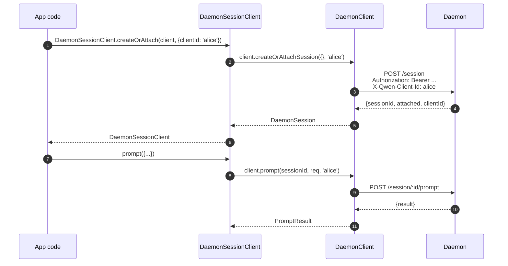

# TypeScript SDK Daemon Client

## 概述

`packages/sdk-typescript/src/daemon/` 是 **TypeScript SDK 的 daemon 客户端**。它是从任意 TypeScript / JavaScript 宿主（CLI 自身的 TUI 适配器、channel bot 后端、VS Code IDE 插件、自定义脚本以及服务端 Web 后端）连接正在运行的 `qwen serve` daemon 的标准方式。所有其他适配器都依赖于它。

包的结构故意保持精简：

| 文件                     | 说明                                                                                                                           |
| ------------------------ | ------------------------------------------------------------------------------------------------------------------------------ |
| `index.ts`               | 公共 barrel（`DaemonClient`、`DaemonSessionClient`、`DaemonAuthFlow`、`parseSseStream`、事件 reducer、类型）。                  |
| `DaemonClient.ts`        | 底层 HTTP/SSE 封装——每个 `qwen-serve-protocol.md` 路由对应一个方法。                                                           |
| `DaemonSessionClient.ts` | 会话级别的包装器，带 SSE 重放跟踪。                                                                                             |
| `DaemonAuthFlow.ts`      | 高层 OAuth device flow 辅助工具。                                                                                               |
| `sse.ts`                 | `parseSseStream`（NDJSON / SSE 帧解析器）。                                                                                     |
| `events.ts`              | `asKnownDaemonEvent`、`reduceDaemonSessionEvent`、`reduceDaemonAuthEvent`（参见 [`09-event-schema.md`](./09-event-schema.md)）。 |
| `types.ts`               | `DaemonCapabilities`、`DaemonSession`、`DaemonEvent`、`PermissionResponse`、`PromptResult`、MCP / agent / memory / auth 类型。  |

示例演练见 [`../examples/daemon-client-quickstart.md`](../examples/daemon-client-quickstart.md)；本文档是架构与契约参考。

## 职责

- 为每个 daemon HTTP 路由提供一个对应的 TypeScript 方法。
- 在每次请求中正确携带 bearer token 和 `X-Qwen-Client-Id`。
- 将每次调用的超时与调用方传入的 `AbortSignal` 组合（不中断长连接 SSE）。
- 流式解析 SSE 帧，生成类型化的 `DaemonEvent`。
- 按会话跟踪 `lastSeenEventId`，以确保重连时能正确重放。
- 暴露 device flow 认证接口，以 daemon 指定的间隔进行轮询。

## 架构

### `DaemonClient`（`DaemonClient.ts`）

构造函数：

```ts
new DaemonClient({
  baseUrl: string,                  // 默认 'http://127.0.0.1:4170'
  token?: string,
  fetch?: typeof globalThis.fetch,  // 可注入，用于测试
  fetchTimeoutMs?: number,          // 0 = 禁用；默认 DEFAULT_FETCH_TIMEOUT_MS
});
```

方法分组（每个方法接受一个可选的 `clientId`，用于设置 `X-Qwen-Client-Id`）：

| 分组                | 方法                                                                                                                                                                                                                                |
| ------------------- | ----------------------------------------------------------------------------------------------------------------------------------------------------------------------------------------------------------------------------------- |
| 基础                | `health()`、`capabilities()`、`auth`（懒加载 `DaemonAuthFlow` 访问器）                                                                                                                                                              |
| 会话                | `createOrAttachSession`、`loadSession`、`resumeSession`、`listSessions`、`closeSession`、`setSessionMetadata`、`getSessionContext`、`getSessionSupportedCommands`、`setSessionApprovalMode`、`setSessionModel`                        |
| 提示                | `prompt`、`cancel`、`heartbeat`                                                                                                                                                                                                     |
| 事件                | `subscribeEvents`（SSE 生成器）、`subscribeEventsStream`（原始响应）                                                                                                                                                                |
| 权限                | `respondToPermission`、`respondToSessionPermission`                                                                                                                                                                                 |
| 工作区快照          | `getWorkspaceMcp`、`getWorkspaceSkills`、`getWorkspaceProviders`、`getWorkspaceEnv`、`getWorkspacePreflight`                                                                                                                        |
| 工作区变更          | `writeWorkspaceMemory`、`readWorkspaceMemory`、`listWorkspaceAgents`、`getWorkspaceAgent`、`createWorkspaceAgent`、`updateWorkspaceAgent`、`deleteWorkspaceAgent`、`toggleWorkspaceTool`、`restartMcpServer`、`initializeWorkspace`   |
| 文件                | `readFile`、`readFileBytes`、`writeFile`、`editFile`、`listDirectory`、`globPaths`、`statPath`                                                                                                                                       |
| 认证                | `startDeviceFlow`、`pollDeviceFlow`、`cancelDeviceFlow`、`getAuthStatus`                                                                                                                                                            |

### `fetchWithTimeout`

每次请求都经过 `fetchWithTimeout`。关键细节：

- **响应体读取在计时器作用域内。** 旧实现在收到响应头时就清除计时器；若代理在传输响应体时卡住，`await res.json()` 可能在 `fetchTimeoutMs` 到期后仍在阻塞。当前实现将响应体读取代码作为回调传入，使计时器同时覆盖响应头到达和响应体消费两个阶段。
- **`perCallTimeoutMs`** 允许单次调用覆盖客户端级别的默认超时。最典型的调用方是 `restartMcpServer`：SDK 使用 `MCP_RESTART_DEFAULT_TIMEOUT_MS = 330_000`（5 分 30 秒）。daemon 自身的 `MCP_RESTART_TIMEOUT_MS` 恰好是 300 秒；若客户端也使用该值，当重启在接近 300 秒时完成，daemon 序列化并发送结构化响应期间可能出现竞态，导致误报 `TimeoutError`。额外的 30 秒用于覆盖序列化、网络传输以及两端的解码时间。需要更短超时的调用方可以传入 `timeoutMs`；传入 `0` 则禁用超时。
- **`AbortSignal.any`** 将调用方传入的 signal 与每次调用的计时器 signal 组合，确保调用方取消和每次调用超时均能干净地中止。
- **`AbortController` + 可取消的 `setTimeout`**（而非 `AbortSignal.timeout()`），避免快速完成的请求在事件循环中泄漏待处理的计时器。计时器在 `finally` 中清除。
- **流式端点（`subscribeEvents`）绕过超时**——长连接 SSE 不应被超时中断。

### `DaemonSessionClient`（`DaemonSessionClient.ts`）

绑定单个会话，并自动跟踪 `lastSeenEventId`，使 SSE 重放和重连无需调用方额外维护状态。

```ts
class DaemonSessionClient {
  readonly client: DaemonClient;
  readonly session: DaemonSession;
  readonly state: DaemonSessionState;
  private lastSeenEventId: number | undefined;

  static createOrAttach(client, req?): Promise<DaemonSessionClient>;
  static load(client, sessionId, req?): Promise<DaemonSessionClient>;
  static resume(client, sessionId, req?): Promise<DaemonSessionClient>;

  events(opts?: DaemonSessionSubscribeOptions): AsyncIterable<DaemonEvent>;
  prompt(req: PromptRequest): Promise<PromptResult>;
  cancel(): Promise<void>;
  respondToPermission(...): Promise<PermissionResponse>;
  setModel(modelServiceId): Promise<SetModelResult>;
  heartbeat(): Promise<HeartbeatResult>;
  setMetadata(metadata): Promise<SessionMetadataResult>;
  close(): Promise<void>;
}
```

`events()` 默认以 `resume: true` 代理 `client.subscribeEvents`——它会传入已跟踪的 `lastSeenEventId`，使重连从上次订阅中断处开始重放。每个产出的事件都会更新 `lastSeenEventId`。

### `DaemonAuthFlow`（`DaemonAuthFlow.ts`）

```ts
class DaemonAuthFlow {
  start(opts: { providerId, ... }): Promise<DaemonAuthFlowHandle>;
}
interface DaemonAuthFlowHandle {
  deviceFlowId: string;
  providerId: string;
  expiresAt: string;
  verificationUrl: string;
  userCode: string;
  awaitCompletion(opts?): Promise<DaemonAuthDeviceFlowState>;
  cancel(): Promise<void>;
}
```

`awaitCompletion()` 按 daemon 提供的 `intervalMs` 轮询 `GET /workspace/auth/device-flow/:id`，直到 flow 状态变为 `authorized`、`failed` 或 `cancelled`。它通过 `client.auth` 懒加载构造，从不触碰认证的客户端不会产生任何分配开销。

### `parseSseStream`（`sse.ts`）

将 `Response.body`（`ReadableStream<Uint8Array>`）转换为 `AsyncIterable<DaemonEvent>`。处理以下情况：

- LF 和 CRLF 帧分隔。
- 缓冲区溢出上限（16 MiB）——防御性限制，防止 daemon 发出单个异常大的帧。
- AbortSignal 接入——abort 时关闭流和迭代器。
- 纯注释帧和未知事件类型（作为 `DaemonEvent` 透传；SDK 消费方通过 `asKnownDaemonEvent` 在下游进行类型收窄）。

### 类型（`types.ts`）

主要导出：`DaemonCapabilities`、`DaemonSession`（`{ sessionId, workspaceCwd, attached, clientId?, createdAt? }`）、`DaemonEvent`、`DaemonSessionState`、`DaemonSessionContextStatus`、`DaemonSessionSupportedCommandsStatus`、`PermissionResponse`、`PromptResult`、`HeartbeatResult`、`SetModelResult`、`SessionMetadataResult`，以及 MCP / agent / memory / auth 结果类型。

## 工作流

### 创建或附加会话 + 首次提示



### 带重放的订阅


### Device flow 认证


`qwen-oauth` 是旧版 v1 提供商标识符。Qwen OAuth 免费套餐已于 2026-04-15 停止服务，新客户端应优先使用当前支持的认证提供商（如有）。

## 状态与生命周期

- `DaemonClient` 无连接状态；构造时不发生任何操作。每个方法都会打开一个新的 `fetch`。
- `DaemonSessionClient` 在多次 `events()` 调用之间保留 `lastSeenEventId`；重连从最后一次看到的事件处重放。
- `DaemonAuthFlow` 懒加载——`client.auth` 在首次访问时构造它。
- SSE 迭代器在以下情况关闭：(a) daemon 结束流，(b) `AbortSignal.abort()` 触发，(c) 消费方跳出 `for await`，或 (d) 触达缓冲区溢出上限（16 MiB）。

## 依赖

- `globalThis.fetch`（Node 18+ 内置、浏览器、undici 等）。可在 `DaemonClient` 中注入，用于测试。
- 原生 `AbortController` / `AbortSignal.any` / `setTimeout`。
- 不依赖 `@qwen-code/qwen-code-core` 或 `@qwen-code/acp-bridge`——SDK 包完全解耦，外部消费方不会引入 daemon 内部实现。

## `ui/*` 子包（[#4328](https://github.com/QwenLM/qwen-code/pull/4328) + [#4353](https://github.com/QwenLM/qwen-code/pull/4353)）

SDK 还导出 `packages/sdk-typescript/src/daemon/ui/`，这是一组宿主无关的原语，用于将 daemon 事件转换为对话块：

- `normalizeDaemonEvent(evt)` 将 43 个已知 daemon wire 事件映射为 37 个对 UI 友好的 `DaemonUiEventType` 值；未建模或格式错误的事件统一归一化为 `debug`。
- `createDaemonTranscriptState()` 和 `reduceDaemonTranscriptEvents(state, events)` 将 UI 事件投影为 `DaemonTranscriptBlock[]`。
- `createDaemonTranscriptStore()` 封装 subscribe / dispatch。
- `render.ts` / `terminal.ts` 提供 HTML 和终端基础渲染器，`toolPreview.ts` 生成工具调用摘要。
- Selector 包括 `selectTranscriptBlocksOrderedByEventId`、`selectPendingPermissionBlocks`、`selectCurrentTool`、`selectApprovalMode`、`selectToolProgress`、`selectSubagentChildBlocks`、`formatMissedRange` 和 `formatBlockTimestamp`。
- 公共常量包括 `DAEMON_PLAN_TOOL_CALL_ID`。
- `conformance.ts` 包含跨宿主一致性测试套件。

第一个生产消费方是 `packages/webui/src/daemon/`，通过 React 的 `DaemonSessionProvider` 使用。详细架构、术语表、selector 表以及与旧版 `DaemonTuiAdapter` 的关系，请参见 [`14-cli-tui-adapter.md`](./14-cli-tui-adapter.md)。

该子包从 `@qwen-code/sdk/daemon` 子路径导出。已有的 `import { DaemonClient }` 代码不受影响。

## 配置

| 配置项             | 位置                                 | 效果                                                                                    |
| ------------------ | ------------------------------------ | --------------------------------------------------------------------------------------- |
| `baseUrl`          | `DaemonClient` 构造函数              | Daemon URL；末尾斜杠会被去除。                                                           |
| `token`            | `DaemonClient` 构造函数              | 作为 `Authorization: Bearer` 携带。                                                     |
| `fetch`            | `DaemonClient` 构造函数              | 测试注入点。                                                                             |
| `fetchTimeoutMs`   | `DaemonClient` 构造函数              | 每次调用超时；`0` = 禁用。                                                              |
| `clientId`         | 每个方法的可选参数                   | `X-Qwen-Client-Id` 请求头（参见 [`08-session-lifecycle.md`](./08-session-lifecycle.md)）。 |
| `lastEventId`      | `DaemonSessionClient` 构造函数       | 设置重放游标的初始值。                                                                   |
| `maxQueued`        | 每次订阅的选项                       | SSE 路由的 `?maxQueued=N`；应先检查 `caps.features.slow_client_warning`。               |
| `perCallTimeoutMs` | 每个方法（如 `restartMcpServer`）    | 覆盖客户端级别的超时。                                                                   |

## 注意事项与已知限制

- **`fetchTimeoutMs` 是每次调用级别，而非连接级别。** 长响应体读取与计时器共享。daemon 以流式方式返回响应时，需覆盖每次调用的超时或将超时设为 `0`。
- **SSE 绕过 fetch 超时**——长连接 SSE 连接不会被 `fetchTimeoutMs` 中断。调用方可控制取消时请使用 `AbortSignal`。
- **`parseSseStream` 缓冲区上限为 16 MiB**，作为防御性限制。单个超出此限制的帧会中止迭代器（daemon 正常情况下不会发出如此大的帧）。
- **`asKnownDaemonEvent` 对未识别的事件类型返回 `undefined`。** SDK 消费方必须处理此分支，而不能假设联合类型是穷举的；这是前向兼容契约。未识别的事件会递增 `DaemonSessionViewState.unrecognizedKnownEventCount`。
- **`client_evicted`、`slow_client_warning`、`stream_error` 不在重放环中。** 驱逐后重连会从 daemon 环中继续；不会再次看到驱逐帧。
- **`DaemonClient` 不自动重试。** 网络失败以 rejection 形式暴露；重连/重放策略由调用方负责（`DaemonSessionClient.events()` 简化了重放，但重连仍需每次调用处理）。

## 参考

- `packages/sdk-typescript/src/daemon/DaemonClient.ts`
- `packages/sdk-typescript/src/daemon/DaemonSessionClient.ts`
- `packages/sdk-typescript/src/daemon/DaemonAuthFlow.ts`
- `packages/sdk-typescript/src/daemon/sse.ts`
- `packages/sdk-typescript/src/daemon/events.ts`
- `packages/sdk-typescript/src/daemon/types.ts`
- 端到端演练：[`../examples/daemon-client-quickstart.md`](../examples/daemon-client-quickstart.md)。
