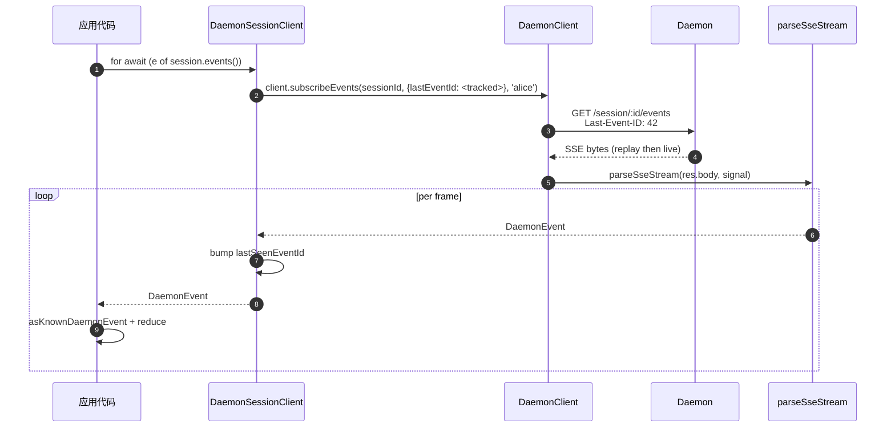
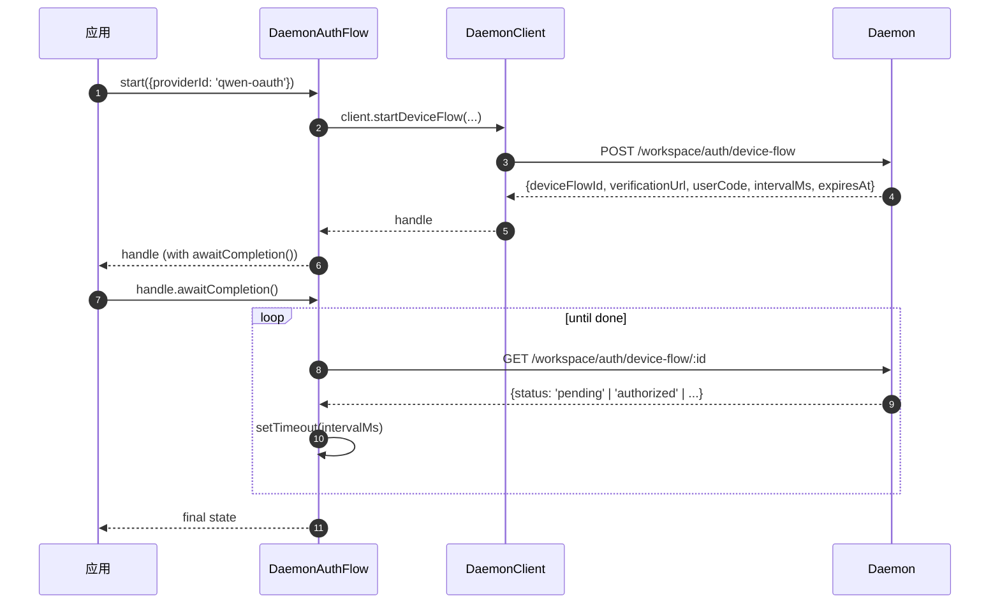

# TypeScript SDK Daemon 客户端

## 概述

`packages/sdk-typescript/src/daemon/` 是 **TypeScript SDK 的 Daemon 客户端**。它是从任何 TypeScript / JavaScript 宿主（CLI 自身的 TUI 适配器、频道机器人后端、VS Code IDE 伴侣插件、自定义脚本以及服务端 Web 后端）连接到正在运行的 `qwen serve` Daemon 的标准方式。所有其他适配器都依赖于它。

该包的布局刻意保持精简：

| 文件                     | 接口                                                                                                                        |
| ------------------------ | ------------------------------------------------------------------------------------------------------------------------------ |
| `index.ts`               | 公共导出入口（`DaemonClient`, `DaemonSessionClient`, `DaemonAuthFlow`, `parseSseStream`、事件 reducer、类型）。              |
| `DaemonClient.ts`        | 底层 HTTP/SSE 门面 —— 每个 `qwen-serve-protocol.md` 路由对应一个方法。                                                     |
| `DaemonSessionClient.ts` | 会话作用域的包装器，带有 SSE 重放跟踪。                                                                               |
| `DaemonAuthFlow.ts`      | 高级 OAuth 设备流辅助工具。                                                                                           |
| `sse.ts`                 | `parseSseStream`（NDJSON / SSE 分帧解析器）。                                                                                |
| `events.ts`              | `asKnownDaemonEvent`, `reduceDaemonSessionEvent`, `reduceDaemonAuthEvent`（参见 [`09-event-schema.md`](./09-event-schema.md)）。  |
| `types.ts`               | `DaemonCapabilities`, `DaemonSession`, `DaemonEvent`, `PermissionResponse`, `PromptResult`、MCP / agent / memory / auth 类型。 |

演练示例位于 [`../examples/daemon-client-quickstart.md`](../examples/daemon-client-quickstart.md)；本文档是架构和契约参考。

## 职责

- 为每个 Daemon HTTP 路由提供一个 TypeScript 方法。
- 在每个请求上正确附加 bearer token 和 `X-Qwen-Client-Id`。
- 将单次调用超时与调用方提供的 `AbortSignal` 组合（不中断长连接的 SSE）。
- 流式传输并将 SSE 帧解析为类型化的 `DaemonEvent`。
- 跟踪每个会话的 `lastSeenEventId`，以便重连时正确重放。
- 暴露设备流认证接口，按 Daemon 提供的间隔进行轮询。

## 架构

### `DaemonClient` (`DaemonClient.ts`)

构造函数：

```ts
new DaemonClient({
  baseUrl: string,                  // default 'http://127.0.0.1:4170'
  token?: string,
  fetch?: typeof globalThis.fetch,  // injectable for tests
  fetchTimeoutMs?: number,          // 0 = disabled; default DEFAULT_FETCH_TIMEOUT_MS
});
```

方法分组（每个方法接受一个可选的 `clientId` 以附加 `X-Qwen-Client-Id`）：

| 分组               | 方法                                                                                                                                                                                                                             |
| ------------------- | ----------------------------------------------------------------------------------------------------------------------------------------------------------------------------------------------------------------------------------- |
| 底层通信            | `health()`, `capabilities()`, `auth` (lazy `DaemonAuthFlow` accessor)                                                                                                                                                               |
| 会话            | `createOrAttachSession`, `loadSession`, `resumeSession`, `listSessions`, `closeSession`, `setSessionMetadata`, `getSessionContext`, `getSessionSupportedCommands`, `setSessionApprovalMode`, `setSessionModel`                      |
| 提示交互           | `prompt`, `cancel`, `heartbeat`                                                                                                                                                                                                     |
| 事件              | `subscribeEvents` (SSE generator), `subscribeEventsStream` (raw response)                                                                                                                                                           |
| 权限         | `respondToPermission`, `respondToSessionPermission`                                                                                                                                                                                 |
| 工作区快照 | `getWorkspaceMcp`, `getWorkspaceSkills`, `getWorkspaceProviders`, `getWorkspaceEnv`, `getWorkspacePreflight`                                                                                                                        |
| 工作区变更 | `writeWorkspaceMemory`, `readWorkspaceMemory`, `listWorkspaceAgents`, `getWorkspaceAgent`, `createWorkspaceAgent`, `updateWorkspaceAgent`, `deleteWorkspaceAgent`, `toggleWorkspaceTool`, `restartMcpServer`, `initializeWorkspace` |
| 文件               | `readFile`, `readFileBytes`, `writeFile`, `editFile`, `listDirectory`, `globPaths`, `statPath`                                                                                                                                      |
| 认证                | `startDeviceFlow`, `pollDeviceFlow`, `cancelDeviceFlow`, `getAuthStatus`                                                                                                                                                            |

### `fetchWithTimeout`

每个请求都通过 `fetchWithTimeout` 发出。关键细节：

- **Body 读取在计时器作用域内。** 以前的实现在收到 headers 时就清除计时器；如果代理在 body 传输中途停滞，`await res.json()` 可能会挂起超过 `fetchTimeoutMs`。当前的实现将 body 读取代码作为回调传入，因此计时器同时覆盖 header 到达和 body 消费。
- **`perCallTimeoutMs`** 允许单次调用覆盖客户端全局默认值。最明显的调用者是 `restartMcpServer`：SDK 使用 `MCP_RESTART_DEFAULT_TIMEOUT_MS = 330_000`（5 分 30 秒）。Daemon 自身的 `MCP_RESTART_TIMEOUT_MS` 正好是 300 秒；如果客户端匹配该值，在接近 300 秒完成的重启中，当 Daemon 序列化并发送其结构化响应时，可能会输掉竞态，导致误报 `TimeoutError`。额外的 30 秒用于覆盖序列化、网络传输和双方的解码。需要更严格预算的调用者可以传递 `timeoutMs`；传递 `0` 则禁用超时。
- **`AbortSignal.any`** 将调用方提供的 signal 与单次调用计时器 signal 组合，因此调用方取消和单次调用超时都能干净地中止。
- 使用 **`AbortController` + 可取消的 `setTimeout`** 而不是 `AbortSignal.timeout()`，这样快速解析的请求不会在事件循环上泄漏挂起的计时器。计时器在 `finally` 中清除。
- **流式端点（`subscribeEvents`）绕过超时** —— 长连接的 SSE 绝不能被其终止。

### `DaemonSessionClient` (`DaemonSessionClient.ts`)

绑定一个会话并自动跟踪 `lastSeenEventId`，因此 SSE 重放和重连无需调用方提供额外状态。

```ts
class DaemonSessionClient {
  readonly client: DaemonClient;
  readonly session: DaemonSession;
  readonly state: DaemonSessionState;
  private lastSeenEventId: number | undefined;

  static createOrAttach(client, req?): Promise<DaemonSessionClient>;
  static load(client, sessionId, req?): Promise<DaemonSessionClient>;
  static resume(client, sessionId, req?): Promise<DaemonSessionClient>;

  events(opts?: DaemonSessionSubscribeOptions): AsyncIterable<DaemonEvent>;
  prompt(req: PromptRequest): Promise<PromptResult>;
  cancel(): Promise<void>;
  respondToPermission(...): Promise<PermissionResponse>;
  setModel(modelServiceId): Promise<SetModelResult>;
  heartbeat(): Promise<HeartbeatResult>;
  setMetadata(metadata): Promise<SessionMetadataResult>;
  close(): Promise<void>;
}
```

`events()` 默认以 `resume: true` 代理 `client.subscribeEvents` —— 它传递跟踪的 `lastSeenEventId`，以便重连时从上一次订阅停止的地方重放。每个 yield 的事件都会更新 `lastSeenEventId`。

### `DaemonAuthFlow` (`DaemonAuthFlow.ts`)

```ts
class DaemonAuthFlow {
  start(opts: { providerId, ... }): Promise<DaemonAuthFlowHandle>;
}
interface DaemonAuthFlowHandle {
  deviceFlowId: string;
  providerId: string;
  expiresAt: string;
  verificationUrl: string;
  userCode: string;
  awaitCompletion(opts?): Promise<DaemonAuthDeviceFlowState>;
  cancel(): Promise<void>;
}
```

`awaitCompletion()` 按 Daemon 提供的 `intervalMs` 轮询 `GET /workspace/auth/device-flow/:id`，直到流变为 `authorized`、`failed` 或 `cancelled`。它通过 `client.auth` 延迟构造，因此从不接触认证的客户端不会产生分配开销。

### `parseSseStream` (`sse.ts`)

将 `Response.body`（`ReadableStream<Uint8Array>`）转换为 `AsyncIterable<DaemonEvent>`。处理：

- LF 和 CRLF 分帧。
- 缓冲区溢出上限（16 MiB） —— 防御 Daemon 发出单个极其巨大的帧。
- AbortSignal 绑定 —— abort 会关闭流和迭代器。
- 仅包含注释的帧和未知事件类型（作为 `DaemonEvent` 传递；SDK 消费者在下游通过 `asKnownDaemonEvent` 进行收窄）。

### 类型 (`types.ts`)

主要导出：`DaemonCapabilities`、`DaemonSession`（`{ sessionId, workspaceCwd, attached, clientId?, createdAt? }`）、`DaemonEvent`、`DaemonSessionState`、`DaemonSessionContextStatus`、`DaemonSessionSupportedCommandsStatus`、`PermissionResponse`、`PromptResult`、`HeartbeatResult`、`SetModelResult`、`SessionMetadataResult`，以及 MCP / agent / memory / auth 结果类型。

## 工作流

### 创建或附加 + 首次提示


### 带重放的订阅



### 设备流认证



`qwen-oauth` 是旧版 v1 提供商标识符。Qwen OAuth 免费层已于 2026-04-15 停用，因此新客户端应优先使用当前受支持的认证提供商（如果可用）。

## 状态与生命周期

- `DaemonClient` 是无连接的；构造时不会发生任何操作。每个方法都会打开一个新的 `fetch`。
- `DaemonSessionClient` 在 `events()` 调用之间保留 `lastSeenEventId`；重连时从最后看到的 ID 重放。
- `DaemonAuthFlow` 是延迟的 —— `client.auth` 在首次访问时构造它。
- SSE 迭代器在以下情况关闭：(a) Daemon 结束流，(b) `AbortSignal.abort()` 触发，(c) 消费者跳出 `for await`，或 (d) 达到缓冲区溢出上限（16 MiB）。

## 依赖

- `globalThis.fetch`（Node 18+ 内置、浏览器、undici 等）。可通过 `DaemonClient` 注入以用于测试。
- 原生 `AbortController` / `AbortSignal.any` / `setTimeout`。
- 不传递依赖 `@qwen-code/qwen-code-core` 或 `@qwen-code/acp-bridge` —— SDK 包完全解耦，因此外部消费者不会引入 Daemon 的内部实现。

## `ui/*` 子包 ([#4328](https://github.com/QwenLM/qwen-code/pull/4328) + [#4353](https://github.com/QwenLM/qwen-code/pull/4353))

SDK 还导出 `packages/sdk-typescript/src/daemon/ui/`，这是一组与宿主无关的原语，用于将 Daemon 事件转换为 transcript 块：

- `normalizeDaemonEvent(evt)` 将 47 个已知的 Daemon 线路事件映射为 42 个对 UI 友好的 `DaemonUiEventType` 值；未建模或格式错误的事件会规范化为 `debug`。
- `createDaemonTranscriptState()` 加上 `reduceDaemonTranscriptEvents(state, events)` 将 UI 事件投影为 `DaemonTranscriptBlock[]`。
- `createDaemonTranscriptStore()` 封装 subscribe / dispatch。
- `render.ts` / `terminal.ts` 提供 HTML 和终端基线渲染器，而 `toolPreview.ts` 生成工具调用摘要。
- 选择器包括 `selectTranscriptBlocksOrderedByEventId`、`selectPendingPermissionBlocks`、`selectCurrentTool`、`selectApprovalMode`、`selectToolProgress`、`selectSubagentChildBlocks`、`formatMissedRange` 和 `formatBlockTimestamp`。
- 公共常量包括 `DAEMON_PLAN_TOOL_CALL_ID`。
- `conformance.ts` 包含跨宿主一致性测试套件。

首个生产消费者是 `packages/webui/src/daemon/`，通过 React 的 `DaemonSessionProvider`。详见 [`14-cli-tui-adapter.md`](./14-cli-tui-adapter.md) 了解详细架构、术语表、选择器表以及与旧版 `DaemonTuiAdapter` 的关系。

该子包从 `@qwen-code/sdk/daemon` 子路径导出。现有执行 `import { DaemonClient }` 的代码不受影响。

## 使用 SDK 进行 Last-Event-ID 重连

### 通过 `DaemonSessionClient` 自动跟踪

`DaemonSessionClient` 在内部跟踪 `lastSeenEventId`。每个带有数字 `id` 的 yield 事件都会推进游标。后续的 `events()` 调用会自动将跟踪的 id 作为 `Last-Event-ID` 传递，因此带重放的重连无需调用方提供额外状态：

```ts
import { DaemonClient, DaemonSessionClient } from '@qwen-code/sdk/daemon';

const client = new DaemonClient({ baseUrl: 'http://127.0.0.1:4170', token });
const session = await DaemonSessionClient.createOrAttach(client);

// 首次订阅 —— 开始实时接收（或新会话从 ring 起点开始）。
for await (const event of session.events()) {
  console.log(event.type, event.id);
  // session.lastEventId 在每个带有 id 的帧上都会更新。
  if (shouldStop(event)) break;
}

// 重连 —— 自动发送 Last-Event-ID: <最后看到的 id>。
// Daemon 从 ring 中重放错过的事件，然后进入实时状态。
for await (const event of session.events()) {
  // 重放帧首先到达，然后是合成的 replay_complete，
  // 接着是实时事件。
  handleEvent(event);
}
```

### 使用 `DaemonClient` 手动重连

对于更底层的控制，直接使用 `DaemonClient.subscribeEvents` 并自行管理游标：

```ts
const client = new DaemonClient({ baseUrl: 'http://127.0.0.1:4170', token });

let cursor: number | undefined; // undefined = 首次连接时仅实时接收

async function* subscribe(sessionId: string, signal: AbortSignal) {
  for await (const event of client.subscribeEvents(sessionId, {
    lastEventId: cursor,
    signal,
  })) {
    // 只有带有 id 的帧才会推进游标。
    if (event.id !== undefined) {
      cursor = event.id;
    }
    // 处理 ring 驱逐间隙。
    if (event.type === 'state_resync_required') {
      // 状态已过期 —— 重新加载完整的会话状态。
      await client.loadSession(sessionId);
      continue;
    }
    yield event;
  }
}
```

### 带重试循环的重连

SDK 在网络故障时**不会**自动重试。在 `events()` 周围实现重试循环：

```ts
async function resilientSubscribe(session: DaemonSessionClient) {
  const MAX_RETRIES = 10;
  const BASE_DELAY_MS = 1000;

  for (let attempt = 0; attempt < MAX_RETRIES; attempt++) {
    try {
      // resume: true（默认）传递跟踪的 lastSeenEventId。
      for await (const event of session.events()) {
        attempt = 0; // 成功收到事件时重置
        handleEvent(event);
      }
      break; // 流干净结束
    } catch (err) {
      const delay = BASE_DELAY_MS * 2 ** Math.min(attempt, 5);
      await new Promise((r) => setTimeout(r, delay));
    }
  }
}
```

重连时，Daemon 从其有界 ring（默认 8000 个事件）中重放 `id > lastSeenEventId` 的事件。如果间隙超过 ring 容量，`state_resync_required` 帧会通知客户端调用 `loadSession` 以进行完整的状态重建。

### 在构造时设定 `lastEventId`

跨进程重启持久化游标的调用者可以设定它：

```ts
const session = new DaemonSessionClient({
  client,
  session: { sessionId, workspaceCwd, attached: true },
  lastEventId: persistedCursor, // 从持久化位置恢复
});
```

该值必须是有限的非负整数（在构造时验证）。无效值会抛出异常。

## 配置

| 配置项               | 位置                                | 效果                                                                                  |
| ------------------ | ------------------------------------ | --------------------------------------------------------------------------------------- |
| `baseUrl`          | `DaemonClient` 构造函数           | Daemon URL；去除尾部斜杠。                                                  |
| `token`            | `DaemonClient` 构造函数           | 附加为 `Authorization: Bearer`。                                                     |
| `fetch`            | `DaemonClient` 构造函数           | 测试注入点。                                                                   |
| `fetchTimeoutMs`   | `DaemonClient` 构造函数           | 单次调用超时；`0` = 禁用。                                                       |
| `clientId`         | 每个方法的可选参数              | `X-Qwen-Client-Id` header（参见 [`08-session-lifecycle.md`](./08-session-lifecycle.md)）。 |
| `lastEventId`      | `DaemonSessionClient` 构造函数    | 设定重放游标。                                                                     |
| `maxQueued`        | 每个订阅的选项                 | SSE 路由的 `?maxQueued=N`；预先检查 `caps.features.slow_client_warning`。 |
| `perCallTimeoutMs` | 每个方法（例如 `restartMcpServer`） | 覆盖客户端全局超时。                                                           |

## 注意事项与已知限制

- **`fetchTimeoutMs` 是单次调用级别的，而非连接级别的。** 长 body 读取共享计时器。流式传输响应的 Daemon 必须覆盖单次调用超时或将超时设置为 `0`。
- **SSE 绕过 fetch 超时** —— 长连接的 SSE 连接不会被 `fetchTimeoutMs` 终止。使用 `AbortSignal` 进行调用方控制的中止。
- **`parseSseStream` 缓冲区上限为 16 MiB**，作为防御性边界。单个大于此值的帧会中止迭代器（Daemon 永远不会合法地发出此类帧）。
- **`asKnownDaemonEvent` 对无法识别的事件类型返回 `undefined`。** SDK 消费者必须处理此分支，而不是假设联合类型是穷尽的；这是向前兼容性契约。无法识别的事件会增加 `DaemonSessionViewState.unrecognizedKnownEventCount`。
- **`client_evicted`、`slow_client_warning`、`stream_error` 不在重放 ring 中。** 被驱逐后重连会从 Daemon 的 ring 中恢复；你将不会再看到驱逐帧。
- **`DaemonClient` 不会自动重试。** 网络故障会表现为 rejection；重连/重放策略是调用方的责任（`DaemonSessionClient.events()` 使重放变得简单，但重连仍是每次调用的事）。
## 参考资料

- `packages/sdk-typescript/src/daemon/DaemonClient.ts`
- `packages/sdk-typescript/src/daemon/DaemonSessionClient.ts`
- `packages/sdk-typescript/src/daemon/DaemonAuthFlow.ts`
- `packages/sdk-typescript/src/daemon/sse.ts`
- `packages/sdk-typescript/src/daemon/events.ts`
- `packages/sdk-typescript/src/daemon/types.ts`
- 端到端演练：[`../examples/daemon-client-quickstart.md`](../examples/daemon-client-quickstart.md)。