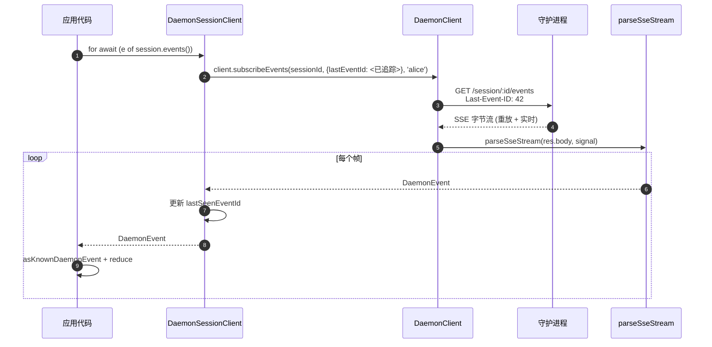
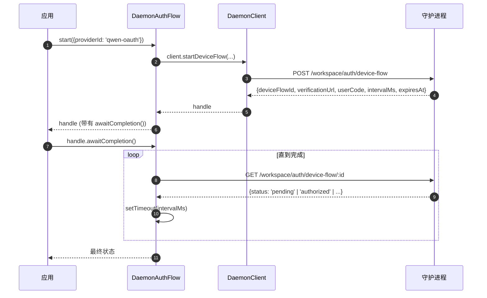

# TypeScript SDK 守护进程客户端

## 概述

`packages/sdk-typescript/src/daemon/` 是 **TypeScript SDK 的守护进程客户端**。它是从任何 TypeScript / JavaScript 宿主环境（CLI 自身的 TUI 适配器、频道机器人后端、VS Code IDE 伴侣、自定义脚本以及服务端 Web 后端）连接到正在运行的 `qwen serve` 守护进程的标准方式。所有其他适配器都依赖于此。

包的布局有意做得精简：

| 文件                       | 对外暴露内容                                                                                                       |
| -------------------------- | ------------------------------------------------------------------------------------------------------------------ |
| `index.ts`                 | 公共导出桶 (`DaemonClient`, `DaemonSessionClient`, `DaemonAuthFlow`, `parseSseStream`, 事件归约器, 类型)。         |
| `DaemonClient.ts`          | 底层 HTTP/SSE 外观模式 — 每个方法对应一个 `qwen-serve-protocol.md` 路由。                                          |
| `DaemonSessionClient.ts`   | 会话作用域的包装器，具有 SSE 重放追踪功能。                                                                        |
| `DaemonAuthFlow.ts`        | 高层 OAuth 设备流辅助工具。                                                                                        |
| `sse.ts`                   | `parseSseStream` (NDJSON / SSE 帧解析器)。                                                                         |
| `events.ts`                | `asKnownDaemonEvent`, `reduceDaemonSessionEvent`, `reduceDaemonAuthEvent` (参见 [`09-event-schema.md`](./09-event-schema.md))。 |
| `types.ts`                 | `DaemonCapabilities`, `DaemonSession`, `DaemonEvent`, `PermissionResponse`, `PromptResult`, MCP / agent / memory / auth 类型。 |

入门示例位于 [`../examples/daemon-client-quickstart.md`](../examples/daemon-client-quickstart.md)；本文档是架构和契约参考。

## 职责

- 为每个守护进程 HTTP 路由提供一个 TypeScript 方法。
- 在每个请求上正确打上 bearer token 和 `X-Qwen-Client-Id`。
- 使用调用者提供的 `AbortSignal` 组合每次调用的超时（不终止长生命周期的 SSE）。
- 将 SSE 帧流式解析为类型化的 `DaemonEvent`。
- 追踪每个会话的 `lastSeenEventId`，以便重新连接时正确重放。
- 暴露一个设备流认证接口，按守护进程提供的间隔轮询。

## 架构

### `DaemonClient` (`DaemonClient.ts`)

构造函数：

```ts
new DaemonClient({
  baseUrl: string,                  // 默认 'http://127.0.0.1:4170'
  token?: string,
  fetch?: typeof globalThis.fetch,  // 可注入，用于测试
  fetchTimeoutMs?: number,          // 0 = 禁用；默认 DEFAULT_FETCH_TIMEOUT_MS
});
```

方法组（每个方法接受可选的 `clientId` 参数以打上 `X-Qwen-Client-Id`）：

| 组别               | 方法                                                                                                                                                                                                                              |
| ------------------- | --------------------------------------------------------------------------------------------------------------------------------------------------------------------------------------------------------------------------------- |
| 基础设施            | `health()`, `capabilities()`, `auth` (惰性 `DaemonAuthFlow` 访问器)                                                                                                                                                               |
| 会话                | `createOrAttachSession`, `loadSession`, `resumeSession`, `listSessions`, `closeSession`, `setSessionMetadata`, `getSessionContext`, `getSessionSupportedCommands`, `setSessionApprovalMode`, `setSessionModel`                      |
| 提示                | `prompt`, `cancel`, `heartbeat`                                                                                                                                                                                                     |
| 事件                | `subscribeEvents` (SSE 生成器), `subscribeEventsStream` (原始响应)                                                                                                                                                           |
| 权限                | `respondToPermission`, `respondToSessionPermission`                                                                                                                                                                                 |
| 工作区快照          | `getWorkspaceMcp`, `getWorkspaceSkills`, `getWorkspaceProviders`, `getWorkspaceEnv`, `getWorkspacePreflight`                                                                                                                        |
| 工作区变更          | `writeWorkspaceMemory`, `readWorkspaceMemory`, `listWorkspaceAgents`, `getWorkspaceAgent`, `createWorkspaceAgent`, `updateWorkspaceAgent`, `deleteWorkspaceAgent`, `toggleWorkspaceTool`, `restartMcpServer`, `initializeWorkspace` |
| 文件                | `readFile`, `readFileBytes`, `writeFile`, `editFile`, `listDirectory`, `globPaths`, `statPath`                                                                                                                                      |
| 认证                | `startDeviceFlow`, `pollDeviceFlow`, `cancelDeviceFlow`, `getAuthStatus`                                                                                                                                                            |

### `fetchWithTimeout`

每个请求都通过 `fetchWithTimeout` 处理。关键细节：

- **主体读取在定时器作用域内。** 之前的实现在获取到响应头时清除定时器；如果代理在响应体中段挂起，`await res.json()` 可能会在 `fetchTimeoutMs` 之后一直挂起。当前的设计将主体读取代码作为回调传递，以便定时器覆盖到响应头到达和主体消费两个阶段。
- **`perCallTimeoutMs`** 允许单个调用覆盖客户端范围的默认超时。最典型的调用者是 `restartMcpServer`：SDK 使用 `MCP_RESTART_DEFAULT_TIMEOUT_MS = 330_000` (5 分 30 秒)。守护进程自身的 `MCP_RESTART_TIMEOUT_MS` 恰好是 300 秒；如果客户端也匹配这个值，那么当重启在接近 300 秒完成时，可能会在守护进程序列化并发送其结构化响应时出现竞态条件，导致假阳性 `TimeoutError`。额外的 30 秒为双方序列化、网络传输和解码提供了缓冲。需要更严格预算的调用者可以传递 `timeoutMs`；传递 `0` 则禁用超时。
- **`AbortSignal.any`** 将调用者提供的信号与每次调用的定时器信号组合起来，这样调用者取消和调用超时都能干净地中止。
- **`AbortController` + 可取消的 `setTimeout`** 而不是 `AbortSignal.timeout()`，使得快速解析的请求不会在事件循环上泄漏挂起的定时器。定时器在 `finally` 中清理。
- **流式端点 (`subscribeEvents`) 绕过超时** — 长生命周期的 SSE 不能被它终止。

### `DaemonSessionClient` (`DaemonSessionClient.ts`)

绑定一个会话并自动追踪 `lastSeenEventId`，以便 SSE 重放和重新连接无需额外的调用者状态。

```ts
class DaemonSessionClient {
  readonly client: DaemonClient;
  readonly session: DaemonSession;
  readonly state: DaemonSessionState;
  private lastSeenEventId: number | undefined;

  static createOrAttach(client, req?): Promise<DaemonSessionClient>;
  static load(client, sessionId, req?): Promise<DaemonSessionClient>;
  static resume(client, sessionId, req?): Promise<DaemonSessionClient>;

  events(opts?: DaemonSessionSubscribeOptions): AsyncIterable<DaemonEvent>;
  prompt(req: PromptRequest): Promise<PromptResult>;
  cancel(): Promise<void>;
  respondToPermission(...): Promise<PermissionResponse>;
  setModel(modelServiceId): Promise<SetModelResult>;
  heartbeat(): Promise<HeartbeatResult>;
  setMetadata(metadata): Promise<SessionMetadataResult>;
  close(): Promise<void>;
}
```

`events()` 默认使用 `resume: true` 代理 `client.subscribeEvents` — 它传递追踪到的 `lastSeenEventId`，以便重新连接时从上一个订阅停止处开始重放。每个 yield 的事件都会更新 `lastSeenEventId`。

### `DaemonAuthFlow` (`DaemonAuthFlow.ts`)

```ts
class DaemonAuthFlow {
  start(opts: { providerId, ... }): Promise<DaemonAuthFlowHandle>;
}
interface DaemonAuthFlowHandle {
  deviceFlowId: string;
  providerId: string;
  expiresAt: string;
  verificationUrl: string;
  userCode: string;
  awaitCompletion(opts?): Promise<DaemonAuthDeviceFlowState>;
  cancel(): Promise<void>;
}
```

`awaitCompletion()` 以守护进程提供的 `intervalMs` 轮询 `GET /workspace/auth/device-flow/:id`，直到流程变为 `authorized`、`failed` 或 `cancelled`。它通过 `client.auth` 惰性构造，因此从不接触认证的客户端不会产生任何分配开销。

### `parseSseStream` (`sse.ts`)

将 `Response.body` (`ReadableStream<Uint8Array>`) 转换为 `AsyncIterable<DaemonEvent>`。处理：

- LF 和 CRLF 帧格式。
- 缓冲区溢出上限 (16 MiB) — 防御性边界，防止守护进程发射单个异常大的帧。
- AbortSignal 连接 — 中止会关闭流和迭代器。
- 纯注释帧和未知事件类型（作为 `DaemonEvent` 透传；SDK 消费者通过 `asKnownDaemonEvent` 下游缩小范围）。

### 类型 (`types.ts`)

值得注意的导出：`DaemonCapabilities`, `DaemonSession` (`{ sessionId, workspaceCwd, attached, clientId?, createdAt? }`), `DaemonEvent`, `DaemonSessionState`, `DaemonSessionContextStatus`, `DaemonSessionSupportedCommandsStatus`, `PermissionResponse`, `PromptResult`, `HeartbeatResult`, `SetModelResult`, `SessionMetadataResult`，以及 MCP / agent / memory / auth 结果类型。

## 工作流程

### 创建或附加 + 首次提示


### 带重放的订阅



### 设备流认证



`qwen-oauth` 是传统的 v1 版本提供商标识符。Qwen OAuth 免费层已于 2026-04-15 停止提供，因此新客户端在可用时应优先选择当前支持的认证提供商。

## 状态与生命周期

- `DaemonClient` 是无连接的；构造时没有任何操作。每个方法都会发起一次全新的 `fetch`。
- `DaemonSessionClient` 在 `events()` 调用之间保留 `lastSeenEventId`；重新连接时会从最后看见的事件开始重放。
- `DaemonAuthFlow` 是惰性的 — `client.auth` 在首次访问时构造它。
- SSE 迭代器在以下情况关闭：(a) 守护进程结束流，(b) `AbortSignal.abort()` 触发，(c) 消费者退出 `for await` 循环，或 (d) 达到缓冲区溢出上限 (16 MiB)。

## 依赖

- `globalThis.fetch` (Node 18+ 内置, 浏览器, undici 等)。可通过 `DaemonClient` 为测试注入。
- 原生 `AbortController` / `AbortSignal.any` / `setTimeout`。
- 无对 `@qwen-code/qwen-code-core` 或 `@qwen-code/acp-bridge` 的传递依赖 — SDK 包完全解耦，因此外部消费者不会引入守护进程的内部实现。

## `ui/*` 子包 ([#4328](https://github.com/QwenLM/qwen-code/pull/4328) + [#4353](https://github.com/QwenLM/qwen-code/pull/4353))

SDK 还导出了 `packages/sdk-typescript/src/daemon/ui/`，这是一组与宿主无关的原语，可将守护进程事件转换为转录块：

- `normalizeDaemonEvent(evt)` 将 43 种已知的守护进程线缆事件映射为 37 种 UI 友好的 `DaemonUiEventType` 值；未建模或格式错误的事件会规整化为 `debug`。
- `createDaemonTranscriptState()` 加上 `reduceDaemonTranscriptEvents(state, events)` 将 UI 事件投射为 `DaemonTranscriptBlock[]`。
- `createDaemonTranscriptStore()` 封装了 subscribe / dispatch。
- `render.ts` / `terminal.ts` 分别提供 HTML 和终端基线渲染器，而 `toolPreview.ts` 生成工具调用摘要。
- 选择器包括 `selectTranscriptBlocksOrderedByEventId`, `selectPendingPermissionBlocks`, `selectCurrentTool`, `selectApprovalMode`, `selectToolProgress`, `selectSubagentChildBlocks`, `formatMissedRange` 和 `formatBlockTimestamp`。
- 公共常量包括 `DAEMON_PLAN_TOOL_CALL_ID`。
- `conformance.ts` 包含跨主机一致性测试套件。

首个生产消费者是 `packages/webui/src/daemon/`，通过 React 的 `DaemonSessionProvider` 实现。有关详细架构、术语表、选择器表以及与传统 `DaemonTuiAdapter` 的关系，请参见 [`14-cli-tui-adapter.md`](./14-cli-tui-adapter.md)。

该子包从 `@qwen-code/sdk/daemon` 子路径导出。现有执行 `import { DaemonClient }` 的代码不受影响。

## 配置

| 配置项              | 位置                                   | 效果                                                                                   |
| ------------------ | -------------------------------------- | --------------------------------------------------------------------------------------- |
| `baseUrl`          | `DaemonClient` 构造函数                | 守护进程 URL；尾部斜杠会被去除。                                                       |
| `token`            | `DaemonClient` 构造函数                | 打上 `Authorization: Bearer`。                                                          |
| `fetch`            | `DaemonClient` 构造函数                | 测试注入点。                                                                           |
| `fetchTimeoutMs`   | `DaemonClient` 构造函数                | 每次调用的超时；`0` = 禁用。                                                            |
| `clientId`         | 每个方法的可选参数                     | `X-Qwen-Client-Id` 头 (参见 [`08-session-lifecycle.md`](./08-session-lifecycle.md))。 |
| `lastEventId`      | `DaemonSessionClient` 构造函数         | 种子重放游标。                                                                         |
| `maxQueued`        | 每次订阅选项                          | SSE 路由的 `?maxQueued=N`；先检查预检 `caps.features.slow_client_warning`。            |
| `perCallTimeoutMs` | 每个方法 (例如 `restartMcpServer`)     | 覆盖客户端范围的超时。                                                                  |

## 注意事项与已知限制

- **`fetchTimeoutMs` 是每次调用的，不是连接级别的。** 长的响应体读取会共享定时器。流式响应结果的守护进程必须重写每次调用的超时，或将其设置为 `0`。
- **SSE 绕过 fetch 超时** — 长生命周期的 SSE 连接不会被 `fetchTimeoutMs` 终止。使用 `AbortSignal` 进行调用者控制的取消。
- **`parseSseStream` 缓冲区上限为 16 MiB**，作为防御性边界。单个帧大于此值会中止迭代器（守护进程绝不会合法地发射这样的帧）。
- **`asKnownDaemonEvent` 对无法识别的事件类型返回 `undefined`。** SDK 消费者必须处理此分支，而不是假设并集是穷举的；这是向前兼容性的契约。无法识别的事件会增加 `DaemonSessionViewState.unrecognizedKnownEventCount`。
- **`client_evicted`, `slow_client_warning`, `stream_error` 不在重放环中。** 被驱逐后重新连接会从守护进程的环中重新开始；你不会再次看到驱逐帧。
- **`DaemonClient` 不会自动重试。** 网络故障会表现为 reject；重新连接 / 重放策略是调用者的责任（`DaemonSessionClient.events()` 使重放变得容易，但重新连接仍然是每次调用的）。

## 参考

- `packages/sdk-typescript/src/daemon/DaemonClient.ts`
- `packages/sdk-typescript/src/daemon/DaemonSessionClient.ts`
- `packages/sdk-typescript/src/daemon/DaemonAuthFlow.ts`
- `packages/sdk-typescript/src/daemon/sse.ts`
- `packages/sdk-typescript/src/daemon/events.ts`
- `packages/sdk-typescript/src/daemon/types.ts`
- 端到端入门示例：[`../examples/daemon-client-quickstart.md`](../examples/daemon-client-quickstart.md)。