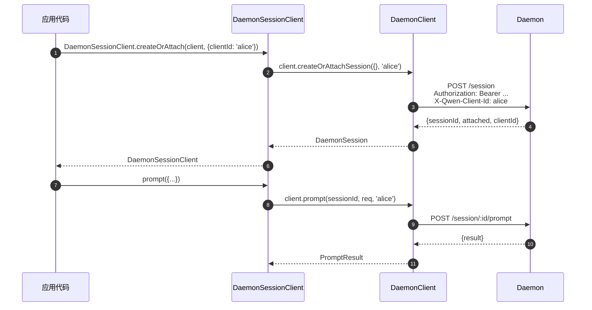
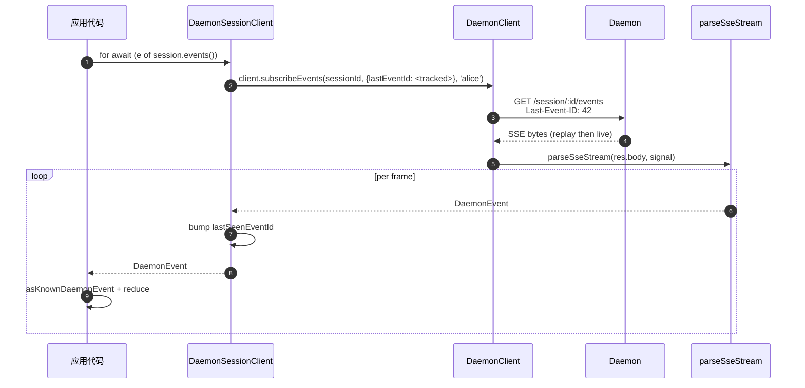
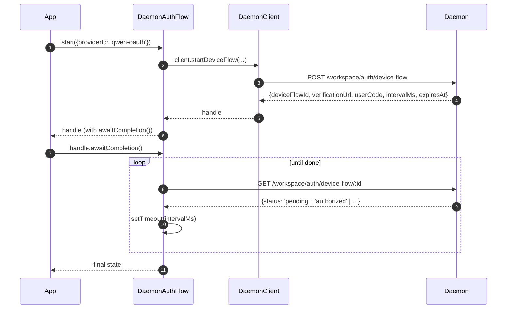

# TypeScript SDK Daemon 客户端

## 概述

`packages/sdk-typescript/src/daemon/` 是 **TypeScript SDK 的 daemon 客户端**。它是从任何 TypeScript / JavaScript 宿主（CLI 自身的 TUI 适配器、频道机器人后端、VS Code IDE 伴侣插件、自定义脚本以及服务端 Web 后端）连接到正在运行的 `qwen serve` daemon 的标准方式。所有其他适配器都依赖于它。

该包的布局刻意保持精简：

| 文件 | 导出的 API |
| ------------------------ | ------------------------------------------------------------------------------------------------------------------------------ |
| `index.ts` | 公共导出桶（`DaemonClient`、`DaemonSessionClient`、`DaemonAuthFlow`、`parseSseStream`、事件 reducer、类型）。 |
| `DaemonClient.ts` | 底层 HTTP/SSE 门面 — 每个 `qwen-serve-protocol.md` 路由对应一个方法。 |
| `DaemonSessionClient.ts` | 会话作用域的封装，带有 SSE 重放追踪。 |
| `DaemonAuthFlow.ts` | 高级 OAuth 设备流辅助工具。 |
| `sse.ts` | `parseSseStream`（NDJSON / SSE 帧解析器）。 |
| `events.ts` | `asKnownDaemonEvent`、`reduceDaemonSessionEvent`、`reduceDaemonAuthEvent`（参见 [`09-event-schema.md`](./09-event-schema.md)）。 |
| `types.ts` | `DaemonCapabilities`、`DaemonSession`、`DaemonEvent`、`PermissionResponse`、`PromptResult`、MCP / agent / memory / auth 类型。 |

演练示例位于 [`../examples/daemon-client-quickstart.md`](../examples/daemon-client-quickstart.md)；本文档是架构和契约参考。

## 职责

- 为每个 daemon HTTP 路由提供一个 TypeScript 方法。
- 在每个请求上正确附加 bearer token 和 `X-Qwen-Client-Id`。
- 将单次调用超时与调用方提供的 `AbortSignal` 组合（不会中断长连接的 SSE）。
- 流式传输并将 SSE 帧解析为类型化的 `DaemonEvent`。
- 追踪每个会话的 `lastSeenEventId`，以便重连时能正确重放。
- 暴露设备流认证接口，按 daemon 提供的间隔进行轮询。

## 架构

### `DaemonClient` (`DaemonClient.ts`)

构造函数：

```ts
new DaemonClient({
  baseUrl: string,                  // 默认 'http://127.0.0.1:4170'
  token?: string,
  fetch?: typeof globalThis.fetch,  // 可注入以用于测试
  fetchTimeoutMs?: number,          // 0 = 禁用；默认 DEFAULT_FETCH_TIMEOUT_MS
});
```

方法分组（每个方法接受一个可选的 `clientId` 以附加 `X-Qwen-Client-Id`）：

| 分组 | 方法 |
| ------------------- | ---------------------------------------------------------------------------------------------------------------------------------------------------------------------------------------------------------------------------------------------------------------------------------------------------------------------------------------------------------------------------------------------------------------- |
| 基础功能 | `health()`、`capabilities()`、`auth`（延迟初始化的 `DaemonAuthFlow` 访问器） |
| 会话 | `createOrAttachSession`、`loadSession`、`resumeSession`、`listSessions`、`closeSession`、`setSessionMetadata`、`getSessionContext`、`getSessionSupportedCommands`、`setSessionApprovalMode`、`setSessionModel` |
| 提示词交互 | `prompt`、`cancel`、`heartbeat` |
| 事件 | `subscribeEvents`（SSE 生成器）、`subscribeEventsStream`（原始响应） |
| 权限 | `respondToPermission`、`respondToSessionPermission` |
| 工作区快照 | `getWorkspaceMcp`、`getWorkspaceSkills`、`getWorkspaceProviders`、`getWorkspaceEnv`、`getWorkspacePreflight` |
| 工作区变更 | `addWorkspace`、`updateWorkspace`、`writeWorkspaceMemory`、`readWorkspaceMemory`、`rememberWorkspaceMemory`、`getWorkspaceMemoryRememberTask`、`forgetWorkspaceMemory`、`getWorkspaceMemoryForgetTask`、`dreamWorkspaceMemory`、`getWorkspaceMemoryDreamTask`、`listWorkspaceAgents`、`getWorkspaceAgent`、`createWorkspaceAgent`、`updateWorkspaceAgent`、`deleteWorkspaceAgent`、`setWorkspaceToolEnabled`、`setWorkspaceSkillEnabled`、`restartMcpServer`、`initWorkspace` |
| 文件 | `readFile`、`readFileBytes`、`writeFile`、`editFile`、`listDirectory`、`globPaths`、`statPath` |
| 认证 | `startDeviceFlow`、`pollDeviceFlow`、`cancelDeviceFlow`、`getAuthStatus` |

### `fetchWithTimeout`

每个请求都会经过 `fetchWithTimeout`。关键细节如下：

- **Body 读取在计时器作用域内。** 以前的实现在收到 headers 时就会清除计时器；如果代理在 body 传输中途停滞，`await res.json()` 可能会挂起超过 `fetchTimeoutMs`。当前的实现将 body 读取代码作为回调传入，因此计时器同时覆盖了 header 到达和 body 消费。
- **`perCallTimeoutMs`** 允许单次调用覆盖客户端的全局默认值。最典型的调用者是 `restartMcpServer`：SDK 使用 `MCP_RESTART_DEFAULT_TIMEOUT_MS = 330_000`（5 分 30 秒）。daemon 自身的 `MCP_RESTART_TIMEOUT_MS` 正好是 300 秒；如果客户端匹配该值，在接近 300 秒完成的重启中，可能会在 daemon 序列化并发送其结构化响应时输掉竞态，从而导致误报 `TimeoutError`。额外的 30 秒用于覆盖两侧的序列化、网络传输和解码。需要更严格预算的调用者可以传入 `timeoutMs`；传入 `0` 则禁用超时。
- **`AbortSignal.any`** 将调用方提供的 signal 与单次调用计时器 signal 组合，因此调用方取消和单次调用超时都能干净地中止。
- 使用 **`AbortController` + 可取消的 `setTimeout`** 而不是 `AbortSignal.timeout()`，这样快速完成的请求不会在事件循环上泄漏挂起的计时器。计时器在 `finally` 中被清除。
- **流式端点（`subscribeEvents`）绕过超时** — 长连接的 SSE 绝不能被其终止。

### `DaemonSessionClient` (`DaemonSessionClient.ts`)

绑定单个会话并自动追踪 `lastSeenEventId`，使得 SSE 重放和重连无需调用方提供额外的状态。

```ts
class DaemonSessionClient {
  readonly client: DaemonClient;
  readonly session: DaemonSession;
  readonly state: DaemonSessionState;
  private lastSeenEventId: number | undefined;

  static createOrAttach(client, req?): Promise<DaemonSessionClient>;
  static load(client, sessionId, req?): Promise<DaemonSessionClient>;
  static resume(client, sessionId, req?): Promise<DaemonSessionClient>;

  events(opts?: DaemonSessionSubscribeOptions): AsyncIterable<DaemonEvent>;
  prompt(req: PromptRequest): Promise<PromptResult>;
  cancel(): Promise<void>;
  respondToPermission(...): Promise<PermissionResponse>;
  setModel(modelServiceId): Promise<SetModelResult>;
  heartbeat(): Promise<HeartbeatResult>;
  setMetadata(metadata): Promise<SessionMetadataResult>;
  close(): Promise<void>;
}
```

`events()` 默认以 `resume: true` 代理 `client.subscribeEvents` — 它会传递追踪到的 `lastSeenEventId`，以便重连时从上一次订阅停止的地方开始重放。每个 yield 的事件都会递增 `lastSeenEventId`。

### `DaemonAuthFlow` (`DaemonAuthFlow.ts`)

```ts
class DaemonAuthFlow {
  start(opts: { providerId, ... }): Promise<DaemonAuthFlowHandle>;
}
interface DaemonAuthFlowHandle {
  deviceFlowId: string;
  providerId: string;
  expiresAt: string;
  verificationUrl: string;
  userCode: string;
  awaitCompletion(opts?): Promise<DaemonAuthDeviceFlowState>;
  cancel(): Promise<void>;
}
```

`awaitCompletion()` 按 daemon 提供的 `intervalMs` 轮询 `GET /workspace/auth/device-flow/:id`，直到流程变为 `authorized`、`failed` 或 `cancelled`。它通过 `client.auth` 延迟构造，因此从不涉及认证的客户端不会产生分配开销。

### `parseSseStream` (`sse.ts`)

将 `Response.body`（`ReadableStream<Uint8Array>`）转换为 `AsyncIterable<DaemonEvent>`。处理以下情况：

- LF 和 CRLF 帧。
- 缓冲区溢出上限（16 MiB）— 防御性边界，防止 daemon 发出单个极其巨大的帧。
- AbortSignal 绑定 — 中止操作会关闭流和迭代器。
- 仅包含注释的帧和未知事件类型（作为 `DaemonEvent` 透传；SDK 消费者在下游通过 `asKnownDaemonEvent` 进行类型收窄）。

### Types (`types.ts`)

主要导出：`DaemonCapabilities`、`DaemonSession`（`{ sessionId, workspaceCwd, attached, clientId?, createdAt? }`）、`DaemonEvent`、`DaemonSessionState`、`DaemonSessionContextStatus`、`DaemonSessionSupportedCommandsStatus`、`PermissionResponse`、`PromptResult`、`HeartbeatResult`、`SetModelResult`、`SessionMetadataResult`，以及 MCP / agent / memory / auth 结果类型。托管工作区 memory 任务类型包括 `DaemonWorkspaceMemoryRememberTask`、`DaemonWorkspaceMemoryForgetTask` 和 `DaemonWorkspaceMemoryDreamTask`。

工作区托管 memory 任务辅助方法：

```ts
await client.rememberWorkspaceMemory('Use strict TypeScript.', {
  contextMode: 'workspace',
});
await client.getWorkspaceMemoryRememberTask('remember-...');

await client.forgetWorkspaceMemory('old preference');
await client.getWorkspaceMemoryForgetTask('forget-...');

await client.dreamWorkspaceMemory();
await client.getWorkspaceMemoryDreamTask('dream-...');
```

工作区 skill 开关在两种客户端形态中均可用：

```ts
await client.setWorkspaceSkillEnabled('review', false, {
  clientId: 'dashboard-1',
});
await client
  .workspaceByCwd('/work/secondary')
  .setWorkspaceSkillEnabled('review', true, { clientId: 'dashboard-1' });
```

预检 `capabilities.features.includes('workspace_skill_toggle')`。类型化的 `DaemonSkillToggleResult` 报告规范的 `skillName`、磁盘状态是否 `changed`、激活状态（`applied`、`deferred` 或 `partial`），以及刷新/失败的会话计数。`DaemonWorkspaceSkillStatus.userInvocable` 是一个可选的仅 false 字段；缺失表示该 skill 可被用户调用。

批量变更时，先预检 `workspace_skill_batch_toggle`，然后以相同的契约调用任一客户端形态：

```ts
await client.setWorkspaceSkillsEnabled(['review', 'deploy'], false, {
  clientId: 'dashboard-1',
});
await client
  .workspaceByCwd('/work/secondary')
  .setWorkspaceSkillsEnabled(['review', 'deploy'], true);
```

`DaemonSkillBatchToggleResult` 包含有序的 `results` 成功列表、每个目标的 `errors`，以及批次级别的激活/会话刷新计数。daemon 会将有效目标一起持久化并一次性刷新活跃会话；一个预期的目标错误不会阻止其他有效目标。该方法仅在非 200 响应时抛出；200 并不意味着每个目标都已应用，因此在将批次视为成功之前务必检查 `errors`。

工作区显示名称是可选的展示元数据。预检 `capabilities.features.includes('workspace_display_name')`；工作区 ID 和规范路径仍然是唯一的选择器，重复的显示名称是合法的。

```ts
const workspace = await client.addWorkspace('/srv/repos/payments', {
  persist: true,
  displayName: 'Payments Production',
});

await client.updateWorkspace(workspace.id, {
  displayName: 'Payments',
});
await client.updateWorkspace(workspace.id, { displayName: null });
```

`addWorkspace` 接受 `displayName?: string` 并在设置时返回它。`updateWorkspace` 接受 ID 或 cwd 选择器以及 `{ displayName: string | null }`；`null` 清除名称。名称在修剪后限制为 256 个字符，并拒绝内部 C0/DEL 控制字符。进程本地工作区仅在当前 daemon 进程中保留其名称；匹配的持久化注册通过现有存储进行更新。`DaemonWorkspaceCapability.displayName` 保持可选，因此 SDK 继续与旧版 daemon 互操作。

## 工作流

### 创建或附加 + 首次 prompt


```mermaid
sequenceDiagram
    autonumber
    participant App as 应用代码
    participant SC as DaemonSessionClient
    participant DC as DaemonClient
    participant D as Daemon

    App->>SC: DaemonSessionClient.createOrAttach(client, {clientId: 'alice'})
    SC->>DC: client.createOrAttachSession({}, 'alice')
    DC->>D: POST /session<br/>Authorization: Bearer ...<br/>X-Qwen-Client-Id: alice
    D-->>DC: {sessionId, attached, clientId}
    DC-->>SC: DaemonSession
    SC-->>App: DaemonSessionClient

    App->>SC: prompt({...})
    SC->>DC: client.prompt(sessionId, req, 'alice')
    DC->>D: POST /session/:id/prompt
    D-->>DC: {result}
    DC-->>SC: PromptResult
```

### 订阅与回放


```mermaid
sequenceDiagram
    autonumber
    participant App as 应用代码
    participant SC as DaemonSessionClient
    participant DC as DaemonClient
    participant D as Daemon
    participant P as parseSseStream

    App->>SC: for await (e of session.events())
    SC->>DC: client.subscribeEvents(sessionId, {lastEventId: <tracked>}, 'alice')
    DC->>D: GET /session/:id/events<br/>Last-Event-ID: 42
    D-->>DC: SSE bytes (replay then live)
    DC->>P: parseSseStream(res.body, signal)
    loop per frame
        P-->>SC: DaemonEvent
        SC->>SC: bump lastSeenEventId
        SC-->>App: DaemonEvent
        App->>App: asKnownDaemonEvent + reduce
    end
```

### Device-flow 认证


```mermaid
sequenceDiagram
    autonumber
    participant App as App
    participant AF as DaemonAuthFlow
    participant DC as DaemonClient
    participant D as Daemon

    App->>AF: start({providerId: 'qwen-oauth'})
    AF->>DC: client.startDeviceFlow(...)
    DC->>D: POST /workspace/auth/device-flow
    D-->>DC: {deviceFlowId, verificationUrl, userCode, intervalMs, expiresAt}
    DC-->>AF: handle
    AF-->>App: handle (with awaitCompletion())
    App->>AF: handle.awaitCompletion()
    loop until done
        AF->>D: GET /workspace/auth/device-flow/:id
        D-->>AF: {status: 'pending' | 'authorized' | ...}
        AF->>AF: setTimeout(intervalMs)
    end
    AF-->>App: final state
```

`qwen-oauth` 是旧版 v1 提供商标识符。Qwen OAuth 免费套餐已于 2026-04-15 停止服务，因此新客户端应优先使用当前受支持的认证提供商（如果可用）。

## 状态与生命周期

- `DaemonClient` 是无连接的；构造时不会发生任何操作。每个方法都会发起一个新的 `fetch` 请求。
- `DaemonSessionClient` 在多次调用 `events()` 期间会保留 `lastSeenEventId`；重连时会从最后看到的事件开始回放。
- `DaemonAuthFlow` 是延迟初始化的 —— `client.auth` 会在首次访问时构造它。
- SSE 迭代器会在以下情况关闭：(a) daemon 结束流，(b) 触发 `AbortSignal.abort()`，(c) 消费者跳出 `for await` 循环，或 (d) 达到缓冲区溢出上限（16 MiB）。

## 依赖

- `globalThis.fetch`（Node 18+ 内置、浏览器、undici 等）。可在 `DaemonClient` 中注入以用于测试。
- 原生 `AbortController` / `AbortSignal.any` / `setTimeout`。
- 不传递依赖 `@qwen-code/qwen-code-core` 或 `@qwen-code/acp-bridge` —— SDK 包完全解耦，因此外部使用者不会引入 daemon 的内部实现。

## `ui/*` 子包 ([#4328](https://github.com/QwenLM/qwen-code/pull/4328) + [#4353](https://github.com/QwenLM/qwen-code/pull/4353))

SDK 还导出了 `packages/sdk-typescript/src/daemon/ui/`，这是一组与宿主无关的基础组件，用于将 daemon 事件转换为 transcript blocks：

- `normalizeDaemonEvent(evt)` 将 53 种已知的 daemon 网络事件映射为 43 种对 UI 友好的 `DaemonUiEventType` 值；未建模或格式错误的事件会被规范化为 `debug`。
- `createDaemonTranscriptState()` 结合 `reduceDaemonTranscriptEvents(state, events)` 将 UI 事件投影为 `DaemonTranscriptBlock[]`。
- `createDaemonTranscriptStore()` 封装了 subscribe / dispatch。
- `render.ts` / `terminal.ts` 提供 HTML 和终端基线渲染器，而 `toolPreview.ts` 生成工具调用摘要。
- Selectors 包括 `selectTranscriptBlocksOrderedByEventId`、`selectPendingPermissionBlocks`、`selectCurrentTool`、`selectApprovalMode`、`selectToolProgress`、`selectSubagentChildBlocks`、`formatMissedRange` 和 `formatBlockTimestamp`。
- 公共常量包括 `DAEMON_PLAN_TOOL_CALL_ID`。
- `conformance.ts` 包含跨宿主一致性测试套件。

首个生产环境使用者是 `packages/webui/src/daemon/`，通过 React 的 `DaemonSessionProvider` 接入。有关详细架构、术语表、selector 表以及与旧版 `DaemonTuiAdapter` 的关系，请参阅 [`14-cli-tui-adapter.md`](./14-cli-tui-adapter.md)。

该子包从 `@qwen-code/sdk/daemon` 子路径导出。现有使用 `import { DaemonClient }` 的代码不受影响。

## 使用 SDK 进行 `Last-Event-ID` 重连

### 通过 `DaemonSessionClient` 自动追踪

`DaemonSessionClient` 在内部追踪 `lastSeenEventId`。每个带有数字 `id` 的 yield 事件都会推进游标。后续的 `events()` 调用会自动将追踪到的 id 作为 `Last-Event-ID` 传递，因此带重放的重新连接无需调用方维护额外状态：

```ts
import { DaemonClient, DaemonSessionClient } from '@qwen-code/sdk/daemon';

const client = new DaemonClient({ baseUrl: 'http://127.0.0.1:4170', token });
const session = await DaemonSessionClient.createOrAttach(client);

// 首次订阅 —— 开始实时接收（或对于新会话从 ring 起始处开始）。
for await (const event of session.events()) {
  console.log(event.type, event.id);
  // session.lastEventId 会在每个包含 id 的帧处推进。
  if (shouldStop(event)) break;
}

// 重连 —— 自动发送 Last-Event-ID: <最后看到的 id>。
// daemon 从 ring 中回放错过的事件，然后进入实时状态。
for await (const event of session.events()) {
  // 回放帧首先到达，然后是合成的 `replay_complete`，
  // 接着是实时事件。
  handleEvent(event);
}
```

### 使用 `DaemonClient` 手动重连

为了进行更底层的控制，可以直接使用 `DaemonClient.subscribeEvents` 并自行管理游标：

```ts
const client = new DaemonClient({ baseUrl: 'http://127.0.0.1:4170', token });

let cursor: number | undefined; // undefined = 首次连接时仅接收实时事件

async function* subscribe(sessionId: string, signal: AbortSignal) {
  for await (const event of client.subscribeEvents(sessionId, {
    lastEventId: cursor,
    signal,
  })) {
    // 只有包含 id 的帧才会推进游标。
    if (event.id !== undefined) {
      cursor = event.id;
    }
    // 处理 ring 驱逐间隙。
    if (event.type === 'state_resync_required') {
      // 状态已过期 —— 重新加载 daemon 的有界重放快照窗口。
      await client.loadSession(sessionId);
      continue;
    }
    if (event.type === 'history_truncated') {
      // 仅提供信息。渲染状态通知，然后继续应用
      // 保留的重放事件；不要触发另一次重新加载。
    }
    yield event;
  }
}
```

### 带重试循环的重连

SDK **不会**在网络故障时自动重试。需要在 `events()` 周围实现一个重试循环：

```ts
async function resilientSubscribe(session: DaemonSessionClient) {
  const MAX_RETRIES = 10;
  const BASE_DELAY_MS = 1000;

  for (let attempt = 0; attempt < MAX_RETRIES; attempt++) {
    try {
      // `resume: true`（默认）传递追踪到的 lastSeenEventId。
      for await (const event of session.events()) {
        attempt = 0; // 成功接收事件时重置
        handleEvent(event);
      }
      break; // 流正常结束
    } catch (err) {
      const delay = BASE_DELAY_MS * 2 ** Math.min(attempt, 5);
      await new Promise((r) => setTimeout(r, delay));
    }
  }
}
```

重连时，daemon 会从其有界 ring（默认 8000 个事件）中回放 `id > lastSeenEventId` 的事件。如果间隙超过 ring 的容量，`state_resync_required` 帧会通知客户端调用 `loadSession` 并从当前的有界重放快照窗口重建。该快照可能以 `history_truncated` 开头；将其视为操作员可见的状态标记，而不是另一个重同步请求。

`history_truncated.fullTranscriptAvailable` 是一个布尔能力标志。当它为 `true` 时，调用方可以使用 `DaemonClient.getSessionTranscriptPage(sessionId, { cursor, limit })` 分页获取完整的活动持久化重放；当它为 `false` 时，客户端应继续正常渲染有界重放。

当 `workspace_persisted_transcript` 被广播时，`client.workspaceById(workspaceId).getSessionTranscriptPage(sessionId, { cursor, limit })` 读取选定的已注册工作区而不附加到 ACP。工作区限定方法始终使用原生 REST，即使客户端具有可替换的传输；其游标在 daemon 重启时过期。

当 `workspace_session_export` 被广播时，`client.workspaceById(workspaceId).exportSession(sessionId, { format })` 或 `client.workspaceByCwd(workspaceCwd).exportSession(...)` 导出选定的可信工作区的活动持久化转录。它返回现有的 `DaemonSessionExportResult`，保留可选的客户端标识和客户端范围的 fetch 超时行为，并且始终使用原生 REST，即使客户端具有可替换的传输。不要从 `session_export` 或 `workspace_qualified_rest_core` 推断此方法的服务端支持；旧版 daemon 保留仅主工作区的导出。

当 `workspace_archived_session_export` 被广播时，使用 `client.workspaceById(workspaceId).exportArchivedSession(sessionId, { format })` 或相应的 `workspaceByCwd` 方法仅导出选定工作区的已归档持久化转录。该方法使用与活动导出相同的结果类型和原生 REST 行为，但它永远不会回退到活动会话；不能从任何活动导出能力推断其支持。

### 在构造时设置 `lastEventId` 初始值

跨进程重启持久化游标的调用方可以为其设置初始值：

```ts
const session = new DaemonSessionClient({
  client,
  session: { sessionId, workspaceCwd, attached: true },
  lastEventId: persistedCursor, // 从持久化的位置恢复
});
```

该值必须是有限的非负整数（在构造时进行验证）。无效的值会抛出异常。

## 配置

| 配置项 | 位置 | 作用 |
| --- | --- | --- |
| `baseUrl` | `DaemonClient` 构造函数 | Daemon URL；会去除尾随斜杠。 |
| `token` | `DaemonClient` 构造函数 | 附加为 `Authorization: Bearer` 请求头。 |
| `fetch` | `DaemonClient` 构造函数 | 测试注入点。 |
| `fetchTimeoutMs` | `DaemonClient` 构造函数 | 每次调用的超时时间；`0` = 禁用。 |
| `clientId` | 每个方法的可选参数 | `X-Qwen-Client-Id` 请求头（参见 [`08-session-lifecycle.md`](./08-session-lifecycle.md)）。 |
| `lastEventId` | `DaemonSessionClient` 构造函数 | 设置回放游标的初始值。 |
| `maxQueued` | 每次订阅的选项 | SSE 路由的 `?maxQueued=N`；需先进行预检 `caps.features.slow_client_warning`。 |
| `perCallTimeoutMs` | 每个方法（如 `restartMcpServer`） | 覆盖客户端全局超时时间。 |

## 注意事项与已知限制

- **`fetchTimeoutMs` 是每次调用级别的，而非连接级别的。** 长响应体读取共享该计时器。流式返回响应的 daemon 必须覆盖每次调用的超时时间或将超时时间设置为 `0`。
- **SSE 会绕过 fetch 超时** —— 长连接的 SSE 不会被 `fetchTimeoutMs` 终止。请使用 `AbortSignal` 进行调用方控制的取消操作。
- **`parseSseStream` 的缓冲区上限为 16 MiB**，作为防御性边界。单个大于此值的帧会中止迭代器（daemon 永远不会合法地发出此类帧）。
- **对于无法识别的事件类型，`asKnownDaemonEvent` 会返回 `undefined`。** SDK 使用者必须处理此分支，而不是假设联合类型是详尽的；这是前向兼容性契约。无法识别的事件会增加 `DaemonSessionViewState.unrecognizedKnownEventCount`。
- **`client_evicted`、`slow_client_warning`、`stream_error` 不在回放 ring 中。** 被驱逐后重新连接会从 daemon 的 ring 中继续；你将不会再看到驱逐帧。
- **`DaemonClient` 不会自动重试。** 网络故障会表现为 rejection；重连/回放策略由调用方负责（`DaemonSessionClient.events()` 使回放变得简单，但重连仍是每次调用级别的）。

## 参考资料

- `packages/sdk-typescript/src/daemon/DaemonClient.ts`
- `packages/sdk-typescript/src/daemon/DaemonSessionClient.ts`
- `packages/sdk-typescript/src/daemon/DaemonAuthFlow.ts`
- `packages/sdk-typescript/src/daemon/sse.ts`
- `packages/sdk-typescript/src/daemon/events.ts`
- `packages/sdk-typescript/src/daemon/types.ts`
- 端到端演练：[`../examples/daemon-client-quickstart.md`](../examples/daemon-client-quickstart.md)。