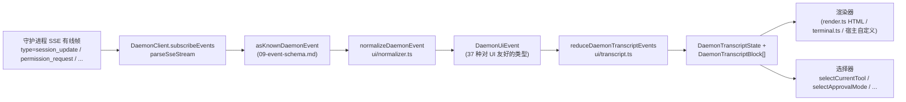

# 共享 UI 转录层

> **当前状态**：`packages/cli/src/ui/daemon/daemon-tui-adapter.ts` 仍保留在 `main` 上，作为旧的实验性 CLI 端适配器。本文档描述的是较新的 SDK 端共享 UI 转录层：可复用的守护进程事件规范化及转录原语，供包括 Web、TUI、IDE 和 IM 通道在内的任何 UI 宿主消费。CLI TUI、通道及 VS Code IDE 的迁移后续进行。

## 概述

`packages/sdk-typescript/src/daemon/ui/` 在 SDK 中新增了一个 `ui/*` 子包。它通过可复用原语将守护进程 SSE 事件流转换为可渲染的 UI 转录块：

- **规范化**（`normalizer.ts`）：将守护进程有线协议中的 43 种已知事件类型（参见 [`09-event-schema.md`](./09-event-schema.md)）映射为 37 个对 UI 友好的 `DaemonUiEventType` 语义事件，例如 `assistant.text.delta`、`tool.update` 和 `session.metadata.changed`。
- **状态机**（`transcript.ts`、`store.ts`）：纯归约器（reducer）加可订阅存储，将 UI 事件投影为有序的 `DaemonTranscriptBlock[]`。
- **渲染器**（`render.ts`、`terminal.ts`、`toolPreview.ts`）：将转录块转换为 HTML、终端文本及工具预览字符串。宿主可以使用或替换它们。
- **一致性测试**（`conformance.ts`）：跨宿主的统一性测试，用于通道、TUI 和 IDE 界面迁移到这些原语时使用。

首个生产消费者是 **`packages/webui/src/daemon/`**（[#4328](https://github.com/QwenLM/qwen-code/pull/4328)）。其 React 的 `DaemonSessionProvider` 和转录适配器让 Web UI 可直接连接守护进程的 HTTP+SSE，而不再仅仅渲染宿主 `postMessage` 流量。CLI TUI、通道基类和 VS Code IDE 之后可以复用同一层；[`../daemon-ui/MIGRATION.md`](../daemon-ui/MIGRATION.md) 文档记录了 v2 增量迁移指南。

## 职责

- 将 43 个守护进程有线事件规范化为稳定的 UI 词汇表（`DaemonUiEventType`），从而渲染器无需检查 `rawEvent.data`。
- 以守护进程单调递增的 SSE `eventId` 作为**主要排序键**，确保不同客户端按相同顺序渲染转录。
- 使用纯归约器生成转录块，并提供选择器用于处理待定权限、当前工具、审批模式、工具进度和子代理子块。
- 提供基础的 HTML 和终端渲染器，同时允许宿主自定义渲染。
- 暴露公共常量，例如用于计划面板的 `DAEMON_PLAN_TOOL_CALL_ID`。
- 保持追加式有线兼容性：未知事件类型会规范化为 `debug` 而非被丢弃。

## 架构

### 包结构

| 文件                                                 | 导出                                                                                                                                               | 用途                         |
| ---------------------------------------------------- | -------------------------------------------------------------------------------------------------------------------------------------------------- | ---------------------------- |
| `packages/sdk-typescript/src/daemon/ui/index.ts`     | 子包桶（barrel）                                                                                                                                   | 公共入口                     |
| `ui/types.ts`                                        | `DaemonUiEventType`、按类型的 `DaemonUiEvent*` 接口、`DaemonTranscriptBlock`、`DaemonTranscriptState`、`DaemonUiToolProvenance`、`DAEMON_PLAN_TOOL_CALL_ID` | 类型                         |
| `ui/normalizer.ts`                                   | `normalizeDaemonEvent(evt) -> DaemonUiEvent`、`getSessionUpdatePayload(evt)`                                                                       | 有线协议到 UI 映射           |
| `ui/transcript.ts`                                   | `createDaemonTranscriptState()`、`appendLocalUserTranscriptMessage()`、`reduceDaemonTranscriptEvents()`、`rebuildDaemonTranscriptBlockIndex()`、选择器 | 状态机和选择器               |
| `ui/store.ts`                                        | `createDaemonTranscriptStore(initial?)`                                                                                                            | 可订阅归约器存储          |
| `ui/toolPreview.ts`                                  | `createDaemonToolPreview(toolEvent)`                                                                                                               | 工具调用摘要文本             |
| `ui/render.ts`                                       | `DaemonHtmlRenderOptions`、`DaemonRenderOptions`、渲染函数                                                                                         | HTML 及通用渲染              |
| `ui/terminal.ts`                                     | 终端特定渲染                                                                                                                                       | TUI 准备                     |
| `ui/conformance.ts`                                  | 跨宿主一致性套件                                                                                                                                | 迁移等价性测试               |
| `ui/utils.ts`                                        | 辅助工具，如 `DaemonUiContentPart`                                                                                                                 | 内部共享工具                 |

### `DaemonUiEventType` 词汇表

`ui/types.ts` 定义了 37 种 UI 事件类型，按领域分组。

**聊天流（阶段 1）**

- `user.text.delta`、`user.image.delta`、`user.shell.command`、`assistant.text.delta`、`assistant.done`、`thought.text.delta`
- `tool.update`、`shell.output`、`user.shell.output`
- `permission.request`、`permission.resolved`
- `model.changed`、`status`、`error`、`debug`

**会话元数据**

- `session.metadata.changed`、`session.approval_mode.changed`
- `session.available_commands`、`session.state_resync_required`、`session.replay_complete`

**提示生命周期（跨客户端）**

- `prompt.cancelled`、`followup.suggestion`

**工作区（阶段 3-4）**

- `workspace.memory.changed`、`workspace.agent.changed`
- `workspace.tool.toggled`、`workspace.settings.changed`、`workspace.initialized`
- `workspace.mcp.budget_warning`、`workspace.mcp.child_refused`
- `workspace.mcp.server_restarted`、`workspace.mcp.server_restart_refused`

**认证流（阶段 4 OAuth）**

- `auth.device_flow.started`、`auth.device_flow.throttled`、`auth.device_flow.authorized`
- `auth.device_flow.failed`、`auth.device_flow.cancelled`

`normalizeDaemonEvent` 将 43 个守护进程已知有线事件映射到此词汇表。未知、未建模或格式错误的事件类型会规范化为 `debug`，并保留 `rawEvent` 供宿主诊断。

### 归约器与选择器

```ts
// 创建初始状态。
const state = createDaemonTranscriptState();

// 应用一个 SSE 事件序列。
const next = reduceDaemonTranscriptEvents(state, daemonUiEvents);

// 选择器。
selectTranscriptBlocks(state); // 所有块
selectTranscriptBlocksOrderedByEventId(state); // 按 eventId 排序；首选键
selectPendingPermissionBlocks(state);
selectCurrentTool(state);
selectApprovalMode(state);
selectToolProgress(state, toolCallId);
selectSubagentChildBlocks(state, parentBlockId);
isSubagentChildBlock(block);
formatBlockTimestamp(block);
formatMissedRange(state); // 在 state_resync_required 后渲染“你错过了 X”文本
```

### 存储

`createDaemonTranscriptStore()` 提供 subscribe 和 dispatch：

```ts
const store = createDaemonTranscriptStore();
store.subscribe(() => render(store.getState()));
store.dispatch(uiEvents); // 内部运行归约器
```

Web UI 的 `DaemonSessionProvider` 在此存储之上构建其 React 上下文。

## 流程

### 单条 SSE 事件端到端



宿主可以在 `(E)` 处停止并实现自己的归约器，也可以消费 `(G)` 及提供的选择器。Web UI 使用完整的 `(B) -> (H)` 路径。迁移后的 TUI 可以消费 `(G)`，并使用 Ink 特定组件进行渲染。

### `state_resync_required`

`session.state_resync_required` 映射为转录中的一个“丢失范围”标记。UI 代码可以调用 `formatMissedRange(state)` 来渲染如“丢失了事件 X-Y”的文本。归约器**继续应用后续事件**，但将受影响的块标记为 `resyncRecovery: true`，以便渲染器添加视觉上下文。参见 [`10-event-bus.md`](./10-event-bus.md) 了解环形驱逐和 `state_resync_required` 语义。

## 消费者

### `packages/webui/src/daemon/`

该内容已在 [#4328](https://github.com/QwenLM/qwen-code/pull/4328) 中合并。

| 文件                          | 导出                                                                                                                                                                                                                                                                                          |
| ----------------------------- | --------------------------------------------------------------------------------------------------------------------------------------------------------------------------------------------------------------------------------------------------------------------------------------------- |
| `DaemonSessionProvider.tsx`   | React `<DaemonSessionProvider />`；`useDaemonSession()`、`useDaemonTranscriptStore()`、`useDaemonTranscriptState()`、`useDaemonTranscriptBlocks()`、`useDaemonPendingPermissions()`、`useDaemonActions()`、`useDaemonConnection()` 钩子；`DaemonConnectionStatus`、`DaemonConnectionState`、`DaemonSessionContextValue` 类型 |
| `transcriptAdapter.ts`        | 将 SDK `DaemonTranscriptBlock` 适配为 Web UI 的 `UnifiedMessage`，包括 Markdown 流式块合并与工具调用摘要                                                                                                                                                                                         |
| `index.ts`                    | 子包桶（barrel）                                                                                                                                                                                                                                                                              |

现在 Web UI 可以直接连接守护进程的 HTTP+SSE 并渲染转录。旧的 `ACPAdapter` 宿主的 `postMessage` 路径仍然可用。

### 后续迁移

[`../daemon-ui/MIGRATION.md`](../daemon-ui/MIGRATION.md) 为 Web 聊天和 Web 终端适配器提供了 v2 增量指南。它明确指出**CLI TUI、通道基类和 VS Code IDE 尚未通过该 PR 迁移**；它们将分别在后续 PR 中迁移，并使用一致性套件保持渲染等价。

## 与旧版 `daemon-tui-adapter.ts` 的关系

| 维度             | 旧版 CLI `DaemonTuiAdapter`                                     | 新版共享转录层                                              |
| ---------------- | --------------------------------------------------------------- | ----------------------------------------------------------- |
| 包               | `packages/cli/src/ui/daemon/`                                   | `packages/sdk-typescript/src/daemon/ui/`                    |
| 公共接口         | `DaemonTuiAdapter`、`DaemonTuiUpdate`、`DaemonTuiSessionClient` | `DaemonUiEventType`、`reduceDaemonTranscriptEvents`、选择器 |
| 范围             | 仅 CLI Ink TUI                                                  | Web、TUI、IDE 或 IM UI                                     |
| 状态形状         | TUI 本地更新联合体                                              | 纯转录块列表加状态字段                                        |
| 排序             | `createdAt`                                                     | `eventId`（守护进程单调递增，跨客户端一致）                   |
| 未知有线类型     | 在 `reduceDaemonEventToTuiUpdates` 中被丢弃                     | 规范化为 `debug` 并保留                                       |
| 测试             | 单包单元测试                                                    | 全局一致性套件，用于跨宿主等价                                |

## 依赖项

- 上游有线类型：`packages/sdk-typescript/src/daemon/events.ts`（参见 [`09-event-schema.md`](./09-event-schema.md)）。
- 实际下游消费者：`packages/webui/src/daemon/`。
- 后续迁移目标：`packages/cli/src/ui/`、`packages/channels/base/` 和 `packages/vscode-ide-companion/src/services/daemonIdeConnection.ts`。
- 并行参考资料：[`../daemon-ui/README.md`](../daemon-ui/README.md)、[`../daemon-ui/MIGRATION.md`](../daemon-ui/MIGRATION.md) 和 [`../daemon-client-adapters/web-ui.md`](../daemon-client-adapters/web-ui.md)。

## 配置

- 无运行时配置。归约器和选择器均为纯函数。
- 宿主选择自己的渲染器：HTML（`render.ts`）、终端（`terminal.ts`）或自定义渲染。
- 调试时，`render.ts` 支持 `includeRawEvent: true` 以在渲染输出中包含原始有线帧。

## 注意事项与已知限制

- **`daemon-tui-adapter.ts` 仍然存在**。它是 CLI 包的旧版实验性适配器。新代码应优先使用 SDK 的 `ui/*`：`normalizeDaemonEvent`、`reduceDaemonTranscriptEvents` 和 `DaemonTranscriptBlock`。
- **CLI TUI、通道基类和 VS Code IDE 尚未迁移**。它们仍维护自己的渲染逻辑。`docs/developers/daemon-client-adapters/` 目录下仍有 `ide.md`、`channel-web.md` 以及历史性的 `tui.md` 草案；较新的 `web-ui.md` 涵盖了 Web UI 适配器设计。
- **`eventId` 是主要排序键**。`createdAt` 作为已弃用的别名（`clientReceivedAt`）保留。新代码应使用 `selectTranscriptBlocksOrderedByEventId(state)`。`MIGRATION.md` 展示了从 `createdAt` 排序切换到 `eventId` 排序的代码差异。
- **未知有线类型规范化为 `debug`**。它们不再像旧适配器中那样被丢弃。渲染器默认不显示 `debug`；宿主必须主动选择显示。
- **包体积**：`ui/*` 子包通过 `@qwen-code/sdk/daemon` 导出为 ESM 子路径，且不引入 React 或 DOM 依赖。仅当 Web UI 消费者使用 `DaemonSessionProvider` 时，才会加载 React 集成。

## 参考资料

- `packages/sdk-typescript/src/daemon/ui/types.ts`（`DaemonUiEventType` 词汇表）
- `packages/sdk-typescript/src/daemon/ui/transcript.ts`（归约器与选择器）
- `packages/sdk-typescript/src/daemon/ui/normalizer.ts`（有线协议到 UI 的映射）
- `packages/sdk-typescript/src/daemon/ui/store.ts`、`render.ts`、`terminal.ts`、`toolPreview.ts`、`conformance.ts`
- `packages/sdk-typescript/src/daemon/index.ts`（`ui/*` 重新导出块）
- `packages/webui/src/daemon/DaemonSessionProvider.tsx`、`transcriptAdapter.ts`
- 上游文档：[`../daemon-ui/README.md`](../daemon-ui/README.md)、[`../daemon-ui/MIGRATION.md`](../daemon-ui/MIGRATION.md)、[`../daemon-client-adapters/web-ui.md`](../daemon-client-adapters/web-ui.md)
- 相关 PR：[#4328](https://github.com/QwenLM/qwen-code/pull/4328)（v1 转录层与 Web UI 提供者）、[#4353](https://github.com/QwenLM/qwen-code/pull/4353)（v2 统一完整性后续）