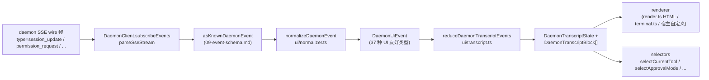

# 共享 UI 对话记录层

> **当前状态**：`packages/cli/src/ui/daemon/daemon-tui-adapter.ts` 仍作为遗留的实验性 CLI 端适配器存在于 `main` 分支中。本文档描述了较新的 SDK 端共享 UI 对话记录层：可复用的 daemon 事件规范化和对话记录原语，任何 UI 宿主（包括 Web、TUI、IDE 和 IM 渠道）均可使用。CLI TUI、渠道和 VS Code IDE 的迁移是后续工作。

## 概述

`packages/sdk-typescript/src/daemon/ui/` 为 SDK 添加了一个 `ui/*` 子包。它通过可复用的原语将 daemon SSE 事件流转换为 UI 可渲染的对话记录块：

- **规范化**（`normalizer.ts`）：将 daemon wire 协议的 47 种已知事件类型（参见 [`09-event-schema.md`](./09-event-schema.md)）映射为 37 种对 UI 友好的 `DaemonUiEventType` 语义事件，例如 `assistant.text.delta`、`tool.update` 和 `session.metadata.changed`。
- **状态机**（`transcript.ts`、`store.ts`）：纯 reducer 加上可订阅的 store，将 UI 事件投影为有序的 `DaemonTranscriptBlock[]`。
- **渲染器**（`render.ts`、`terminal.ts`、`toolPreview.ts`）：将对话记录块渲染为 HTML、终端文本和工具预览字符串。宿主可以使用或替换它们。
- **一致性**（`conformance.ts`）：跨宿主一致性测试，在渠道、TUI 和 IDE 界面迁移到这些原语时使用。

首个生产环境使用者是 **`packages/webui/src/daemon/`**（[#4328](https://github.com/QwenLM/qwen-code/pull/4328)）。其 React `DaemonSessionProvider` 和对话记录适配器使 Web UI 能够直接连接到 daemon HTTP+SSE，而不仅仅是渲染宿主的 `postMessage` 流量。CLI TUI、渠道基础层和 VS Code IDE 后续可复用同一层；[`../daemon-ui/MIGRATION.md`](../daemon-ui/MIGRATION.md) 记录了 v2 增量迁移指南。

## 职责

- 将 47 种 daemon wire 事件规范化为稳定的 UI 词汇表（`DaemonUiEventType`），使渲染器无需检查 `rawEvent.data`。
- 保持 daemon 单调递增的 SSE `eventId` 作为**主要排序键**，确保不同客户端以相同顺序渲染对话记录。
- 使用纯 reducer 生成对话记录块，并提供用于待处理权限、当前工具、审批模式、工具进度和子 agent 子项的 selectors。
- 提供基线 HTML 和终端渲染器，同时允许宿主特定的渲染。
- 公开公共常量，例如用于计划面板的 `DAEMON_PLAN_TOOL_CALL_ID`。
- 保持增量 wire 兼容性：未知事件类型会被规范化为 `debug` 而不是被丢弃。

## 架构

### 包结构

| 文件                                             | 导出                                                                                                                                                           | 用途                     |
| ------------------------------------------------ | ----------------------------------------------------------------------------------------------------------------------------------------------------------------- | --------------------------- |
| `packages/sdk-typescript/src/daemon/ui/index.ts` | 子包入口文件                                                                                                                                                 | 公共入口点          |
| `ui/types.ts`                                    | `DaemonUiEventType`、各类型的 `DaemonUiEvent*` 接口、`DaemonTranscriptBlock`、`DaemonTranscriptState`、`DaemonUiToolProvenance`、`DAEMON_PLAN_TOOL_CALL_ID` | 类型                       |
| `ui/normalizer.ts`                               | `normalizeDaemonEvent(evt) -> DaemonUiEvent`、`getSessionUpdatePayload(evt)`                                                                                      | Wire 到 UI 的映射          |
| `ui/transcript.ts`                               | `createDaemonTranscriptState()`、`appendLocalUserTranscriptMessage()`、`reduceDaemonTranscriptEvents()`、`rebuildDaemonTranscriptBlockIndex()`、selectors         | 状态机和 selectors |
| `ui/store.ts`                                    | `createDaemonTranscriptStore(initial?)`                                                                                                                           | 可订阅的 reducer store  |
| `ui/toolPreview.ts`                              | `createDaemonToolPreview(toolEvent)`                                                                                                                              | 工具调用摘要文本      |
| `ui/render.ts`                                   | `DaemonHtmlRenderOptions`、`DaemonRenderOptions`、渲染函数                                                                                                | HTML 和通用渲染  |
| `ui/terminal.ts`                                 | 终端特定渲染                                                                                                                                       | TUI 准备             |
| `ui/conformance.ts`                              | 跨宿主一致性测试套件                                                                                                                                      | 迁移一致性测试      |
| `ui/utils.ts`                                    | 诸如 `DaemonUiContentPart` 等辅助工具                                                                                                                             | 内部共享工具函数   |

### `DaemonUiEventType` 词汇表

`ui/types.ts` 定义了 37 种 UI 事件类型，按领域分组。

**聊天流（阶段 1）**

- `user.text.delta`、`user.image.delta`、`user.shell.command`、`assistant.text.delta`、`assistant.done`、`thought.text.delta`
- `tool.update`、`shell.output`、`user.shell.output`
- `permission.request`、`permission.resolved`
- `model.changed`、`status`、`error`、`debug`

**会话元数据**

- `session.metadata.changed`、`session.approval_mode.changed`
- `session.available_commands`、`session.state_resync_required`、`session.replay_complete`

**Prompt 生命周期（跨客户端）**

- `prompt.cancelled`、`followup.suggestion`

**工作区（Wave 3-4）**

- `workspace.memory.changed`、`workspace.agent.changed`
- `workspace.tool.toggled`、`workspace.settings.changed`、`workspace.initialized`
- `workspace.mcp.budget_warning`、`workspace.mcp.child_refused`
- `workspace.mcp.server_restarted`、`workspace.mcp.server_restart_refused`

**认证流程（Wave 4 OAuth）**

- `auth.device_flow.started`、`auth.device_flow.throttled`、`auth.device_flow.authorized`
- `auth.device_flow.failed`、`auth.device_flow.cancelled`

`normalizeDaemonEvent` 将 47 种已知的 daemon wire 事件映射到此词汇表中。未知、未建模或格式错误的事件类型会被规范化为 `debug`，并保留 `rawEvent` 以供宿主诊断。

### Reducer 和 selectors

```ts
// 创建初始状态。
const state = createDaemonTranscriptState();

// 应用 SSE 事件序列。
const next = reduceDaemonTranscriptEvents(state, daemonUiEvents);

// Selectors。
selectTranscriptBlocks(state); // 所有块
selectTranscriptBlocksOrderedByEventId(state); // 按 eventId 排序；首选键
selectPendingPermissionBlocks(state);
selectCurrentTool(state);
selectApprovalMode(state);
selectToolProgress(state, toolCallId);
selectSubagentChildBlocks(state, parentBlockId);
isSubagentChildBlock(block);
formatBlockTimestamp(block);
formatMissedRange(state); // state_resync_required 之后的 "you missed X" 文本
```

### Store

`createDaemonTranscriptStore()` 提供 subscribe 和 dispatch：

```ts
const store = createDaemonTranscriptStore();
store.subscribe(() => render(store.getState()));
store.dispatch(uiEvents); // 内部运行 reducer
```

Web UI 的 `DaemonSessionProvider` 在此 store 之上构建其 React context。

## 流程

### 单个 SSE 事件的端到端流程



宿主可以在 `(E)` 处停止并实现自己的 reducer，或者消费 `(G)` 及提供的 selectors。Web UI 使用完整的 `(B) -> (H)` 路径。迁移后的 TUI 可以消费 `(G)` 并使用 Ink 特定组件进行渲染。

### `state_resync_required`

`session.state_resync_required` 映射为对话记录的“错过范围”标记。UI 代码可以调用 `formatMissedRange(state)` 来渲染诸如“错过事件 X-Y”的文本。reducer **会继续应用后续事件**，但会将受影响的块标记为 `resyncRecovery: true`，以便渲染器添加视觉上下文。有关 ring-eviction 和 `state_resync_required` 语义，请参见 [`10-event-bus.md`](./10-event-bus.md)。

## 使用者

### `packages/webui/src/daemon/`

此功能已在 [#4328](https://github.com/QwenLM/qwen-code/pull/4328) 中合入。

| 文件                        | 导出                                                                                                                                                                                                                                                                                                                        |
| --------------------------- | ------------------------------------------------------------------------------------------------------------------------------------------------------------------------------------------------------------------------------------------------------------------------------------------------------------------------------ |
| `DaemonSessionProvider.tsx` | React `<DaemonSessionProvider />`；`useDaemonSession()`、`useDaemonTranscriptStore()`、`useDaemonTranscriptState()`、`useDaemonTranscriptBlocks()`、`useDaemonPendingPermissions()`、`useDaemonActions()`、`useDaemonConnection()` hooks；`DaemonConnectionStatus`、`DaemonConnectionState`、`DaemonSessionContextValue` 类型 |
| `transcriptAdapter.ts`      | 将 SDK 的 `DaemonTranscriptBlock` 适配为 Web UI 的 `UnifiedMessage`，包括 markdown 流式分块合并和工具调用摘要                                                                                                                                                                                        |
| `index.ts`                  | 子包入口文件                                                                                                                                                                                                                                                                                                              |

Web UI 现在可以直接连接到 daemon HTTP+SSE 并渲染对话记录。旧的 `ACPAdapter` 宿主 `postMessage` 路径仍然可用。

### 后续迁移

[`../daemon-ui/MIGRATION.md`](../daemon-ui/MIGRATION.md) 为 Web 聊天和 Web 终端适配器提供了 v2 增量指南。它明确指出 **CLI TUI、渠道基础层和 VS Code IDE 未在该 PR 中迁移**；它们将在后续 PR 中进行迁移，并使用一致性测试套件来保持渲染一致性。

## 与遗留 `daemon-tui-adapter.ts` 的关系

| 维度         | 遗留 CLI `DaemonTuiAdapter`                                   | 新的共享对话记录层                                    |
| ----------------- | --------------------------------------------------------------- | -------------------------------------------------------------- |
| 包           | `packages/cli/src/ui/daemon/`                                   | `packages/sdk-typescript/src/daemon/ui/`                       |
| 公共接口    | `DaemonTuiAdapter`、`DaemonTuiUpdate`、`DaemonTuiSessionClient` | `DaemonUiEventType`、`reduceDaemonTranscriptEvents`、selectors |
| 范围             | 仅限 CLI Ink TUI                                                | Web、TUI、IDE 或 IM UI                                        |
| 状态结构       | TUI 本地更新联合类型                                          | 纯对话记录块列表加状态字段                   |
| 排序          | `createdAt`                                                     | `eventId`（daemon 单调递增，跨客户端一致）        |
| 未知 wire 类型 | 在 `reduceDaemonEventToTuiUpdates` 中丢弃                      | 规范化为 `debug` 并保留                            |
| 测试             | 单包单元测试                                       | 用于跨宿主一致性的全局一致性测试套件                 |

## 依赖项

- 上游 wire 类型：`packages/sdk-typescript/src/daemon/events.ts`（参见 [`09-event-schema.md`](./09-event-schema.md)）。
- 实际下游使用者：`packages/webui/src/daemon/`。
- 后续迁移目标：`packages/cli/src/ui/`、`packages/channels/base/` 和 `packages/vscode-ide-companion/src/services/daemonIdeConnection.ts`。
- 并行参考：[`../daemon-ui/README.md`](../daemon-ui/README.md)、[`../daemon-ui/MIGRATION.md`](../daemon-ui/MIGRATION.md) 和 [`../daemon-client-adapters/web-ui.md`](../daemon-client-adapters/web-ui.md)。

## 配置

- 无运行时配置。Reducer 和 selectors 是纯函数。
- 宿主选择其渲染器：HTML（`render.ts`）、终端（`terminal.ts`）或自定义渲染。
- 为了调试，`render.ts` 支持 `includeRawEvent: true` 以在渲染输出中包含原始 wire 帧。

## 注意事项与已知限制

- **`daemon-tui-adapter.ts` 仍然存在**。它是 CLI 包的遗留实验性适配器。新代码应优先使用 SDK 的 `ui/*`：`normalizeDaemonEvent`、`reduceDaemonTranscriptEvents` 和 `DaemonTranscriptBlock`。
- **CLI TUI、渠道基础层和 VS Code IDE 尚未迁移**。它们仍然维护自己的渲染逻辑。`docs/developers/daemon-client-adapters/` 目录中仍有 `ide.md`、`channel-web.md` 和历史草稿 `tui.md`；较新的 `web-ui.md` 涵盖了 Web UI 适配器设计。
- **`eventId` 是主要排序键**。`createdAt` 作为已弃用的别名（`clientReceivedAt`）保留。新代码应使用 `selectTranscriptBlocksOrderedByEventId(state)`。`MIGRATION.md` 展示了从 `createdAt` 排序切换到 `eventId` 排序的代码差异。
- **未知 wire 类型规范化为 `debug`**。它们不再像旧适配器那样被丢弃。渲染器默认不显示 `debug`；宿主必须主动选择显示它。
- **包体积**：`ui/*` 子包通过 `@qwen-code/sdk/daemon` 作为 ESM 子路径导出，不会引入 React 或 DOM 依赖项。仅当 Web UI 使用者使用 `DaemonSessionProvider` 时才会加载 React 集成。

## 参考资料

- `packages/sdk-typescript/src/daemon/ui/types.ts`（`DaemonUiEventType` 词汇表）
- `packages/sdk-typescript/src/daemon/ui/transcript.ts`（reducer 和 selectors）
- `packages/sdk-typescript/src/daemon/ui/normalizer.ts`（wire 到 UI 的映射）
- `packages/sdk-typescript/src/daemon/ui/store.ts`、`render.ts`、`terminal.ts`、`toolPreview.ts`、`conformance.ts`
- `packages/sdk-typescript/src/daemon/index.ts`（`ui/*` 重新导出块）
- `packages/webui/src/daemon/DaemonSessionProvider.tsx`、`transcriptAdapter.ts`
- 上游文档：[`../daemon-ui/README.md`](../daemon-ui/README.md)、[`../daemon-ui/MIGRATION.md`](../daemon-ui/MIGRATION.md)、[`../daemon-client-adapters/web-ui.md`](../daemon-client-adapters/web-ui.md)
- 相关 PR：[#4328](https://github.com/QwenLM/qwen-code/pull/4328)（v1 对话记录层和 Web UI provider）、[#4353](https://github.com/QwenLM/qwen-code/pull/4353)（v2 统一完整性后续工作）