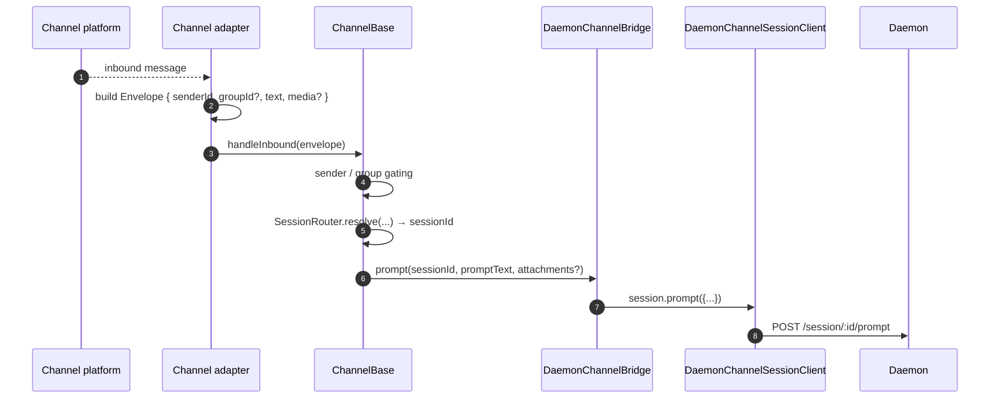
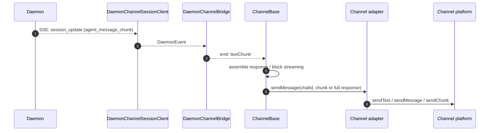
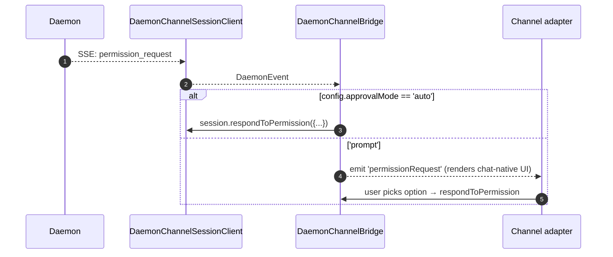

# Channel Adapters

## 概述

`packages/channels/` 包含 **IM channel 适配器**，负责将聊天平台的入站消息转换为 daemon 提示词，并将 daemon 的出站事件转换为聊天平台消息。目前内置四个具体的 channel：钉钉（DingTalk）、微信（Weixin）、Telegram 和飞书（Feishu）。它们共享一个基础层（`packages/channels/base/`）以及一个处理会话多路复用和 SSE 消费的 `DaemonChannelBridge`。

每个 channel 通过可配置的 `SessionScope`（`user`、`thread` 或 `single`）将入站聊天流量映射到 daemon 会话。适配器委托给 `DaemonChannelBridge`，后者再委托给 SDK 的 `DaemonSessionClient`（参见 [`13-sdk-daemon-client.md`](./13-sdk-daemon-client.md)）。

## 职责

- 通过 channel 的原生传输层接收入站消息（钉钉 WebSocket 流、微信 HTTP 长轮询、Telegram Bot 长轮询、飞书 WebSocket 或 HTTP webhook）。
- 通过 `DaemonChannelSessionFactory` 将 `(senderId, groupId?)` 解析为 daemon 会话。
- 将用户消息作为 daemon 提示词转发，并将响应以出站聊天消息的形式流式返回，可能会分块处理。
- 在交互模式下将权限请求渲染为聊天平台原生提示；否则根据 `ChannelConfig.approvalMode` 自动批准。
- 应用发送者过滤（allowlist / denylist）、群组过滤以及内容规范化（各 channel 的 markdown / HTML 格式）。

## 架构

### `DaemonChannelBridge`（共享基础层，`packages/channels/base/src/DaemonChannelBridge.ts`）

```ts
class DaemonChannelBridge extends EventEmitter {
  constructor(opts: {
    cwd: string;
    sessionFactory: DaemonChannelSessionFactory;
    modelServiceId?: string;
    sessionScope?: SessionScope;
  });
  newSession(cwd: string): Promise<string>;
  loadSession(sessionId: string, cwd: string): Promise<string>;
  prompt(sessionId: string, text: string, options?): Promise<string>;
  cancelSession(sessionId: string): Promise<void>;
  stop(): void;
}
```

以 daemon `sessionId` 为键存储 daemon 会话客户端；`ChannelBase` 和 `SessionRouter` 决定哪个入站聊天目标映射到该会话。每个挂载的会话包含：

- 一个 `DaemonChannelSessionClient`（`DaemonSessionClient` 去除 channel 无关方法后的形态）。
- 一个实时 SSE 消费泵。
- 一个防抖提示词组装器（用于将用户输入碎片化跨多条入站消息的适配器）。
- 每条请求的自动批准策略。

发出的事件：`textChunk`、`toolCall`、`sessionUpdate`、`permissionRequest`、`permissionResolved`、`modelSwitched`、`modelSwitchFailed`、`sessionDied`、`promptComplete` 和 `error`。Channel 适配器将这些事件接入平台原生 API。

### `ChannelBase`（`packages/channels/base/src/ChannelBase.ts`）

每个适配器继承的抽象基类：

```ts
abstract class ChannelBase {
  abstract connect(): Promise<void>;
  abstract sendMessage(chatId: string, text: string): Promise<void>;
  abstract disconnect(): void;
  handleInbound(envelope: Envelope): Promise<void>; // → SessionRouter.resolve + bridge.prompt
}
```

处理公共横切关注点：发送者过滤（allowlist / denylist）、群组过滤、消息块流式传输（块大小、限流）、入站防抖。

### 各 channel 适配器

| 适配器           | 文件                                                | 传输方式                                                   | 备注                                                                                                         |
| --------------- | --------------------------------------------------- | ---------------------------------------------------------- | ------------------------------------------------------------------------------------------------------------ |
| DingTalk        | `packages/channels/dingtalk/src/DingtalkAdapter.ts` | DingTalk Stream SDK WebSocket                              | 通过 `sessionWebhook` POST 发送；媒体图片通过 DT API 下载，以 base64 格式放入 envelope。                      |
| WeChat (Weixin) | `packages/channels/weixin/src/WeixinAdapter.ts`     | iLink Bot HTTP 长轮询                                       | 通过专有 `sendText` / `sendImage` API 发送；支持正在输入指示器。                                              |
| Telegram        | `packages/channels/telegram/src/TelegramAdapter.ts` | Telegram Bot API 长轮询（grammy）                           | 通过 `sendMessage` 发送 HTML 块。                                                                            |
| Feishu          | `packages/channels/feishu/src/FeishuAdapter.ts`     | 飞书/Lark Stream WebSocket（默认）或 HTTP webhook            | 通过 Lark SDK 以交互式卡片形式发送；webhook 模式需要 `encryptKey` 进行 HMAC 签名验证。                         |

每个适配器实现：

1. 入站传输（订阅/轮询消息）。
2. Envelope 构建（`{ senderId, groupId?, text, media?, raw }`）。
3. 发送者/群组过滤（委托给 `ChannelBase`）。
4. 出站序列化（markdown → HTML / 微信原生 / 钉钉原生）。
5. 生命周期（启动/关闭）。

### 适配器矩阵

| 适配器       | 传输方式                       | 身份标识                                                    | 权限 UX                              | 自动批准配置                                              |
| ------------ | ------------------------------ | ------------------------------------------------------------ | ------------------------------------ | --------------------------------------------------------- |
| **DingTalk** | WebSocket 流                   | `senderStaffId`（+ 可选的群组 `conversationId`）             | 通过 DT markdown 内联按钮            | `ChannelConfig.approvalMode = 'auto' \| 'prompt'`         |
| **WeChat**   | HTTP 长轮询                    | `senderWxid`（+ 可选的群组 `groupWxid`）                     | 纯文本提示加回复 token               | 同上                                                      |
| **Telegram** | Bot API 长轮询                 | `from.id`（+ 可选群组的 `chat.id`）                          | 内联键盘按钮                         | 同上                                                      |
| **Feishu**   | WebSocket 流 / HTTP webhook    | `sender.open_id`（+ 可选群组的 `chat_id`）                   | 交互式卡片按钮                       | 同上                                                      |

> **Note:** "权限 UX" 列描述各平台的原生操作方式，但目前均未接入 — `AcpBridge.requestPermission` 当前对所有请求自动批准（`packages/channels/base/src/AcpBridge.ts`），且 `ChannelConfig.approvalMode` 已声明但尚未读取。交互式批准计划在 Phase 5 实现。

## 工作流

### 入站提示词



### SSE 驱动的出站



### 权限自动批准



## 状态与生命周期

- `DaemonChannelBridge` 与 channel 适配器共存亡；其中的会话根据配置的 `SessionScope` 决定生命周期。
- 每个活跃会话在 SSE 断开后会自动重连 — `DaemonSessionClient.events()` 跟踪 `lastSeenEventId` 以确保重放正确。
- `shutdown()` 关闭所有活跃会话及底层传输（channel 的 WebSocket / 长轮询）。
- 钉钉的 WebSocket 流支持服务器推送；微信的长轮询在空闲响应时需要退避策略；Telegram 的长轮询有内置的 `timeout` 参数。

## 依赖

- `packages/channels/base/` — `ChannelBase`、`DaemonChannelBridge`、`types.ts`（`ChannelConfig`、`Envelope`、`SessionScope`、`ChannelPlugin`）。
- `packages/sdk-typescript/src/daemon/` — `DaemonSessionClient` 及相关类。
- 各 channel SDK：`@dingtalk/stream`（钉钉）、专有 iLink Bot HTTP（微信）、`grammy`（Telegram）。

## 配置

`ChannelConfig`（来自 `packages/channels/base/src/types.ts`）：

| 配置项                                   | 作用                                                                                                      |
| ---------------------------------------- | --------------------------------------------------------------------------------------------------------- |
| `sessionScope`                           | `'user'`（发送者 + 聊天）、`'thread'`（thread id 或聊天）或 `'single'`（每个 channel 共用一个会话）。     |
| `approvalMode`                           | `'auto'`（自动响应）/ `'prompt'`（渲染 UI）。                                                             |
| `allowlist?: string[]`                   | 允许的发送者 id；缺失则开放。                                                                             |
| `denylist?: string[]`                    | 拒绝的发送者 id。                                                                                         |
| `chunkSize`, `chunkIntervalMs`           | 出站块流式传输设置。                                                                                      |
| `daemon: { baseUrl, token?, clientId? }` | 转发给 `DaemonChannelSessionFactory`。                                                                    |

各 channel 专属配置叠加在上层（钉钉：`streamCredentials`；微信：`ilinkUrl`、`botId`；Telegram：`botToken`；飞书：`clientId`（appId）、`clientSecret`（appSecret）、`verificationToken`、`encryptKey`（webhook 模式））。

## 注意事项与已知限制

- **Channel 不直接导入 `@qwen-code/sdk`。** 它们通过 `ChannelBase` → `DaemonChannelBridge` → `DaemonChannelSessionClient`（由 bridge 从 SDK 构造）进行访问。这种间接层允许 bridge 在不修改 channel 的情况下替换实现，例如替换为测试桩。
- **权限 UX 因 channel 而异。** 钉钉使用 markdown 按钮；微信仅支持纯文本；Telegram 使用内联键盘；飞书使用交互式卡片按钮。（目前均通过 `AcpBridge` 自动批准；交互式批准已规划。）尚无通用的"交互式权限组件"抽象。
- **自动批准是部署侧的决策**，而非 daemon 侧的决策。daemon 的 `permission_mediation` 策略仍然生效；自动批准仅意味着 channel 无需提示用户即可响应。不要将 `auto` 与 `enforce` 级别的工作流结合使用。
- **各 channel 的速率限制/消息大小限制由适配器负责。** `DaemonChannelBridge` 只处理分块；超过微信单条消息大小或 Telegram 洪水限制由适配器处理。
- **不支持钉钉/微信/Telegram/飞书的反向回调** — channel 是单向的（聊天 → daemon → 聊天）。IM 平台的原生推送路径（如钉钉卡片回调）尚未接入 bridge。

## 参考

- `packages/channels/base/src/DaemonChannelBridge.ts`
- `packages/channels/base/src/ChannelBase.ts`
- `packages/channels/base/src/types.ts`
- `packages/channels/dingtalk/src/DingtalkAdapter.ts`
- `packages/channels/weixin/src/WeixinAdapter.ts`
- `packages/channels/telegram/src/TelegramAdapter.ts`
- `packages/channels/plugin-example/`（参考插件脚手架）
- Channel 插件指南：[`../channel-plugins.md`](../channel-plugins.md)。
- SDK 参考：[`13-sdk-daemon-client.md`](./13-sdk-daemon-client.md)。
