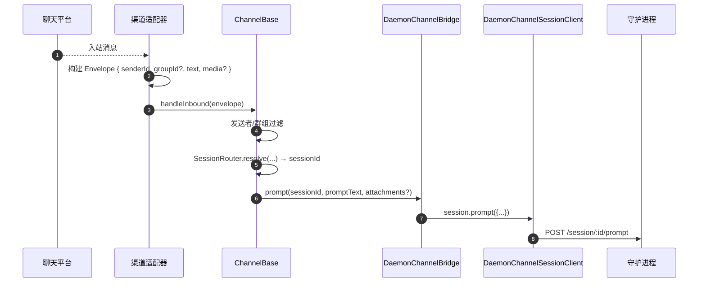
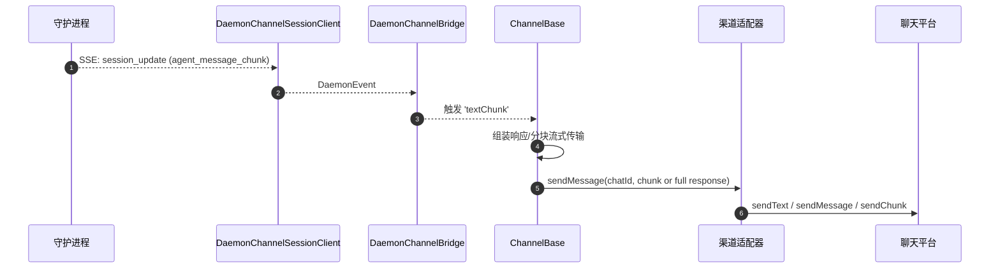
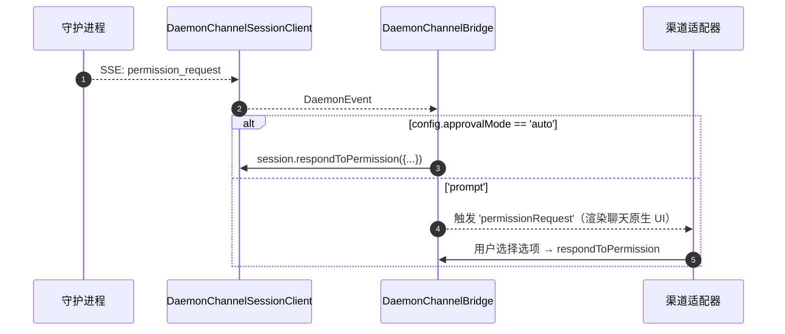

# 渠道适配器

## 概述

`packages/channels/` 包含 **IM 渠道适配器**，负责将聊天平台接收到的消息转换为 agent prompt，并将 agent 的响应发送回聊天平台。目前内置了四个具体的渠道：钉钉 (DingTalk)、微信 (WeChat/Weixin)、Telegram 和飞书 (Feishu)。它们共享一个基础层 (`packages/channels/base/`) 和一个面向适配器的 `ChannelAgentBridge` 契约。

目前有两种宿主模式：

- `qwen channel start [name]` 是独立的 ACP 支持的渠道服务。它向适配器传递 `ChannelAgentBridge` 的 `AcpBridge` 实现。
- `qwen serve --channel <name>` 和 `qwen serve --channel all` 是实验性的守护进程管理模式。`qwen serve` 会启动一个进程外的渠道 worker，该 worker 通过 SDK 连接到守护进程，适配器接收由 `DaemonChannelBridge` 支持的 `ChannelAgentBridge` 门面。

在守护进程管理模式下，每个渠道将入站聊天流量映射到可配置 `SessionScope`（`user`、`thread` 或 `single`）下的守护进程会话。适配器委托给 `DaemonChannelBridge`，后者再委托给 SDK 的 `DaemonSessionClient`（参见 [`13-sdk-daemon-client.md`](./13-sdk-daemon-client.md)）。一个守护进程绑定到一个工作区，因此每个所选渠道的 `cwd` 必须解析为该守护进程的工作区。

## 职责

- 接收来自渠道原生传输的入站消息（钉钉 WebSocket 流、微信 HTTP 长轮询、Telegram Bot 长轮询、飞书 WebSocket 或 HTTP webhook）。
- 通过 `DaemonChannelSessionFactory` 将 `(senderId, groupId?)` 解析为守护进程会话。
- 将用户消息作为守护进程 prompt 转发，并将响应以出站聊天消息的形式流式传回，可能会进行分块。
- 在交互模式下将权限请求渲染为聊天原生提示；否则根据 `ChannelConfig.approvalMode` 自动批准。
- 应用发送者过滤（白名单/黑名单）、群组过滤以及内容规范化（根据渠道转换为 markdown / HTML）。

## 架构

### `DaemonChannelBridge`（共享基础类，`packages/channels/base/src/DaemonChannelBridge.ts`）

```ts
class DaemonChannelBridge extends EventEmitter {
  constructor(opts: {
    cwd: string;
    sessionFactory: DaemonChannelSessionFactory;
    modelServiceId?: string;
    sessionScope?: SessionScope;
  });
  newSession(cwd: string): Promise<string>;
  loadSession(sessionId: string, cwd: string): Promise<string>;
  prompt(sessionId: string, text: string, options?): Promise<string>;
  cancelSession(sessionId: string): Promise<void>;
  stop(): void;
}
```

保存以守护进程 `sessionId` 为键的守护进程会话客户端；`ChannelBase` 和 `SessionRouter` 决定哪个入站聊天目标映射到该会话。每个附加的会话包含：

- 一个 `DaemonChannelSessionClient`（`DaemonSessionClient` 的形状，去除了与渠道无关的方法）。
- 一个活跃的 SSE 消费泵。
- 一个防抖的 prompt 组装器（用于将跨多个入站消息分片的用户输入进行组装的适配器）。
- 每个请求的自动批准策略。

触发的事件包括：`textChunk`、`toolCall`、`sessionUpdate`、`permissionRequest`、`permissionResolved`、`modelSwitched`、`modelSwitchFailed`、`sessionDied`、`promptComplete` 和 `error`。渠道适配器将这些事件接入平台原生 API。

### `ChannelBase` (`packages/channels/base/src/ChannelBase.ts`)

每个适配器扩展的抽象基类：

```ts
abstract class ChannelBase {
  abstract connect(): Promise<void>;
  abstract sendMessage(chatId: string, text: string): Promise<void>;
  abstract disconnect(): void;
  handleInbound(envelope: Envelope): Promise<void>; // → SessionRouter.resolve + bridge.prompt
}
```

处理常见的横切关注点：发送者过滤（白名单/黑名单）、群组过滤、消息块流式传输（分块大小、节流）、入站防抖。

### 各渠道适配器

| 适配器 | 文件 | 传输方式 | 备注 |
| --- | --- | --- | --- |
| 钉钉 | `packages/channels/dingtalk/src/DingtalkAdapter.ts` | 钉钉 Stream SDK WebSocket | 通过 `sessionWebhook` POST 发送；媒体图片通过钉钉 API 下载，在 envelope 中以 base64 形式存在。 |
| 微信 (Weixin) | `packages/channels/weixin/src/WeixinAdapter.ts` | iLink Bot HTTP 长轮询 | 通过专有的 `sendText` / `sendImage` API 发送；支持输入中指示器。 |
| Telegram | `packages/channels/telegram/src/TelegramAdapter.ts` | Telegram Bot API 长轮询 (grammy) | 通过 `sendMessage` 发送 HTML 分块。 |
| 飞书 | `packages/channels/feishu/src/FeishuAdapter.ts` | 飞书/Lark Stream WebSocket（默认）或 HTTP webhook | 通过 Lark SDK 作为交互卡片发送；webhook 模式需要 `encryptKey` 进行 HMAC 签名验证。 |

每个适配器实现：

1. 入站传输（订阅/轮询消息）。
2. Envelope 构建（`{ senderId, groupId?, text, media?, raw }`）。
3. 发送者/群组过滤（委托给 `ChannelBase`）。
4. 出站序列化（markdown → HTML / 微信原生 / 钉钉原生）。
5. 生命周期（启动/关闭）。

### 适配器矩阵

| 适配器 | 传输方式 | 身份标识 | 权限 UX | 自动批准配置 |
| --- | --- | --- | --- | --- |
| **钉钉** | WebSocket 流 | `senderStaffId`（群组可选 `conversationId`） | 通过钉钉 markdown 的内联按钮 | `ChannelConfig.approvalMode = 'auto' \| 'prompt'` |
| **微信** | HTTP 长轮询 | `senderWxid`（群组可选 `groupWxid`） | 带有回复 token 的纯文本提示 | 同上 |
| **Telegram** | Bot API 长轮询 | `from.id`（群组可选 `chat.id`） | 内联键盘按钮 | 同上 |
| **飞书** | WebSocket 流 / HTTP webhook | `sender.open_id`（群组可选 `chat_id`） | 交互卡片按钮 | 同上 |

> **注意：** “权限 UX”列描述了各平台的原生交互方式，但目前尚未接入——`AcpBridge.requestPermission` 当前会自动批准所有请求（`packages/channels/base/src/AcpBridge.ts`），并且 `ChannelConfig.approvalMode` 已声明但尚未被读取。交互式批准功能已在计划中（Phase 5）。

## 工作流

### 入站 prompt



### SSE 驱动的出站



### 权限自动批准



## 状态与生命周期

- `DaemonChannelBridge` 的生命周期与渠道适配器一致；其内部的会话生命周期由配置的 `SessionScope` 决定。
- 如果 SSE 断开，每个活跃会话会自动重连——`DaemonSessionClient.events()` 会跟踪 `lastSeenEventId` 以确保重放正确。
- `shutdown()` 会关闭所有活跃会话和底层传输（渠道的 WebSocket/长轮询）。
- 钉钉的 WebSocket 流支持服务端推送；微信的长轮询在空闲响应时需要退避策略；Telegram 的长轮询内置了 `timeout` 参数。

## 依赖

- `packages/channels/base/` — `ChannelBase`、`DaemonChannelBridge`、`types.ts`（`ChannelConfig`、`Envelope`、`SessionScope`、`ChannelPlugin`）。
- `packages/sdk-typescript/src/daemon/` — `DaemonSessionClient` 及相关模块。
- 各渠道 SDK：`@dingtalk/stream`（钉钉）、专有的 iLink Bot HTTP（微信）、`grammy`（Telegram）。

## 配置

`ChannelConfig`（来自 `packages/channels/base/src/types.ts`）：

| 配置项 | 作用 |
| --- | --- |
| `sessionScope` | `'user'`（发送者 + 聊天）、`'thread'`（线程 id 或聊天）或 `'single'`（每个渠道一个共享会话）。 |
| `approvalMode` | `'auto'`（自动响应）/ `'prompt'`（渲染 UI）。 |
| `allowlist?: string[]` | 允许的发送者 id；缺失则表示开放。 |
| `denylist?: string[]` | 拒绝的发送者 id。 |
| `chunkSize`, `chunkIntervalMs` | 出站分块流式传输设置。 |
| `daemon: { baseUrl, token?, clientId? }` | 转发给 `DaemonChannelSessionFactory`。 |

渠道特定的配置项在此基础上叠加（钉钉：`streamCredentials`；微信：`ilinkUrl`、`botId`；Telegram：`botToken`；飞书：`clientId` (appId)、`clientSecret` (appSecret)、`verificationToken`、`encryptKey`（webhook 模式））。

## 注意事项与已知限制

- **渠道不直接导入 `@qwen-code/sdk`。** 它们通过 `ChannelBase` → `DaemonChannelBridge` → `DaemonChannelSessionClient`（由 bridge 从 SDK 构建）进行交互。这种间接方式允许 bridge 替换实现（例如测试桩），而无需修改渠道代码。
- **权限 UX 因渠道而异。** 钉钉使用 markdown 按钮；微信仅支持纯文本；Telegram 使用内联键盘；飞书使用交互卡片按钮。（目前均通过 `AcpBridge` 自动批准；交互式批准功能已在计划中。）目前还没有通用的“交互式权限组件”抽象。
- **自动批准是部署侧的决策**，而非守护进程侧的决策。守护进程的 `permission_mediation` 策略仍然适用；自动批准仅意味着渠道在不提示用户的情况下进行响应。请勿将 `auto` 与 `enforce` 级别的工作流结合使用。
- **各渠道的速率限制/消息大小限制由适配器负责。** `DaemonChannelBridge` 仅处理分块；超出微信单条消息大小限制或 Telegram 频率限制的问题由适配器处理。
- **没有钉钉/微信/Telegram/飞书的反向调用**——渠道是单向的（聊天 → 守护进程 → 聊天）。IM 平台的原生推送路径（如钉钉卡片回调）尚未接入 bridge。

## 参考资料

- `packages/channels/base/src/DaemonChannelBridge.ts`
- `packages/channels/base/src/ChannelBase.ts`
- `packages/channels/base/src/types.ts`
- `packages/channels/dingtalk/src/DingtalkAdapter.ts`
- `packages/channels/weixin/src/WeixinAdapter.ts`
- `packages/channels/telegram/src/TelegramAdapter.ts`
- `packages/channels/plugin-example/`（参考插件脚手架）
- 渠道插件指南：[`../channel-plugins.md`](../channel-plugins.md)。
- SDK 参考：[`13-sdk-daemon-client.md`](./13-sdk-daemon-client.md)。