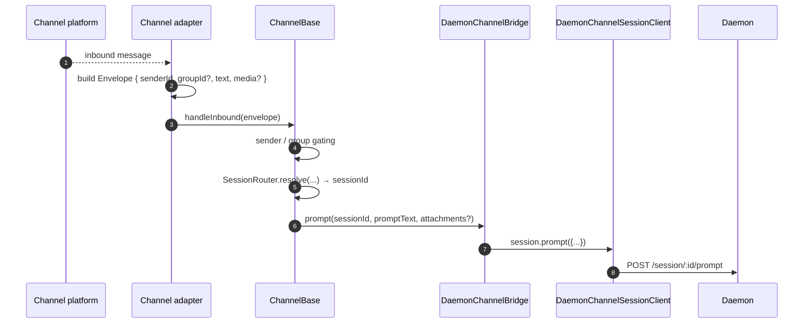
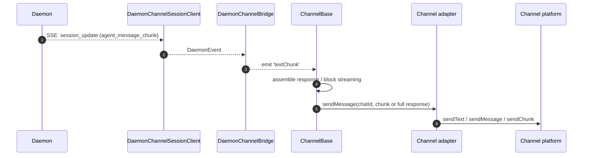
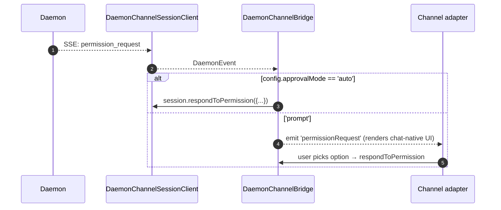

# Channel 适配器

## 概述

`packages/channels/` 目录包含 **IM 频道适配器**，用于将聊天平台传入的消息转换为 daemon 提示词，并将 daemon 的出站事件转换为聊天平台消息。当前内置了四个具体频道：钉钉、微信、Telegram 和飞书。它们共享一个基础层 (`packages/channels/base/`) 以及一个处理会话复用和 SSE 消费的 `DaemonChannelBridge`。

每个频道在可配置的 `SessionScope` (`user`、`thread` 或 `single`) 下将入站聊天流量映射到 daemon 会话。适配器委托给 `DaemonChannelBridge`，该桥接器再委托给 SDK 的 `DaemonSessionClient`（参见 [`13-sdk-daemon-client.md`](./13-sdk-daemon-client.md)）。

## 职责

- 从频道的原生传输层接收入站消息（钉钉 WebSocket 流、微信 HTTP 长轮询、Telegram Bot 长轮询、飞书 WebSocket 或 HTTP webhook）。
- 通过 `DaemonChannelSessionFactory` 将 `(senderId, groupId?)` 解析为 daemon 会话。
- 将用户消息转发为 daemon 提示词，并将响应流式传输回为出站聊天消息，可能分块。
- 在交互模式下将权限请求渲染为聊天原生提示；否则根据 `ChannelConfig.approvalMode` 自动批准。
- 应用发送者门控（白名单/黑名单）、群组门控以及内容规范化（按频道处理 markdown / HTML）。

## 架构

### `DaemonChannelBridge`（共享基础，`packages/channels/base/src/DaemonChannelBridge.ts`）

```ts
class DaemonChannelBridge extends EventEmitter {
  constructor(opts: {
    cwd: string;
    sessionFactory: DaemonChannelSessionFactory;
    modelServiceId?: string;
    sessionScope?: SessionScope;
  });
  newSession(cwd: string): Promise<string>;
  loadSession(sessionId: string, cwd: string): Promise<string>;
  prompt(sessionId: string, text: string, options?): Promise<string>;
  cancelSession(sessionId: string): Promise<void>;
  stop(): void;
}
```

持有以 daemon `sessionId` 为键的 daemon 会话客户端；`ChannelBase` 和 `SessionRouter` 决定哪个入站聊天目标映射到该会话。每个附加的会话包含：

- 一个 `DaemonChannelSessionClient`（形状与 `DaemonSessionClient` 相同，但去掉了与频道无关的方法）。
- 一个活跃的 SSE 消费者泵。
- 一个去抖的提示词组装器（适用于那些将用户输入分散到多个入站消息中的适配器）。
- 每个请求的自动批准策略。

发出的事件：`textChunk`、`toolCall`、`sessionUpdate`、`permissionRequest`、`permissionResolved`、`modelSwitched`、`modelSwitchFailed`、`sessionDied`、`promptComplete` 和 `error`。频道适配器将这些事件绑定到平台原生 API。

### `ChannelBase`（`packages/channels/base/src/ChannelBase.ts`）

每个适配器继承的抽象基类：

```ts
abstract class ChannelBase {
  abstract connect(): Promise<void>;
  abstract sendMessage(chatId: string, text: string): Promise<void>;
  abstract disconnect(): void;
  handleInbound(envelope: Envelope): Promise<void>; // → SessionRouter.resolve + bridge.prompt
}
```

处理通用的横切关注点：发送者门控（白名单/黑名单）、群组门控、消息块流式传输（块大小、限速）、入站去抖。

### 各频道适配器

| 适配器           | 文件                                                     | 传输层                                                                   | 说明                                                                                                |
| ---------------- | -------------------------------------------------------- | ------------------------------------------------------------------------ | --------------------------------------------------------------------------------------------------- |
| 钉钉 (DingTalk)  | `packages/channels/dingtalk/src/DingtalkAdapter.ts`      | 钉钉 Stream SDK WebSocket                                                | 通过 `sessionWebhook` POST 发送；媒体图片通过钉钉 API 下载，base64 编码后放入信封。                  |
| 微信 (WeChat)    | `packages/channels/weixin/src/WeixinAdapter.ts`          | iLink Bot HTTP 长轮询                                                    | 通过专有 `sendText` / `sendImage` API 发送；支持输入状态指示器。                                    |
| Telegram         | `packages/channels/telegram/src/TelegramAdapter.ts`      | Telegram Bot API 长轮询 (grammy)                                         | 通过 `sendMessage` 发送 HTML 块。                                                                   |
| 飞书 (Feishu)    | `packages/channels/feishu/src/FeishuAdapter.ts`          | 飞书/Lark Stream WebSocket（默认）或 HTTP webhook                         | 通过 Lark SDK 以交互式卡片发送；webhook 模式需要 `encryptKey` 进行 HMAC 签名验证。                  |

每个适配器实现：

1. 入站传输层（订阅/轮询消息）。
2. 信封构造（`{ senderId, groupId?, text, media?, raw }`）。
3. 发送者/群组门控（委托给 `ChannelBase`）。
4. 出站序列化（markdown → HTML / 微信原生 / 钉钉原生）。
5. 生命周期（启动/关闭）。

### 适配器矩阵

| 适配器     | 传输层                       | 身份标识                                                              | 权限交互 UX                         | 自动批准配置                                    |
| ---------- | ---------------------------- | --------------------------------------------------------------------- | ----------------------------------- | ----------------------------------------------- |
| **钉钉**   | WebSocket 流                 | `senderStaffId`（可选 `conversationId` 用于群组）                      | 通过钉钉 markdown 的内联按钮        | `ChannelConfig.approvalMode = 'auto' \| 'prompt'` |
| **微信**   | HTTP 长轮询                  | `senderWxid`（可选 `groupWxid`）                                       | 纯文本提示词，带回复令牌            | 同上                                            |
| **Telegram** | Bot API 长轮询               | `from.id`（可选 `chat.id` 用于群组）                                   | 内联键盘按钮                        | 同上                                            |
| **飞书**   | WebSocket 流 / HTTP webhook | `sender.open_id`（可选 `chat_id` 用于群组）                             | 交互式卡片按钮                      | 同上                                            |

> **注意：** "权限交互 UX" 列描述了各平台的原生交互方式，但尚未实际接入 — `AcpBridge.requestPermission` 当前自动批准所有请求（`packages/channels/base/src/AcpBridge.ts`），且 `ChannelConfig.approvalMode` 虽已声明但尚未被读取。交互式批准计划在阶段五实现。

## 工作流程

### 入站提示词



### SSE 驱动的出站



### 权限自动批准



## 状态与生命周期

- `DaemonChannelBridge` 与频道适配器的生命周期相同；内部的会话根据配置的 `SessionScope` 生存。
- 每个活跃会话在 SSE 断开时会自动重连 — `DaemonSessionClient.events()` 会跟踪 `lastSeenEventId` 以便正确重放。
- `shutdown()` 会关闭每个活跃会话以及底层传输层（频道的 WebSocket / 长轮询）。
- 钉钉的 WebSocket 流支持服务器推送；微信的长轮询需要在空闲响应时使用退避策略；Telegram 的长轮询内置了 `timeout` 参数。

## 依赖项

- `packages/channels/base/` — `ChannelBase`、`DaemonChannelBridge`、`types.ts`（`ChannelConfig`、`Envelope`、`SessionScope`、`ChannelPlugin`）。
- `packages/sdk-typescript/src/daemon/` — `DaemonSessionClient` 及相关内容。
- 各频道 SDK：`@dingtalk/stream`（钉钉）、专有 iLink Bot HTTP（微信）、`grammy`（Telegram）。

## 配置

`ChannelConfig`（来自 `packages/channels/base/src/types.ts`）：

| 配置项                                   | 效果                                                                                                    |
| ---------------------------------------- | ------------------------------------------------------------------------------------------------------- |
| `sessionScope`                           | `'user'`（发送者+聊天）、`'thread'`（线程 ID 或聊天）、或 `'single'`（每个频道一个共享会话）。             |
| `approvalMode`                           | `'auto'`（自动响应）/ `'prompt'`（渲染 UI）。                                                           |
| `allowlist?: string[]`                   | 允许的发送者 ID；缺省即开放。                                                                            |
| `denylist?: string[]`                    | 拒绝的发送者 ID。                                                                                       |
| `chunkSize`、`chunkIntervalMs`           | 出站块流式传输设置。                                                                                    |
| `daemon: { baseUrl, token?, clientId? }` | 转发给 `DaemonChannelSessionFactory`。                                                                   |

频道特定键在其上叠加（钉钉：`streamCredentials`；微信：`ilinkUrl`、`botId`；Telegram：`botToken`；飞书：`clientId`（appId）、`clientSecret`（appSecret）、`verificationToken`、`encryptKey`（webhook 模式））。

## 注意事项与已知限制

- **频道不直接导入 `@qwen-code/sdk`。** 它们通过 `ChannelBase` → `DaemonChannelBridge` → `DaemonChannelSessionClient`（桥接器从 SDK 构造）进行。这种间接性允许桥接器切换实现（例如测试存根），而无需修改频道代码。
- **权限交互 UX 按频道不同。** 钉钉使用 markdown 按钮；微信仅文本；Telegram 使用内联键盘；飞书使用交互式卡片按钮。（目前均通过 `AcpBridge` 自动批准；交互式批准计划中。）尚未有通用的“交互式权限组件”抽象。
- **自动批准是部署侧决策**，而非 daemon 侧。daemon 的 `permission_mediation` 策略仍然适用；自动批准仅表示频道无需提示人类即可响应。不要将 `auto` 与 `enforce` 级别的工作流结合。
- **各频道的速率限制/消息大小限制由适配器负责。** `DaemonChannelBridge` 仅处理分块；超出微信单条消息大小或 Telegram 洪水限制的问题由适配器处理。
- **无钉钉/微信/Telegram/飞书反向调用** — 频道是单向的（聊天 → daemon → 聊天）。IM 平台的原生推送路径（例如钉钉卡片回调）尚未接入桥接器。

## 参考

- `packages/channels/base/src/DaemonChannelBridge.ts`
- `packages/channels/base/src/ChannelBase.ts`
- `packages/channels/base/src/types.ts`
- `packages/channels/dingtalk/src/DingtalkAdapter.ts`
- `packages/channels/weixin/src/WeixinAdapter.ts`
- `packages/channels/telegram/src/TelegramAdapter.ts`
- `packages/channels/plugin-example/`（参考插件脚手架）
- 频道插件指南：[`../channel-plugins.md`](../channel-plugins.md)
- SDK 参考：[`13-sdk-daemon-client.md`](./13-sdk-daemon-client.md)