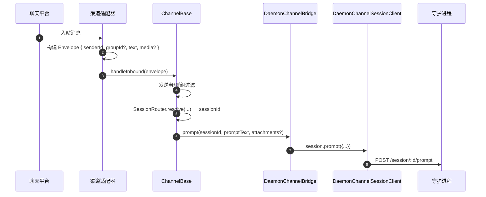
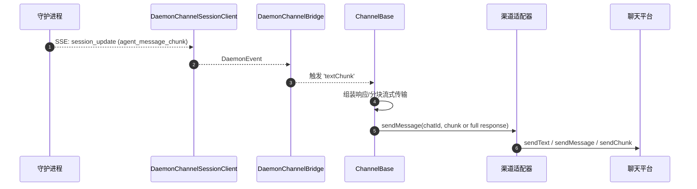
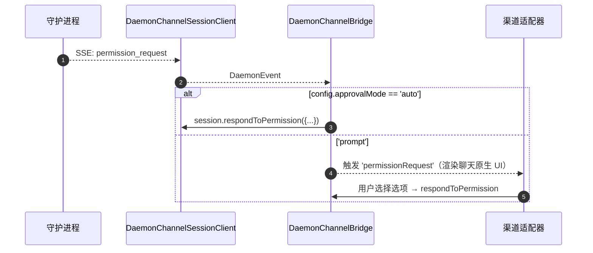

# 渠道适配器

## 概述

`packages/channels/` 包含 **IM 渠道适配器**，负责将聊天平台接收到的消息转换为 agent prompt，并将 agent 的响应发送回聊天平台。目前内置了四个具体的渠道：钉钉 (DingTalk)、微信 (WeChat/Weixin)、Telegram 和飞书 (Feishu)。它们共享一个基础层 (`packages/channels/base/`) 和一个面向适配器的 `ChannelAgentBridge` 契约。

目前有两种宿主模式：

- `qwen channel start [name]` 是独立的 ACP 支持的渠道服务。它向适配器传递 `ChannelAgentBridge` 的 `AcpBridge` 实现。
- `qwen serve --channel <name>` 和 `qwen serve --channel all` 是实验性的守护进程管理模式。命名选择按所属工作区分组，`qwen serve` 为每个所属运行时启动一个进程外 worker；每个 worker 通过 SDK 连接到守护进程，适配器接收由 `DaemonChannelBridge` 支持的 `ChannelAgentBridge` 门面。`--channel all` 仍然是仅主工作区的选择。

在守护进程管理模式下，每个渠道将入站聊天流量映射到可配置 `SessionScope`（`user`、`chat_thread` 或 `single`）下的守护进程会话。旧版 Channel 值 `thread` 仍可用于已有配置的读取和编辑，但新的 Web Shell 配置不再提供该选项；这与 daemon bridge 自身的 `single`/`thread` 会话创建旋钮是分开的。适配器委托给 `DaemonChannelBridge`，后者再委托给 SDK 的 `DaemonSessionClient`（参见 [`13-sdk-daemon-client.md`](./13-sdk-daemon-client.md)）。每个命名渠道必须解析到一个已注册的、可信的工作区。worker 使用该运行时的规范 cwd、`QWEN_DAEMON_WORKSPACE` 和环境覆盖；所属关系解析不会回退到主工作区。

### Webhook 触发的渠道任务

Webhook 触发的任务由 `qwen serve` 托管，并在守护进程管理的渠道 worker 内执行。HTTP 路由验证来源并通过 IPC 将 `ChannelWebhookTask` 转发给 worker。worker 调用 `ChannelBase.runWebhookTask()`，因此适配器无需实现 webhook 解析。

适配器仍然通过主动发送支持参与：`supportsProactiveSend()` 告诉宿主渠道是否可以在没有入站消息的情况下发送，`supportsProactiveTarget()` 处理特定目标形态的投递限制，`pushProactive()` 承载出站内容。

## 职责

- 接收来自渠道原生传输的入站消息（钉钉 WebSocket 流、微信 HTTP 长轮询、Telegram Bot 长轮询、飞书 WebSocket 或 HTTP webhook）。
- 通过 `DaemonChannelSessionFactory` 将 `(senderId, groupId?)` 解析为守护进程会话。
- 将用户消息作为守护进程 prompt 转发，并将响应以出站聊天消息的形式流式传回，可能会进行分块。
- 在交互模式下将权限请求渲染为聊天原生提示；否则根据 `ChannelConfig.approvalMode` 自动批准。
- 应用发送者过滤（白名单/黑名单）、群组过滤以及内容规范化（根据渠道转换为 markdown / HTML）。

## 架构

### `DaemonChannelBridge`（共享基础类，`packages/channels/base/src/DaemonChannelBridge.ts`）

```ts
class DaemonChannelBridge extends EventEmitter {
  constructor(opts: {
    cwd: string;
    sessionFactory: DaemonChannelSessionFactory;
    modelServiceId?: string;
    sessionScope?: SessionScope;
  });
  newSession(cwd: string): Promise<string>;
  loadSession(sessionId: string, cwd: string): Promise<string>;
  prompt(sessionId: string, text: string, options?): Promise<string>;
  cancelSession(sessionId: string): Promise<void>;
  stop(): void;
}
```

保存以守护进程 `sessionId` 为键的守护进程会话客户端；`ChannelBase` 和 `SessionRouter` 决定哪个入站聊天目标映射到该会话。每个附加的会话包含：

- 一个 `DaemonChannelSessionClient`（`DaemonSessionClient` 的形状，去除了与渠道无关的方法）。
- 一个活跃的 SSE 消费泵。
- 一个防抖的 prompt 组装器（用于将跨多个入站消息分片的用户输入进行组装的适配器）。
- 每个请求的自动批准策略。

触发的事件包括：`textChunk`、`toolCall`、`sessionUpdate`、`permissionRequest`、`permissionResolved`、`modelSwitched`、`modelSwitchFailed`、`sessionDied`、`promptComplete` 和 `error`。渠道适配器将这些事件接入平台原生 API。

### `ChannelBase` (`packages/channels/base/src/ChannelBase.ts`)

每个适配器扩展的抽象基类：

```ts
abstract class ChannelBase {
  abstract connect(): Promise<void>;
  abstract sendMessage(chatId: string, text: string): Promise<void>;
  abstract disconnect(): void;
  handleInbound(envelope: Envelope): Promise<void>; // → SessionRouter.resolve + bridge.prompt
}
```

所有内部消息投递都通过 `sendThreadMessage(chatId, threadId, text)` 路由。默认实现会回退到 `sendMessage(chatId, text)`，忽略 `threadId`——IM 适配器不受影响。轮询适配器（例如 GitHub）覆盖 `sendThreadMessage` 以使用 `threadId` 在特定的 issue/PR 上发布评论。

处理常见的横切关注点：发送者过滤（白名单/黑名单）、群组过滤、消息块流式传输（分块大小、节流）、入站防抖。

### 各渠道适配器

| 适配器 | 文件 | 传输方式 | 备注 |
| --- | --- | --- | --- |
| 钉钉 | `packages/channels/dingtalk/src/DingtalkAdapter.ts` | 钉钉 Stream SDK WebSocket | 通过 `sessionWebhook` POST 发送；媒体图片通过钉钉 API 下载，在 envelope 中以 base64 形式存在。 |
| 微信 (Weixin) | `packages/channels/weixin/src/WeixinAdapter.ts` | iLink Bot HTTP 长轮询 | 通过专有的 `sendText` / `sendImage` API 发送；支持输入中指示器。 |
| Telegram | `packages/channels/telegram/src/TelegramAdapter.ts` | Telegram Bot API 长轮询 (grammy) | 通过 `sendMessage` 发送 HTML 分块。 |
| 飞书 | `packages/channels/feishu/src/FeishuAdapter.ts` | 飞书/Lark Stream WebSocket（默认）或 HTTP webhook | 通过 Lark SDK 作为交互卡片发送；webhook 模式需要 `encryptKey` 进行 HMAC 签名验证。 |
| GitHub | `packages/channels/github/src/GithubAdapter.ts` | GitHub Notifications API 轮询（`@octokit/rest`） | 扩展 `PollingChannelBase`；基于游标的评论窗口去重；通过 Issues API 发布评论。 |
| GitLab | `packages/channels/gitlab/src/GitlabAdapter.ts` | GitLab Todos API 轮询（`@gitbeaker/rest`） | 扩展 `PollingChannelBase`；直接分发 `todo.body`；`action_prompt_template` 配置驱动事件过滤和元数据渲染。 |

每个适配器实现：

1. 入站传输（订阅/轮询消息）。
2. Envelope 构建（`{ senderId, groupId?, text, media?, raw }`）。
3. 发送者/群组过滤（委托给 `ChannelBase`）。
4. 出站序列化（markdown → HTML / 微信原生 / 钉钉原生）。
5. 生命周期（启动/关闭）。

### 适配器矩阵

| 适配器 | 传输方式 | 身份标识 | 权限 UX | 自动批准配置 |
| --- | --- | --- | --- | --- |
| **钉钉** | WebSocket 流 | `senderStaffId`（群组可选 `conversationId`） | 通过钉钉 markdown 的内联按钮 | `ChannelConfig.approvalMode = 'auto' \| 'prompt'` |
| **微信** | HTTP 长轮询 | `senderWxid`（群组可选 `groupWxid`） | 带有回复 token 的纯文本提示 | 同上 |
| **Telegram** | Bot API 长轮询 | `from.id`（群组可选 `chat.id`） | 内联键盘按钮 | 同上 |
| **飞书** | WebSocket 流 / HTTP webhook | `sender.open_id`（群组可选 `chat_id`） | 交互卡片按钮 | 同上 |
| **GitHub** | Notifications API 轮询 | 数字 `user.id`（不可变；login 在连接时解析） | 错误评论 + 重新 @提及 | `senderPolicy: 'allowlist' \| 'open'` |
| **GitLab** | Todos API 轮询 | `author.username`（小写化） | 日志 + 重新 @提及 | `senderPolicy: 'allowlist' \| 'open'` |

> **注意：** “权限 UX”列描述了各平台的原生交互方式，但目前尚未接入——`AcpBridge.requestPermission` 当前会自动批准所有请求（`packages/channels/base/src/AcpBridge.ts`），并且 `ChannelConfig.approvalMode` 已声明但尚未被读取。交互式批准功能已在计划中（Phase 5）。

## 工作流

### 入站 prompt


```mermaid
sequenceDiagram
    autonumber
    participant CH as 聊天平台
    participant AD as 渠道适配器
    participant CB as ChannelBase
    participant BR as DaemonChannelBridge
    participant SC as DaemonChannelSessionClient
    participant D as 守护进程

    CH-->>AD: 入站消息
    AD->>AD: 构建 Envelope { senderId, groupId?, text, media? }
    AD->>CB: handleInbound(envelope)
    CB->>CB: 发送者/群组过滤
    CB->>CB: SessionRouter.resolve(...) → sessionId
    CB->>BR: prompt(sessionId, promptText, attachments?)
    BR->>SC: session.prompt({...})
    SC->>D: POST /session/:id/prompt
```

### SSE 驱动的出站


```mermaid
sequenceDiagram
    autonumber
    participant D as 守护进程
    participant SC as DaemonChannelSessionClient
    participant BR as DaemonChannelBridge
    participant CB as ChannelBase
    participant AD as 渠道适配器
    participant CH as 聊天平台

    D-->>SC: SSE: session_update (agent_message_chunk)
    SC-->>BR: DaemonEvent
    BR-->>CB: 触发 'textChunk'
    CB->>CB: 组装响应/分块流式传输
    CB->>AD: sendMessage(chatId, chunk or full response)
    AD->>CH: sendText / sendMessage / sendChunk
```

### 权限自动批准


```mermaid
sequenceDiagram
    autonumber
    participant D as 守护进程
    participant SC as DaemonChannelSessionClient
    participant BR as DaemonChannelBridge
    participant AD as 渠道适配器

    D-->>SC: SSE: permission_request
    SC-->>BR: DaemonEvent
    alt config.approvalMode == 'auto'
        BR->>SC: session.respondToPermission({...})
    else 'prompt'
        BR-->>AD: 触发 'permissionRequest'（渲染聊天原生 UI）
        AD->>BR: 用户选择选项 → respondToPermission
    end
```

## 状态与生命周期

- `DaemonChannelBridge` 的生命周期与渠道适配器一致；其内部的会话生命周期由配置的 `SessionScope` 决定。
- 如果 SSE 断开，每个活跃会话会自动重连——`DaemonSessionClient.events()` 会跟踪 `lastSeenEventId` 以确保重放正确。
- `shutdown()` 会关闭所有活跃会话和底层传输（渠道的 WebSocket/长轮询）。
- 钉钉的 WebSocket 流支持服务端推送；微信的长轮询在空闲响应时需要退避策略；Telegram 的长轮询内置了 `timeout` 参数。

### 运行时选择与设置重新加载

长生命周期的 `ChannelWorkerManager` 持有已提交的 daemon 选择和按工作区分组的 supervisor。daemon 可以在启动时不带 `--channel`；第一个严格门控的 `PUT /workspace/channel` 会动态加载渠道运行时、保留服务 pidfile、解析工作区所属关系，并启动所选的 worker。`GET /workspace/channel` 读取管理器快照，`DELETE /workspace/channel` 幂等地停止它。SDK 辅助方法有 `getChannelWorkerControl()`、`setChannelWorkerSelection()` 和 `stopChannelWorker()`；CLI 入口是 `qwen channel set` 以及远程 `status` 和 `stop` 变体。

守护进程在每个 worker 启动时从 `settings.json` 读取渠道设置（`packages/cli/src/commands/channel/daemon-worker.ts` → `loadSettings` → `loadChannelsConfig`）。`POST /workspace/channel/reload` 重新读取这些设置并强制调和已提交的选择。所有生命周期变更共享一个 FIFO 通道。未变更的工作区分组在普通选择替换中保留；变更的分组按顺序停止和启动，同时 serve 持有的 PID 租约保持不变。

如果替换失败，新启动的 worker 会被停止，旧 worker 会在请求返回前恢复。无法在 SIGTERM 和 SIGKILL 后观察到退出的 supervisor 会保留其子引用并导致停止失败；管理器保留 PID 租约，永远不会启动第二个 worker。Webhook 配置和路由仅在选择提交成功时才会变更。运行时选择是进程本地的，在 daemon 重启时消失。

适配器 `connect()` 失败与 worker 生命周期错误分开报告。worker 通过启动 IPC 发送每个有界的、凭证已编辑的失败，并在尝试下一个适配器之前等待 supervisor 确认。部分连接的 worker 保持运行并在其快照中暴露 `startupFailures`。如果动态尝试中的每个适配器都失败，`502 channel_worker_start_failed` 响应携带带工作区注释的尝试失败信息，而 `state` 反映回滚结果；后续 GET 响应不保留尝试信息。daemon 启动时没有已连接的适配器仍然快速失败。可选的适配器 `code` 仅用于诊断，当前 `phase` 为 `connect`。

## 依赖

- `packages/channels/base/` — `ChannelBase`、`PollingChannelBase`、`DaemonChannelBridge`、`types.ts`（`ChannelConfig`、`Envelope`、`SessionScope`、`ChannelPlugin`）。
- `packages/sdk-typescript/src/daemon/` — `DaemonSessionClient` 及相关模块。
- 各渠道 SDK：`@dingtalk/stream`（钉钉）、专有的 iLink Bot HTTP（微信）、`grammy`（Telegram）、`@octokit/rest`（GitHub 轮询）、`@gitbeaker/rest`（GitLab 轮询）。

## 配置

`ChannelConfig`（来自 `packages/channels/base/src/types.ts`）：

| 配置项 | 作用 |
| --- | --- |
| `sessionScope` | `'user'`（发送者 + 聊天）、`'chat_thread'`（渠道 + chatId + threadId）或 `'single'`（每个渠道一个共享会话）。旧版 `'thread'` 在已配置时保留，但不再为新的 Web Shell 配置提供。 |
| `approvalMode` | `'auto'`（自动响应）/ `'prompt'`（渲染 UI）。 |
| `allowlist?: string[]` | 允许的发送者 id；缺失则表示开放。 |
| `denylist?: string[]` | 拒绝的发送者 id。 |
| `chunkSize`, `chunkIntervalMs` | 出站分块流式传输设置。 |
| `daemon: { baseUrl, token?, clientId? }` | 转发给 `DaemonChannelSessionFactory`。 |

渠道特定的配置项在此基础上叠加（钉钉：`streamCredentials`；微信：`ilinkUrl`、`botId`；Telegram：`botToken`；飞书：`clientId` (appId)、`clientSecret` (appSecret)、`verificationToken`、`encryptKey`（webhook 模式））。

## 注意事项与已知限制

- **渠道不直接导入 `@qwen-code/sdk`。** 它们通过 `ChannelBase` → `DaemonChannelBridge` → `DaemonChannelSessionClient`（由 bridge 从 SDK 构建）进行交互。这种间接方式允许 bridge 替换实现（例如测试桩），而无需修改渠道代码。
- **权限 UX 因渠道而异。** 钉钉使用 markdown 按钮；微信仅支持纯文本；Telegram 使用内联键盘；飞书使用交互卡片按钮。（目前均通过 `AcpBridge` 自动批准；交互式批准功能已在计划中。）目前还没有通用的“交互式权限组件”抽象。
- **自动批准是部署侧的决策**，而非守护进程侧的决策。守护进程的 `permission_mediation` 策略仍然适用；自动批准仅意味着渠道在不提示用户的情况下进行响应。请勿将 `auto` 与 `enforce` 级别的工作流结合使用。
- **各渠道的速率限制/消息大小限制由适配器负责。** `DaemonChannelBridge` 仅处理分块；超出微信单条消息大小限制或 Telegram 频率限制的问题由适配器处理。
- **没有钉钉/微信/Telegram/飞书的反向调用**——渠道是单向的（聊天 → 守护进程 → 聊天）。IM 平台的原生推送路径（如钉钉卡片回调）尚未接入 bridge。

## 参考资料

- `packages/channels/base/src/DaemonChannelBridge.ts`
- `packages/channels/base/src/ChannelBase.ts`
- `packages/channels/base/src/types.ts`
- `packages/cli/src/serve/channel-worker-manager.ts`（选择生命周期 + 序列化）
- `packages/cli/src/serve/channel-worker-group.ts`（工作区差异调和）
- `packages/cli/src/serve/channel-worker-supervisor.ts`（子进程监督）
- `packages/cli/src/serve/routes/workspace-channel-control.ts`（GET/PUT/DELETE/reload 资源）
- `packages/channels/dingtalk/src/DingtalkAdapter.ts`
- `packages/channels/weixin/src/WeixinAdapter.ts`
- `packages/channels/telegram/src/TelegramAdapter.ts`
- `packages/channels/plugin-example/`（参考插件脚手架）
- 渠道插件指南：[`../channel-plugins.md`](../channel-plugins.md)。
- SDK 参考：[`13-sdk-daemon-client.md`](./13-sdk-daemon-client.md)。