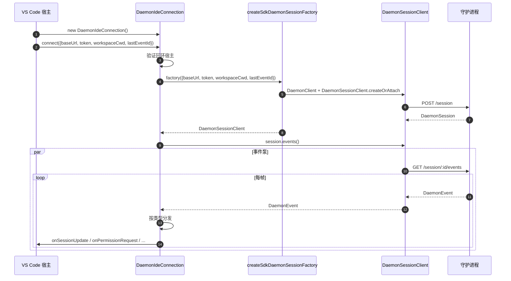
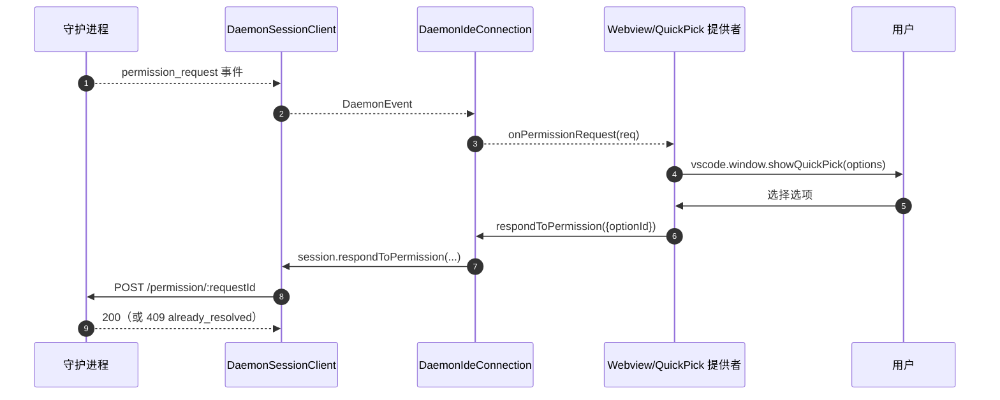
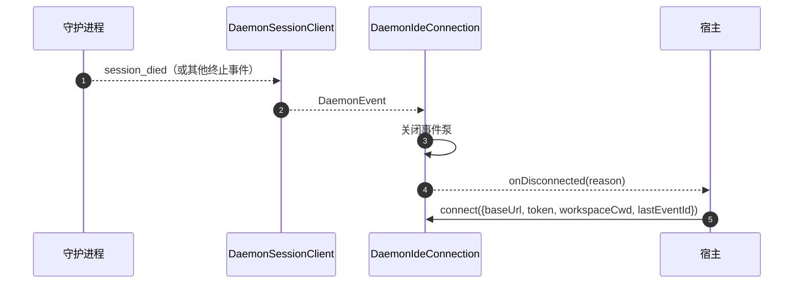

# VS Code IDE 守护进程适配器

## 概述

`packages/vscode-ide-companion/src/services/daemonIdeConnection.ts` 是 **VS Code 扩展的守护进程适配器**。它允许 IDE companion 通过 HTTP + SSE 连接到运行中的 `qwen serve` 守护进程，而不是启动一个进程内 `qwen --acp` stdio 子进程（即传统的 `AcpConnectionState` 路径）。对于 VS Code 宿主而言，它是 [`14-cli-tui-adapter.md`](./14-cli-tui-adapter.md) 的同级传输等价物。

IDE 的聊天 webview 通过此适配器消费守护进程事件；权限提示以原生 VS Code 快速选择对话框的形式呈现。

## 职责

- 根据传入 `connect(options)` 的、经过回环验证的 `baseUrl`，构建 `DaemonClient` + `DaemonSessionClient` 实例。
- 将来自会话客户端的 SSE 事件分发到对应的回调函数（`onSessionUpdate`、`onPermissionRequest`、`onAskUserQuestion`、`onEndTurn`、`onDisconnected`）。
- 在 `connect(options)` 中强制实施**仅限回环**的不变约束（IDE 只应连接到同一宿主上的守护进程）。
- 将守护进程事件桥接到 webview 的 `postMessage` 中，使聊天面板保持同步。
- 通过 VS Code 的原生快速选择 UI 呈现权限请求。
- 将调用序列化到队列中，以防止宿主的快速双重 `connect()` 调用导致竞态条件。

## 架构

### 公开接口

```ts
class DaemonIdeConnection {
  connect(options: DaemonIdeConnectionOptions): Promise<void>;
  disconnect(): Promise<void>;
  sendPrompt(prompt: string | ContentBlock[]): Promise<DaemonIdePromptResult>;
  cancelSession(): Promise<void>;
  setModel(modelId: string): Promise<DaemonIdeSetModelResult>;

  onSessionUpdate: (data: SessionNotification) => void;
  onPermissionRequest: (
    data: RequestPermissionRequest,
  ) => Promise<{ optionId?: string }>;
  onAskUserQuestion: (data: AskUserQuestionRequest) => Promise<{
    optionId: string;
    answers?: Record<string, string>;
  }>;
  onEndTurn: (reason?: string) => void;
  onDisconnected: (code: number | null, signal: string | null) => void;
}

interface DaemonIdeConnectionOptions {
  baseUrl: string; // 必须为回环地址（127.0.0.1 / localhost / [::1]）
  token?: string;
  workspaceCwd?: string;
  modelServiceId?: string;
  lastEventId?: number;
  sessionFactory?: DaemonIdeSessionFactory;
}
```

### 回环验证

在 `connectInternal()` 中：

```ts
const baseUrl = validateDaemonBaseUrl(options.baseUrl);
```

这是一个**客户端侧的硬约束**，与守护进程自身的 `hostAllowlist`（参见 [`12-auth-security.md`](./12-auth-security.md)）不同。IDE companion 绝不会连接到远程守护进程——即使运维人员配置了一个。理由：VS Code 的威胁模型假设工作区和守护进程共享同一宿主，包括文件系统信任及相关假设。

### `createSdkDaemonSessionFactory()`

`createSdkDaemonSessionFactory()` 构建 `DaemonClient` 并调用 `@qwen-code/sdk` 中的 `DaemonSessionClient.createOrAttach()`。连接类持有工厂而非直接实例化，以便测试可以注入伪造对象。

### 事件分发

连接运行一个 SSE 消费者（`for await` 遍历 `session.events()`）并按类型路由每个事件：

| 守护进程事件 / 来源                                                                                     | IDE 回调 / 动作                                                            |
| ------------------------------------------------------------------------------------------------------- | -------------------------------------------------------------------------- |
| `session_update`                                                                                        | `onSessionUpdate`                                                          |
| 正常的 `permission_request`                                                                             | `onPermissionRequest`，然后 `respondToPermission()`                        |
| `toolCall.kind === 'ask_user_question'` 且 `rawInput.questions` 为数组的 `permission_request`           | `onAskUserQuestion`，然后将 `answers` 转发给守护进程                       |
| `session_died` 且载荷中的 `sessionId` 与当前会话匹配                                                     | `onDisconnected(null, reason)`                                             |
| SSE 自然结束 / 流失败 / 手动 `disconnect()`                                                             | `onDisconnected(null, 'stream_ended' / 'daemon_error' / 'disconnected')`   |
| 其他守护进程事件                                                                                        | 调试级日志；目前无 IDE 回调。                                               |

`onEndTurn` 并非由 SSE 分发产生。`sendPrompt()` 等待守护进程 HTTP prompt 响应，并调用 `onEndTurn(response.stopReason)`；非中止异常的路径调用 `onEndTurn('error')`。

### Webview 桥接

连接类**仅负责传输**。实际的 VS Code 集成位于 `packages/vscode-ide-companion/src/webview/providers/ChatWebviewViewProvider.ts`（及相关文件）中。该提供者订阅连接的回调，并将其转换为 webview 的 `postMessage` 调用。Webview 本身使用共享的 `packages/webui/` 组件库进行渲染——参见 [`01-architecture.md`](./01-architecture.md) 中的适配器矩阵。

### 连接序列化

`connect()` 使用内部队列，因此宿主的快速双重调用（例如用户在握手过程中两次打开面板）不会导致竞态条件。第二次调用会等待第一次完成；连接最终处于单一确定的状态。

## 工作流程

### 初始连接



### 通过快速选择的权限请求



### 断开 / 恢复



## 状态与生命周期

- 构造函数是同步的；在调用 `connect(options)` 之前**没有网络 I/O**。
- 通过内部队列，`connect()` 是幂等的；两次调用会串行处理。
- `disconnect()` 中止 SSE 迭代器（在泵上使用 `AbortController`）并清除回调注册。
- 断开时从 SDK 的 `DaemonSessionClient` 捕获 `lastEventId`，可在下一次 `connect()` 时重新提供以实现恢复。

## 依赖项

- `packages/sdk-typescript/src/daemon/` — `DaemonClient`、`DaemonSessionClient`（实际传输层）。
- VS Code 扩展 API（`vscode.*`）— 宿主 API、快速选择、webview。
- `packages/webui/src/adapters/ACPAdapter.ts` — 通过 `postMessage` 中继的 ACP 形状消息的 webview 渲染。

## 配置

| 参数                                                   | 位置                              | 效果                                                                       |
| ------------------------------------------------------ | --------------------------------- | -------------------------------------------------------------------------- |
| `baseUrl`                                              | `connect(options)`                | 守护进程 URL；必须为回环地址。                                             |
| `token`                                                | `connect(options)`                | Bearer token（通过 SDK 戳印）。                                            |
| `workspaceCwd`                                         | `connect(options)`                | 用于 `POST /session`；必须与守护进程绑定的工作区一致。                     |
| `modelServiceId`                                       | `connect(options)` / `setModel()` | 初始模型。                                                                 |
| `lastEventId`                                          | `connect(options)`                | 恢复游标（通常从宿主状态恢复）。                                           |
| VS Code 设置 `qwen.ide.daemonUrl`（或等效项）         | 工作区设置                        | 运维人员配置的守护进程 URL。                                               |

## 注意事项与已知限制

- **仅限回环——`connect(options)` 中硬性拒绝。** 想要将 IDE 指向远程守护进程的运维人员需要使用 SSH 端口转发 / 本地代理；适配器不会连接到非回环 URL。
- **传统的 `AcpConnectionState` 路径仍是主要路径**（stdio 子进程）。此适配器是 Mode-B 迁移的同级传输；迁移障碍及计划中的 `BridgeFileSystem` 对等工作参见 [`../daemon-client-adapters/ide.md`](../daemon-client-adapters/ide.md)。
- **通过 HTTP 尚无反向 RPC 或编辑器功能接口。** 需要 agent 回调 IDE 的功能（例如只读缓冲区访问、差异预览集成）目前仅存在于 stdio 路径上。
- **Webview ↔ 连接耦合由宿主拥有**，不在此适配器中。不要将 webview 特定的逻辑推入 `DaemonIdeConnection`。
- **`workspaceCwd` 与守护进程绑定的工作区不匹配**会返回 `400 workspace_mismatch`——应将其作为明确的设置错误显示，而不是重试。

## 参考资料

- `packages/vscode-ide-companion/src/services/daemonIdeConnection.ts`
- `packages/vscode-ide-companion/src/services/daemonIdeConnection.ts`（`createSdkDaemonSessionFactory`）
- `packages/vscode-ide-companion/src/types/connectionTypes.ts`（传统的 `AcpConnectionState`）
- `packages/vscode-ide-companion/src/webview/providers/ChatWebviewViewProvider.ts`（webview 桥接）
- `packages/webui/src/adapters/ACPAdapter.ts`（webview ACP 消息适配器）
- 设计草案：[`../daemon-client-adapters/ide.md`](../daemon-client-adapters/ide.md)
- SDK 参考：[`13-sdk-daemon-client.md`](./13-sdk-daemon-client.md)