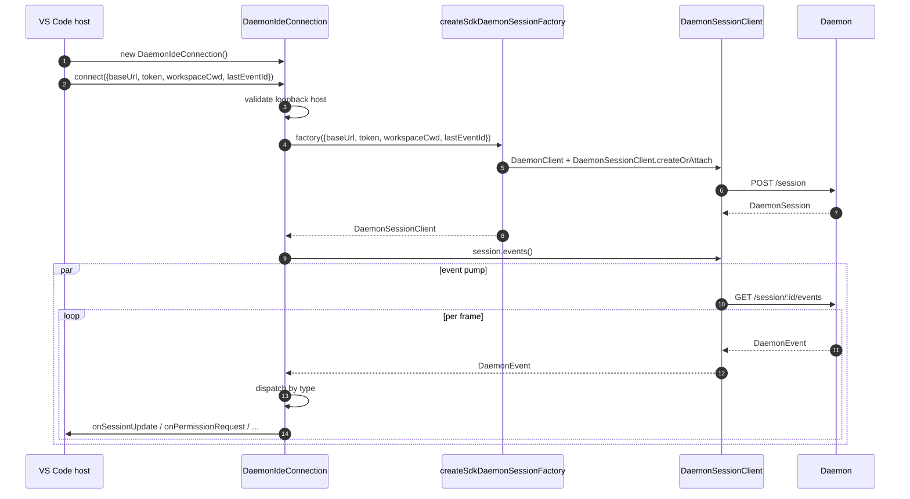
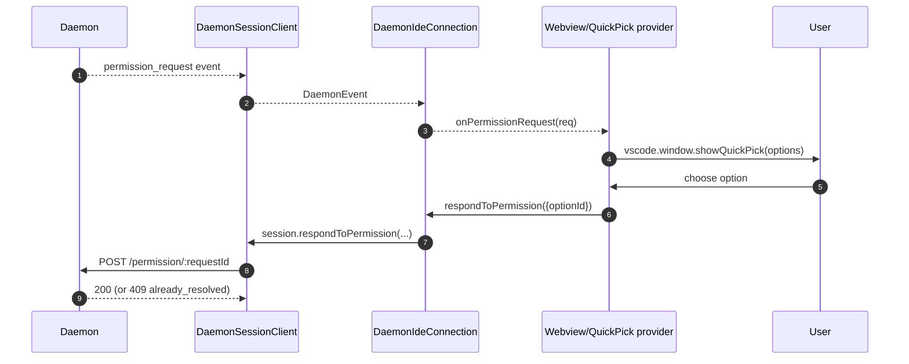
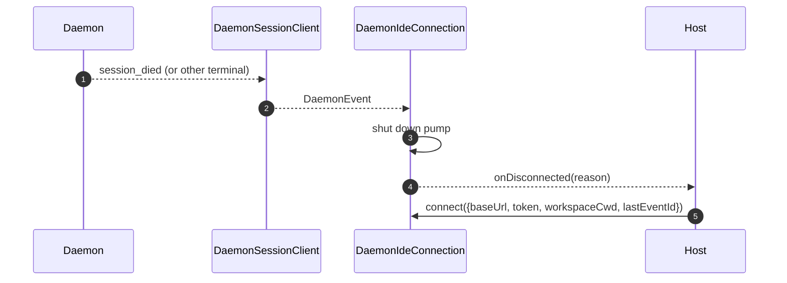

# VS Code IDE Daemon 适配器

## 概述

`packages/vscode-ide-companion/src/services/daemonIdeConnection.ts` 是 **VS Code 扩展的 daemon 适配器**。它让 IDE 伴侣通过 HTTP + SSE 连接到运行中的 `qwen serve` daemon，而无需启动进程内的 `qwen --acp` stdio 子进程（旧版 `AcpConnectionState` 路径）。它是 VS Code 宿主的兄弟传输实现，等价于 [`14-cli-tui-adapter.md`](./14-cli-tui-adapter.md)。

IDE 的聊天 webview 通过此适配器消费 daemon 事件；权限提示以原生 VS Code 快速选择对话框的形式呈现。

## 职责

- 从传入 `connect(options)` 的经过 loopback 验证的 `baseUrl` 构造 `DaemonClient` + `DaemonSessionClient`。
- 将 session 客户端的 SSE 事件泵入各回调分发（`onSessionUpdate`、`onPermissionRequest`、`onAskUserQuestion`、`onEndTurn`、`onDisconnected`）。
- 在 `connect(options)` 中强制执行**仅 loopback**约束（IDE 只允许连接到同一主机上的 daemon）。
- 将 daemon 事件桥接为 webview `postMessage`，使聊天面板保持同步。
- 通过 VS Code 原生快速选择 UI 呈现权限请求。
- 将调用序列化到队列中，防止宿主快速连续两次调用 `connect()` 产生竞争。

## 架构

### 公共接口

```ts
class DaemonIdeConnection {
  connect(options: DaemonIdeConnectionOptions): Promise<void>;
  disconnect(): Promise<void>;
  sendPrompt(prompt: string | ContentBlock[]): Promise<DaemonIdePromptResult>;
  cancelSession(): Promise<void>;
  setModel(modelId: string): Promise<DaemonIdeSetModelResult>;

  onSessionUpdate: (data: SessionNotification) => void;
  onPermissionRequest: (
    data: RequestPermissionRequest,
  ) => Promise<{ optionId?: string }>;
  onAskUserQuestion: (data: AskUserQuestionRequest) => Promise<{
    optionId: string;
    answers?: Record<string, string>;
  }>;
  onEndTurn: (reason?: string) => void;
  onDisconnected: (code: number | null, signal: string | null) => void;
}

interface DaemonIdeConnectionOptions {
  baseUrl: string; // 必须是 loopback（127.0.0.1 / localhost / [::1]）
  token?: string;
  workspaceCwd?: string;
  modelServiceId?: string;
  lastEventId?: number;
  sessionFactory?: DaemonIdeSessionFactory;
}
```

### Loopback 验证

在 `connectInternal()` 中：

```ts
const baseUrl = validateDaemonBaseUrl(options.baseUrl);
```

这是**客户端硬约束**，与 daemon 自身的 `hostAllowlist`（见 [`12-auth-security.md`](./12-auth-security.md)）独立。IDE 伴侣永远不会连接到远程 daemon——即使运营者配置了远程 daemon。原因：VS Code 的威胁模型假设工作区与 daemon 共享同一主机，包括文件系统信任及相关假设。

### `createSdkDaemonSessionFactory()`

`createSdkDaemonSessionFactory()` 构造 `DaemonClient` 并从 `@qwen-code/sdk` 调用 `DaemonSessionClient.createOrAttach()`。连接类持有工厂而非直接实例化，以便测试时注入 fake。

### 事件分发

连接运行一个 SSE 消费者（对 `session.events()` 的 `for await`），并按类型路由每个事件：

| Daemon 事件 / 来源                                                                                      | IDE 回调 / 动作                                                          |
| ------------------------------------------------------------------------------------------------------- | ------------------------------------------------------------------------ |
| `session_update`                                                                                        | `onSessionUpdate`                                                        |
| 普通 `permission_request`                                                                               | `onPermissionRequest`，然后 `respondToPermission()`                      |
| `permission_request` 且 `toolCall.kind === 'ask_user_question'` 且 `rawInput.questions` 为数组          | `onAskUserQuestion`，然后将 `answers` 转发给 daemon                      |
| `session_died`，payload `sessionId` 与当前 session 匹配                                                 | `onDisconnected(null, reason)`                                           |
| SSE 自然结束 / 流失败 / 手动 `disconnect()`                                                             | `onDisconnected(null, 'stream_ended' / 'daemon_error' / 'disconnected')` |
| 其他 daemon 事件                                                                                        | Debug 级日志；暂无 IDE 回调。                                            |

`onEndTurn` 不由 SSE 分发产生。`sendPrompt()` 等待 daemon HTTP prompt 响应后以 `response.stopReason` 调用它；非 abort 异常路径调用 `onEndTurn('error')`。

### Webview 桥接

连接类**仅负责传输**。实际的 VS Code 集成在 `packages/vscode-ide-companion/src/webview/providers/ChatWebviewViewProvider.ts`（及相关文件）中。provider 订阅连接的回调，并将其转换为 webview `postMessage` 调用。webview 本身使用共享的 `packages/webui/` 组件库进行渲染——见 [`01-architecture.md`](./01-architecture.md) 中的适配器矩阵。

### 连接序列化

`connect()` 使用内部队列，防止宿主快速连续调用（例如用户在握手进行中打开面板两次）产生竞争。第二次调用等待第一次完成；连接最终处于单一确定性状态。

## 工作流

### 初始连接



### 通过快速选择处理权限



### 断开连接 / 恢复



## 状态与生命周期

- 构造是同步的；`connect(options)` 调用前**无网络 I/O**。
- `connect()` 通过内部队列实现幂等；连续调用两次会序列化执行。
- `disconnect()` 中止 SSE 迭代器（pump 上的 `AbortController`）并清除回调注册。
- `lastEventId` 在断开时从 SDK 的 `DaemonSessionClient` 中捕获，可在下次 `connect()` 时重新提供以恢复。

## 依赖

- `packages/sdk-typescript/src/daemon/` — `DaemonClient`、`DaemonSessionClient`（实际传输层）。
- VS Code 扩展 API（`vscode.*`）— 宿主 API、快速选择、webview。
- `packages/webui/src/adapters/ACPAdapter.ts` — 通过 `postMessage` 中继的 ACP 形状消息的 webview 渲染。

## 配置

| 配置项                                               | 位置                              | 作用                                                              |
| ---------------------------------------------------- | --------------------------------- | ----------------------------------------------------------------- |
| `baseUrl`                                            | `connect(options)`                | Daemon URL；必须是 loopback。                                     |
| `token`                                              | `connect(options)`                | Bearer token（通过 SDK 注入）。                                   |
| `workspaceCwd`                                       | `connect(options)`                | 用于 `POST /session`；必须与 daemon 绑定的工作区匹配。            |
| `modelServiceId`                                     | `connect(options)` / `setModel()` | 初始模型。                                                        |
| `lastEventId`                                        | `connect(options)`                | 恢复游标（通常从宿主状态中恢复）。                                |
| VS Code 设置 `qwen.ide.daemonUrl`（或等效项）        | 工作区设置                        | 运营者配置的 daemon URL。                                         |

## 注意事项与已知限制

- **仅 loopback——`connect(options)` 中硬拒绝。** 希望将 IDE 指向远程 daemon 的运营者需要使用 SSH 端口转发 / 本地代理；适配器不会连接非 loopback URL。
- **旧版 `AcpConnectionState` 路径在 IDE 伴侣中仍为主路径**（stdio 子进程）。此适配器是 Mode-B 迁移的兄弟传输；迁移阻碍和计划的 `BridgeFileSystem` 对齐工作见 [`../daemon-client-adapters/ide.md`](../daemon-client-adapters/ide.md)。
- **HTTP 上尚无反向 RPC 或编辑器功能接口。** 需要 agent 回调 IDE 的功能（如只读缓冲区访问、diff 预览集成）目前仅存在于 stdio 路径上。
- **Webview ↔ 连接耦合由宿主负责**，不在此适配器中。不要将 webview 特定逻辑推入 `DaemonIdeConnection`。
- **`workspaceCwd` 与 daemon 绑定工作区不匹配**时返回 `400 workspace_mismatch`——应将其作为明确的配置错误呈现，而非重试。

## 参考资料

- `packages/vscode-ide-companion/src/services/daemonIdeConnection.ts`
- `packages/vscode-ide-companion/src/services/daemonIdeConnection.ts`（`createSdkDaemonSessionFactory`）
- `packages/vscode-ide-companion/src/types/connectionTypes.ts`（旧版 `AcpConnectionState`）
- `packages/vscode-ide-companion/src/webview/providers/ChatWebviewViewProvider.ts`（webview 桥接）
- `packages/webui/src/adapters/ACPAdapter.ts`（webview ACP 消息适配器）
- 草案设计：[`../daemon-client-adapters/ide.md`](../daemon-client-adapters/ide.md)
- SDK 参考：[`13-sdk-daemon-client.md`](./13-sdk-daemon-client.md)
