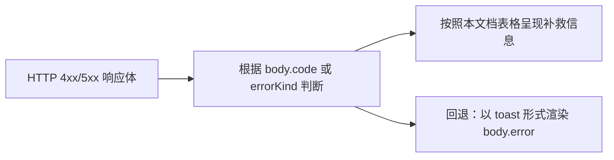
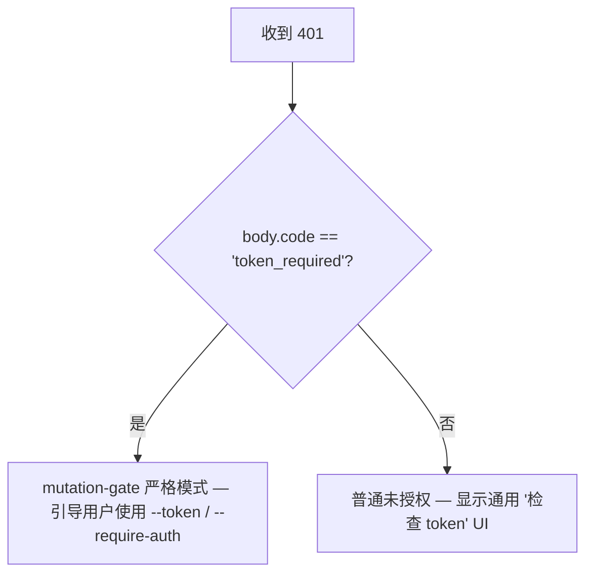

# 错误分类与修复

## 概述

Daemon 的故障模式故意设计为封闭联合类型（closed unions），以便 SDK 消费者可以穷举切换，路由处理程序可以构建一致的 HTTP 响应。本文档按三层分类记录了所有类型化的错误类/种类：

1. **`packages/cli/src/serve/`** — HTTP 边缘的边界错误（认证、工作区文件系统、daemon 主机预检）。
2. **`packages/acp-bridge/`** — daemon 与 ACP 子进程之间的桥接/中介错误。
3. **`packages/sdk-typescript/src/daemon/`** — SDK 端的包装和结构化错误字段。

线级错误格式记录在 [`../qwen-serve-protocol.md`](../qwen-serve-protocol.md) 中；本文档补充了原因和修复指导。

## 文件系统边界 (`packages/cli/src/serve/fs/errors.ts`)

`FsError` 携带 `{ kind, message, status, cause? }`。`FsErrorKind` 联合类型（14 种，默认 HTTP 状态）：

| Kind（种类）                | HTTP | 原因                                                                                        | 修复措施                                                                                                                         |
| --------------------------- | ---- | ------------------------------------------------------------------------------------------- | -------------------------------------------------------------------------------------------------------------------------------- |
| `path_outside_workspace`    | 400  | 解析后的路径超出了绑定的工作区。                                                            | 使用 daemon 的 `workspaceCwd` 内的路径；检查 `/capabilities`。                                                                    |
| `symlink_escape`            | 400  | 目标是一个符号链接。                                                                        | 直接使用解析后的路径；符号链接按设计被拒绝。                                                                                     |
| `path_not_found`            | 404  | `ENOENT`。                                                                                  | 确认文件存在；检查 Linux 上路径是否区分大小写。                                                                                  |
| `binary_file`               | 422  | 内容嗅探为二进制文件但请求的是文本路由。                                                    | 使用 `GET /file/bytes` 获取原始字节；文本路由拒绝二进制文件。                                                                     |
| `file_too_large`            | 413  | 超过 `MAX_READ_BYTES`（256 KiB）或 `MAX_WRITE_BYTES`（5 MiB）。                              | 使用字节范围读取；拆分写入。                                                                                                     |
| `hash_mismatch`             | 409  | 乐观并发 `expectedSha256` 失败。                                                            | 重新读取文件并使用新哈希重试。                                                                                                   |
| `file_already_exists`       | 409  | `mode: 'create'` 但文件已存在。                                                             | 使用 `mode: 'overwrite'` 或选择新路径。                                                                                           |
| `text_not_found`            | 422  | `POST /file/edit` 的搜索字符串未在文件中找到。                                              | 重新检查搜索字符串；常见原因是空白符或编码不匹配。                                                                               |
| `ambiguous_text_match`      | 422  | 需要唯一匹配但找到多个匹配项。                                                              | 为搜索字符串添加更多上下文，使其唯一。                                                                                           |
| `untrusted_workspace`       | 403  | 在不受信任的工作区尝试写入。                                                                | 将工作区标记为受信任（`Config.isTrustedFolder()`）或使用 `runQwenServe` 而非直接嵌入 `createServeApp`。                               |
| `permission_denied`         | 403  | OS 级别的 `EACCES` / `EPERM`。                                                              | 调整文件系统 ACL；这不是安全警报。                                                                                                |
| `io_error`                  | 503  | `ENOSPC` / `EIO` / `EBUSY` / `ETXTBSY` / `ENAMETOOLONG` / `EMFILE` / `ENFILE`。             | 主机级运维修复（磁盘满、文件描述符耗尽）；联系运维，非安全问题。                                                                 |
| `internal_error`            | 500  | 非 errno 错误到达边界。                                                                     | 提交 daemon bug。                                                                                                                |
| `parse_error`               | 400 / 422 | 请求体解析错误（400）或服务级不变式违反（422）。                                            | 检查请求体；检查 SDK 版本。                                                                                                      |

`io_error` 与 `permission_denied` 的区分是经过深思熟虑的，以便监控管道可以根据 `errorKind` 路由；如果将 ENOSPC 归入 `permission_denied`，会在遇到 `df -h` 可以解决的问题时通知安全响应人员。

## 桥接错误 (`packages/acp-bridge/src/bridgeErrors.ts`)

桥接/中介抛出的类型化类。大多数通过路由处理程序的 switch 携带 HTTP 状态。

| 类                                       | HTTP | 原因                                                                                           | 修复措施                                                                                                                                                                  |
| ---------------------------------------- | ---- | ---------------------------------------------------------------------------------------------- | ------------------------------------------------------------------------------------------------------------------------------------------------------------------------ |
| `SessionNotFoundError`                   | 404  | sessionId 不在 `byId` 中。                                                                     | 重新创建或附加；会话可能已被回收。                                                                                                                                       |
| `WorkspaceMismatchError`                 | 400  | `POST /session` 的 `cwd` 不等于 daemon 的 `boundWorkspace`。                                      | 省略 `cwd`（使用绑定的工作区）或路由到绑定到你的 `cwd` 的 daemon。                                                                                                          |
| `SessionLimitExceededError`              | 503  | `byId.size >= maxSessions`。                                                                   | 关闭过期会话；增加 `--max-sessions`。                                                                                                                                     |
| `InvalidClientIdError`                   | 400  | `X-Qwen-Client-Id` 不符合 `[A-Za-z0-9._:-]{1,128}`。                                            | 清理客户端 ID。                                                                                                                                                          |
| `InvalidSessionMetadataError`            | 400  | `displayName` 超过 256 个字符或包含控制字符。                                                  | 截断/清理。                                                                                                                                                             |
| `InvalidSessionScopeError`               | 400  | 未知的 `sessionScope` 值。                                                                     | 使用 `'single'` 或 `'thread'`。                                                                                                                                          |
| `RestoreInProgressError`                 | 409  | 并发 `loadSession` / `resumeSession`。                                                         | 等待并重试。                                                                                                                                                            |
| `WorkspaceInitConflictError`             | 409  | `POST /workspace/init` 对现有文件操作且未设置 `force`。                                        | 传递 `force: true` 或选择其他路径。                                                                                                                                       |
| `WorkspaceInitPathEscapeError`           | 400  | 初始化路径超出了工作区范围。                                                                   | 使用 `workspaceCwd` 内的路径。                                                                                                                                            |
| `WorkspaceInitSymlinkError`              | 400  | 初始化路径是符号链接。                                                                         | 使用解析后的路径。                                                                                                                                                       |
| `WorkspaceInitRaceError`                 | 409  | 初始化时出现 TOCTOU 竞态条件。                                                                 | 重试。                                                                                                                                                                  |
| `McpServerNotFoundError`                 | 404  | 对未知服务器的重启请求。                                                                       | 在 `/workspace/mcp` 中确认服务器名称。                                                                                                                                    |
| `McpServerRestartFailedError`            | 502  | ACP 子进程内部重启失败。                                                                       | 检查 ACP 子进程日志；可能表明 MCP 服务器损坏。                                                                                                                           |
| `InvalidPermissionOptionError`           | 400  | 投票中试图通过 `optionId` 注入 `CANCEL_VOTE_SENTINEL`。                                        | 使用 `{outcome: 'cancelled'}` 投票，而不是使用 `optionId`。                                                                                                             |
| `PermissionForbiddenError`               | 403  | 策略拒绝投票者（`designated_mismatch` / `remote_not_allowed`）。                                  | 使用发起者的客户端 ID（指定模式）、预注册投票者（共识模式）或从 loopback 投票（仅本地模式）。详见 [`04-permission-mediation.md`](./04-permission-mediation.md)。 |
| `CancelSentinelCollisionError`           | 500  | Agent 发布了 `'__cancelled__'` 作为合法选项标签。                                              | Agent bug — 将选项标签改为 sentinel 以外的任何内容。                                                                                                                     |
| `PermissionPolicyNotImplementedError`    | 500  | 请求的策略未构建在此 daemon 中。                                                               | 更新 daemon，或更改 `policy.permissionStrategy`。                                                                                                                         |
| `BridgeChannelClosedError`               | 503  | ACP 子进程通道在调用过程中关闭。                                                               | 重新连接/重试；检查 `session_died` 了解原因。                                                                                                                           |
| `BridgeTimeoutError`                     | 504  | 桥接级别的墙钟超时。                                                                           | 重试；调查底层缓慢原因。                                                                                                                                                  |
| `MissingCliEntryError`                   | 500  | `qwen` CLI 入口文件缺失（定义在 `status.ts` 中，而非 `bridgeErrors.ts` 中）。                     | 确认 CLI 安装完整；检查 `packages/cli/index.ts` 是否存在。                                                                                                                |

## 启动时配置错误 (`packages/cli/src/serve/run-qwen-serve.ts`)

| 类                           | 时机                                                                                                                                                                                                                      | 修复措施                                                                                                                                                                                      |
| ---------------------------- | ------------------------------------------------------------------------------------------------------------------------------------------------------------------------------------------------------------------------- | -------------------------------------------------------------------------------------------------------------------------------------------------------------------------------------------- |
| `InvalidPolicyConfigError`   | `validatePolicyConfig()` 拒绝合并后的设置：未知的 `policy.permissionStrategy`（根据 `SERVE_CAPABILITY_REGISTRY.permission_mediation.modes` 验证）或非正整数的 `policy.consensusQuorum`。启动明确失败。                      | 修复 `settings.json` 中的问题字段。该类支持 `instanceof`；`runQwenServe` 使用它来区分策略不匹配与设置读取 I/O 失败（后者会回退到默认值）。                                                       |

## Device Flow 认证 (`packages/cli/src/serve/auth/device-flow.ts`)

| 类                                 | 时机                                | 说明                                                                                                                                                                                                                                                                                                                                                                                                                                    |
| ---------------------------------- | ----------------------------------- | ---------------------------------------------------------------------------------------------------------------------------------------------------------------------------------------------------------------------------------------------------------------------------------------------------------------------------------------------------------------------------------------------------------------------------------------- |
| `UpstreamDeviceFlowError`          | 上游 IdP 在轮询时返回结构化错误。 | `oauthError` 在插入 stderr 或审计提示之前通过 `sanitizeForStderr` 进行清理（CVE-2021-42574 / Trojan Source 防御；详见 [`12-auth-security.md`](./12-auth-security.md)）。                                                                                                                                                                                                                                         |
| `DeviceFlowPollTimeoutError`       | 注册表竞态定时器在提供者返回之前触发。 | 提供者代码不得抛出此类型。它被导出用于测试，但注册表通过运行时标志 `_isRegistryTimeout: boolean`（而非 `instanceof`）来识别 `pollTimedOut`。如果提供者导入并抛出了 `new DeviceFlowPollTimeoutError(ms)`，仍然会走通用的提供者抛出审计路径，因为 `_isRegistryTimeout` 默认为 `false`；只有内部工厂函数 `makeRegistryPollTimeoutError(ms)` 会设置该标志。 |

## Daemon 主机错误种类 (`packages/acp-bridge/src/status.ts`)

`SERVE_ERROR_KINDS` 是诊断单元和结构化 daemon 错误使用的封闭枚举：

| Kind（种类）                    | 含义                                       |
| ------------------------------- | ------------------------------------------ |
| `missing_binary`                | 无法解析所需的本地可执行文件或 CLI 入口点。 |
| `blocked_egress`                | 出站网络探测失败。                           |
| `auth_env_error`                | 与认证相关的环境变量、提供者或信任门配置无效。 |
| `init_timeout`                  | Daemon 端初始化步骤超过墙钟时间。            |
| `protocol_error`                | ACP / HTTP 协议不匹配。                      |
| `missing_file`                  | 所需的本地文件缺失。                         |
| `parse_error`                   | 本地文件或请求解析错误。                     |
| `stat_failed`                   | 本地文件系统状态查询失败。                    |
| `budget_exhausted`              | MCP 预算执行拒绝发现或服务器条目。           |
| `mcp_budget_would_exceed`       | MCP 重启或变更将超出配置的预算。             |
| `mcp_server_spawn_failed`       | MCP 服务器生成或重启失败。                    |
| `invalid_config`                | MCP 或 daemon 配置无效。                      |
| `prompt_deadline_exceeded`      | Prompt 墙钟截止时间已过。                     |
| `writer_idle_timeout`           | SSE 写入器在空闲超时之前未成功写入任何数据。 |

这些错误通过预检单元的 `errorKind` 暴露，以便客户端 UI 呈现结构化的修复指导（而非原始堆栈跟踪）。

## 认证错误形状

| 状态 | 主体                                            | 时间                                                                                                                                    |
| ---- | ----------------------------------------------- | --------------------------------------------------------------------------------------------------------------------------------------- |
| `401` | `{ error: 'Unauthorized' }`                     | 缺少/错误/无 scheme 的 bearer token。在 `缺少头部` / `错误 scheme` / `错误 token` 情况下统一返回，使探测无法区分。                    |
| `401` | `{ error: '...', code: 'token_required' }`      | 在无 token 的 loopback daemon 上，突变门控严格路由。SDK 渲染 "configure --token / --require-auth" 提示。                  |
| `403` | `{ error: 'Request denied by CORS policy' }`    | `denyBrowserOriginCors` 拒绝了包含 `Origin` 的请求。                                                                                     |
| `403` | `{ error: 'Invalid Host header' }`              | `hostAllowlist` 拒绝了 `Host` 头部（DNS 重绑定防御）。                                                                                   |

详见 [`12-auth-security.md`](./12-auth-security.md) 了解完整认证模型。

## 权限结果（线级 vs 审计重载）

`PermissionResolution` 有两个终结种类：

- `{kind: 'option', optionId}` — 投票获胜。
- `{kind: 'cancelled', reason: 'timeout' | 'session_closed' | 'agent_cancelled'}` — 请求被取消。线级形状是单一的（`{outcome: 'cancelled'}`）；审计日志通过 `decisionReason.type` 区分超时/会话关闭/投票者取消/agent 取消。这种重载是特意保留的，以避免破坏已冻结的 `permission.ts` 契约。

## SDK 端错误包装

`DaemonClient` 将 HTTP 错误作为被拒绝的 Promise 返回，并以解析后的主体作为拒绝值。当遇到未知会话的 `404` 时，方法拒绝 `{error, sessionId}`；目前 SDK 不会将其包装成类型化类。调用方不应依赖 `instanceof Error` 加 `.message.includes(...)` 匹配；应改为根据主体中的 `err.code` 或 `err.kind` 进行切换。
`parseSseStream` 会在 16 MiB 缓冲区溢出时中止迭代器（防御性边界）。

## 工作流

### 向用户展示错误

### 区分认证失败模式

## 依赖项

- 所有错误类均从其各自包中导出；SDK 消费者可以在同一 Node 进程中对 `bridgeErrors.ts` 中的类型进行 `instanceof` 检查。跨网络传输时，需根据 `body.code` / `body.kind` / `body.errorKind` 路由。

## 注意事项与已知限制

- **`io_error` 与 `permission_denied`** 是有意区分的。请勿混用。
- **`PermissionForbiddenError` 的原因（`designated_mismatch` / `remote_not_allowed`）** 在 `designated` 和 `consensus` 策略中均有重载；审计日志中会精确区分，但网络形式中不会。
- **`CancelSentinelCollisionError` 表示代理端 bug**，而非安全事件 — 桥接器会拒绝请求，而非静默让 sentinel 匹配真实选项。
- **SDK 端的类型化错误仍在演进中。** 调用方应基于响应体字段路由，而非依赖跨网络的 JS 类身份。
- **`internal_error` 应始终进行调查。** 它表示 `FsError` 构造函数被调用时使用了保留给非 errno 路径的 kind（编程错误）；响应体的 `cause` 字段可能携带原始抛出内容。

## 参考资料

- `packages/cli/src/serve/fs/errors.ts`（`FsErrorKind`、`FsErrorStatus`）
- `packages/acp-bridge/src/bridgeErrors.ts`（每个类型化类）
- `packages/acp-bridge/src/status.ts`（`SERVE_ERROR_KINDS`、`ServeErrorKind`）
- `packages/cli/src/serve/auth.ts`（认证响应体）
- 网络协议参考：[`../qwen-serve-protocol.md`](../qwen-serve-protocol.md)。