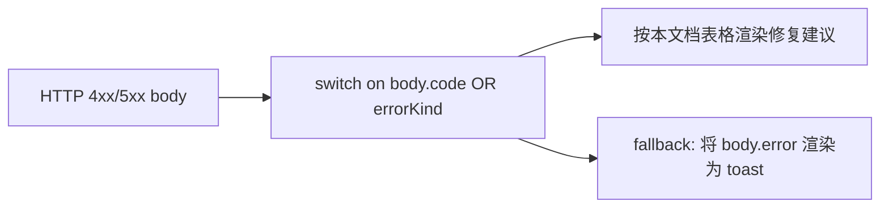
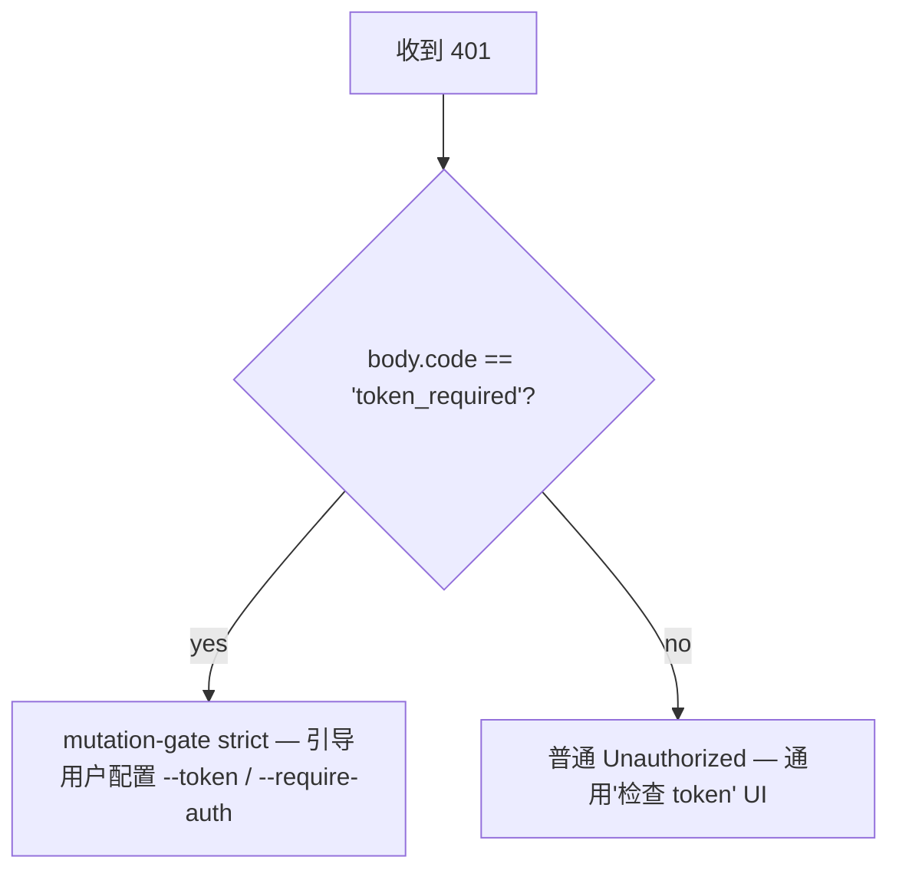

# 错误分类与修复指南

## 概述

daemon 的失败模式被设计为封闭的联合类型，以便 SDK 使用者可以穷举 switch 分支，路由处理器也能构造一致的 HTTP 响应。本文档对三个层级的所有类型化错误类/kind 进行了归类：

1. **`packages/cli/src/serve/`** — HTTP 边界处的边界错误（auth、workspace 文件系统、daemon-host 预检）。
2. **`packages/acp-bridge/`** — daemon 到 ACP 子进程边界处的 bridge/mediator 错误。
3. **`packages/sdk-typescript/src/daemon/`** — SDK 侧的包装与结构化错误字段。

Wire 层错误结构已在 [`../qwen-serve-protocol.md`](../qwen-serve-protocol.md) 中说明；本文档补充了原因分析和修复建议。

## 文件系统边界（`packages/cli/src/serve/fs/errors.ts`）

`FsError` 包含 `{ kind, message, status, cause? }`。`FsErrorKind` 联合类型（14 种，默认 HTTP 状态码）：

| Kind                     | HTTP      | 原因                                                                           | 修复建议                                                                                                                |
| ------------------------ | --------- | ------------------------------------------------------------------------------ | ----------------------------------------------------------------------------------------------------------------------- |
| `path_outside_workspace` | 400       | 解析后的路径超出了绑定的 workspace。                                           | 使用 daemon 的 `workspaceCwd` 内的路径；检查 `/capabilities`。                                                          |
| `symlink_escape`         | 400       | 目标是符号链接。                                                               | 直接使用解析后的路径；符号链接被设计上拒绝。                                                                            |
| `path_not_found`         | 404       | `ENOENT`。                                                                     | 确认文件存在；在 Linux 上注意路径大小写敏感。                                                                           |
| `binary_file`            | 422       | 文本路由检测到二进制内容。                                                     | 使用 `GET /file/bytes` 获取原始字节；文本路由拒绝二进制文件。                                                           |
| `file_too_large`         | 413       | 超过 `MAX_READ_BYTES`（256 KiB）或 `MAX_WRITE_BYTES`（5 MiB）。               | 使用字节范围读取；拆分写入。                                                                                            |
| `hash_mismatch`          | 409       | 乐观并发 `expectedSha256` 校验失败。                                           | 重新读取文件，使用新的 hash 重试。                                                                                      |
| `file_already_exists`    | 409       | `mode: 'create'` 作用于已存在的文件。                                         | 使用 `mode: 'overwrite'` 或选择新路径。                                                                                 |
| `text_not_found`         | 422       | `POST /file/edit` 的搜索字符串在文件中未找到。                                 | 重新检查搜索字符串；常见原因是空白字符或编码不匹配。                                                                    |
| `ambiguous_text_match`   | 422       | 需要唯一匹配，但找到多处匹配。                                                 | 在搜索字符串中加入更多上下文，使其唯一。                                                                                |
| `untrusted_workspace`    | 403       | 在不受信任的 workspace 中尝试写入。                                            | 将 workspace 标记为受信任（`Config.isTrustedFolder()`），或使用 `runQwenServe` 代替直接嵌入 `createServeApp`。          |
| `permission_denied`      | 403       | OS 级别的 `EACCES` / `EPERM`。                                                 | 调整文件系统 ACL；这**不是**安全告警。                                                                                  |
| `io_error`               | 503       | `ENOSPC` / `EIO` / `EBUSY` / `ETXTBSY` / `ENAMETOOLONG` / `EMFILE` / `ENFILE`。 | 主机运维修复（磁盘满、fd 耗尽）；属于运维告警，非安全事件。                                                            |
| `internal_error`         | 500       | 非 errno 错误到达边界。                                                        | 提交 daemon bug。                                                                                                       |
| `parse_error`            | 400 / 422 | 请求体解析错误（400）或服务级不变量违反（422）。                               | 校验请求体；检查 SDK 版本。                                                                                             |

`io_error` 与 `permission_denied` 的区分是有意为之，以便监控管道可以按 `errorKind` 路由；如果将 ENOSPC 归入 `permission_denied`，会让安全响应人员被 `df -h` 问题误触发。

## Bridge 错误（`packages/acp-bridge/src/bridgeErrors.ts`）

bridge/mediator 抛出的类型化错误类。大多数通过路由处理器的 switch 携带 HTTP 状态码。

| 类                                    | HTTP | 原因                                                                                  | 修复建议                                                                                                                                                                         |
| ------------------------------------- | ---- | ------------------------------------------------------------------------------------- | -------------------------------------------------------------------------------------------------------------------------------------------------------------------------------- |
| `SessionNotFoundError`                | 404  | sessionId 不在 `byId` 中。                                                            | 重新创建或附加；session 可能已被回收。                                                                                                                                           |
| `WorkspaceMismatchError`              | 400  | `POST /session` 的 `cwd` ≠ daemon 的 `boundWorkspace`。                               | 省略 `cwd`（使用绑定值）或路由到绑定了你的 `cwd` 的 daemon。                                                                                                                    |
| `SessionLimitExceededError`           | 503  | `byId.size >= maxSessions`。                                                          | 关闭旧 session；增大 `--max-sessions`。                                                                                                                                          |
| `InvalidClientIdError`                | 400  | `X-Qwen-Client-Id` 不在 `[A-Za-z0-9._:-]{1,128}` 范围内。                            | 清理 client id。                                                                                                                                                                 |
| `InvalidSessionMetadataError`         | 400  | `displayName` 超过 256 字符或包含控制字符。                                           | 截断/清理。                                                                                                                                                                      |
| `InvalidSessionScopeError`            | 400  | 未知的 `sessionScope` 值。                                                            | 使用 `'single'` 或 `'thread'`。                                                                                                                                                  |
| `RestoreInProgressError`              | 409  | 并发 `loadSession` / `resumeSession`。                                                | 等待后重试。                                                                                                                                                                     |
| `WorkspaceInitConflictError`          | 409  | `POST /workspace/init` 作用于已存在的文件且未传 `force`。                             | 传入 `force: true` 或选择其他路径。                                                                                                                                              |
| `WorkspaceInitPathEscapeError`        | 400  | init 路径超出 workspace。                                                             | 使用 `workspaceCwd` 内的路径。                                                                                                                                                   |
| `WorkspaceInitSymlinkError`           | 400  | init 路径是符号链接。                                                                 | 使用解析后的路径。                                                                                                                                                               |
| `WorkspaceInitRaceError`              | 409  | init 期间发生 TOCTOU 竞争。                                                           | 重试。                                                                                                                                                                           |
| `McpServerNotFoundError`              | 404  | 重启了一个未知的服务器。                                                              | 在 `/workspace/mcp` 中验证服务器名称。                                                                                                                                           |
| `McpServerRestartFailedError`         | 502  | ACP 子进程内重启失败。                                                                | 检查 ACP 子进程日志；可能是 MCP 服务器损坏。                                                                                                                                     |
| `InvalidPermissionOptionError`        | 400  | Wire 投票尝试通过 `optionId` 注入 `CANCEL_VOTE_SENTINEL`。                            | 使用 `{outcome: 'cancelled'}` 代替 `optionId`。                                                                                                                                  |
| `PermissionForbiddenError`            | 403  | 策略拒绝了投票者（`designated_mismatch` / `remote_not_allowed`）。                    | 使用发起方 client id（designated）、预注册投票者（consensus），或从回环地址投票（local-only）。参见 [`04-permission-mediation.md`](./04-permission-mediation.md)。                |
| `CancelSentinelCollisionError`        | 500  | Agent 将 `'__cancelled__'` 作为合法选项标签发布。                                     | Agent bug — 将选项标签改为 sentinel 以外的任何值。                                                                                                                               |
| `PermissionPolicyNotImplementedError` | 500  | 请求的策略未内置于此 daemon。                                                         | 升级 daemon，或修改 `policy.permissionStrategy`。                                                                                                                                |
| `BridgeChannelClosedError`            | 503  | ACP 子进程 channel 在调用中途关闭。                                                   | 重连/重试；检查 `session_died` 获取原因。                                                                                                                                        |
| `BridgeTimeoutError`                  | 504  | Bridge 级挂钟时间超限。                                                               | 重试；排查底层延迟问题。                                                                                                                                                         |
| `MissingCliEntryError`                | 500  | `qwen` CLI 入口文件缺失（定义在 `status.ts` 而非 `bridgeErrors.ts`）。                | 确认 CLI 安装完整；检查 `packages/cli/index.ts` 是否存在。                                                                                                                       |

## 启动时配置错误（`packages/cli/src/serve/run-qwen-serve.ts`）

| 类                         | 触发时机                                                                                                                                                                                             | 修复建议                                                                                                                                                                                              |
| -------------------------- | ---------------------------------------------------------------------------------------------------------------------------------------------------------------------------------------------------- | ----------------------------------------------------------------------------------------------------------------------------------------------------------------------------------------------------- |
| `InvalidPolicyConfigError` | `validatePolicyConfig()` 拒绝了合并后的设置：未知的 `policy.permissionStrategy`（根据 `SERVE_CAPABILITY_REGISTRY.permission_mediation.modes` 验证）或非正整数 `policy.consensusQuorum`。启动明确失败。 | 修复 `settings.json` 中的问题字段。该类支持 `instanceof`；`runQwenServe` 用它来区分策略不匹配与 settings 读取 I/O 失败（后者回退为默认值）。 |

## Device Flow 认证（`packages/cli/src/serve/auth/device-flow.ts`）

| 类                           | 触发时机                                       | 说明                                                                                                                                                                                                                                                                                                                                                                                                                                        |
| ---------------------------- | ---------------------------------------------- | ------------------------------------------------------------------------------------------------------------------------------------------------------------------------------------------------------------------------------------------------------------------------------------------------------------------------------------------------------------------------------------------------------------------------------------------- |
| `UpstreamDeviceFlowError`    | 上游 IdP 在轮询时返回结构化错误。              | `oauthError` 在插入 stderr 或 audit hint 前会经过 `sanitizeForStderr` 处理（CVE-2021-42574 / Trojan Source 防御；参见 [`12-auth-security.md`](./12-auth-security.md)）。                                                                                                                                                                                                                                                                    |
| `DeviceFlowPollTimeoutError` | registry 竞争计时器在 provider 返回前触发。    | Provider 代码不得抛出此类型。它仅供测试导出，registry 通过运行时品牌 `_isRegistryTimeout: boolean` 而非 `instanceof` 来判断 `pollTimedOut`。provider 导入并抛出 `new DeviceFlowPollTimeoutError(ms)` 时，仍会走通用 provider-throw audit 路径，因为 `_isRegistryTimeout` 默认为 `false`；只有内部工厂函数 `makeRegistryPollTimeoutError(ms)` 才会设置该品牌。 |

## Daemon-host 错误 kind（`packages/acp-bridge/src/status.ts`）

`SERVE_ERROR_KINDS` 是诊断 cell 和结构化 daemon 错误使用的封闭枚举：

| Kind                       | 含义                                                           |
| -------------------------- | -------------------------------------------------------------- |
| `missing_binary`           | 所需的本地可执行文件或 CLI 入口无法解析。                      |
| `blocked_egress`           | 出站网络探测失败。                                             |
| `auth_env_error`           | 与 auth 相关的环境变量、provider 或 trust-gate 配置无效。      |
| `init_timeout`             | Daemon 侧初始化步骤超过挂钟时间。                              |
| `protocol_error`           | ACP / HTTP 协议不匹配。                                        |
| `missing_file`             | 所需的本地文件缺失。                                           |
| `parse_error`              | 本地文件或请求解析错误。                                       |
| `stat_failed`              | 本地文件系统 stat 失败。                                       |
| `budget_exhausted`         | MCP 预算限制拒绝了 discovery 或某个服务器条目。                |
| `mcp_budget_would_exceed`  | MCP 重启或变更会超出配置的预算。                               |
| `mcp_server_spawn_failed`  | MCP 服务器 spawn 或重启失败。                                  |
| `invalid_config`           | MCP 或 daemon 配置无效。                                       |
| `prompt_deadline_exceeded` | Prompt 挂钟截止时间已过期。                                    |
| `writer_idle_timeout`      | SSE writer 在空闲超时前未成功写入任何内容。                    |

这些内容通过预检 cell 的 `errorKind` 暴露，以便客户端 UI 渲染结构化修复建议（而非原始堆栈跟踪）。

## Auth 错误结构

| 状态码 | 响应体                                       | 触发时机                                                                                                                                  |
| ------ | -------------------------------------------- | ----------------------------------------------------------------------------------------------------------------------------------------- |
| `401`  | `{ error: 'Unauthorized' }`                  | bearer token 缺失/错误/无 scheme。统一处理 `missing header` / `wrong scheme` / `wrong token`，探测者无法区分。                            |
| `401`  | `{ error: '...', code: 'token_required' }`   | mutation-gate strict 路由作用于无 token 的回环 daemon。SDK 渲染"配置 --token / --require-auth"提示。                                      |
| `403`  | `{ error: 'Request denied by CORS policy' }` | `denyBrowserOriginCors` 拒绝了带 `Origin` 的请求。                                                                                       |
| `403`  | `{ error: 'Invalid Host header' }`           | `hostAllowlist` 拒绝了 `Host` 请求头（DNS rebinding 防御）。                                                                             |

完整 auth 模型参见 [`12-auth-security.md`](./12-auth-security.md)。

## 权限结果（wire 与 audit 的重载）

`PermissionResolution` 有两种终态 kind：

- `{kind: 'option', optionId}` — 某投票获胜。
- `{kind: 'cancelled', reason: 'timeout' \| 'session_closed' \| 'agent_cancelled'}` — 请求被取消。wire 结构为简化形式（`{outcome: 'cancelled'}`）；audit 日志在 `decisionReason.type` 中区分 timeout / session_closed / voter-cancelled / agent-cancelled。此重载被有意保留，以避免破坏冻结的 `permission.ts` 合约。

## SDK 侧错误包装

`DaemonClient` 将 HTTP 错误以解析后的响应体作为 rejected Promise 的拒绝值返回。命中 `404`（未知 session）的方法会以 `{error, sessionId}` 拒绝；SDK 目前不将其包装为类型化类。调用方不应依赖 `instanceof Error` 加 `.message.includes(...)` 匹配；应改为 switch on 响应体中的 `err.code` 或 `err.kind`。

`parseSseStream` 在 16 MiB 缓冲区溢出时中止迭代器（防御性限制）。

## 工作流

### 向用户展示错误

### 区分 auth 失败模式

## 依赖关系

- 所有错误类均从各自的包中导出；在同一 Node 进程中运行时，SDK 使用者可以对 `bridgeErrors.ts` 类型使用 `instanceof`。通过 wire 时，应按 `body.code` / `body.kind` / `body.errorKind` 路由。

## 注意事项与已知限制

- **`io_error` 与 `permission_denied`** 刻意区分，不要混淆。
- **`PermissionForbiddenError` 的原因（`designated_mismatch` / `remote_not_allowed`）在 `designated` 和 `consensus` 策略间存在重载**；audit 日志精确区分，但 wire 层不作区分。
- **`CancelSentinelCollisionError` 表示 agent 侧 bug**，而非安全事件——bridge 拒绝请求，而不是悄悄让 sentinel 匹配到真实选项。
- **SDK 侧类型化错误仍在演进中。** 调用方应按响应体字段路由，而非依赖通过 wire 传输的 JS 类身份。
- **`internal_error` 应始终被排查。** 它表示 `FsError` 构造函数以为非 errno 路径保留的 kind 被调用（程序员错误）；响应体的 `cause` 字段可能携带原始异常。

## 参考资料

- `packages/cli/src/serve/fs/errors.ts`（`FsErrorKind`、`FsErrorStatus`）
- `packages/acp-bridge/src/bridgeErrors.ts`（所有类型化类）
- `packages/acp-bridge/src/status.ts`（`SERVE_ERROR_KINDS`、`ServeErrorKind`）
- `packages/cli/src/serve/auth.ts`（auth 响应体）
- Wire 参考：[`../qwen-serve-protocol.md`](../qwen-serve-protocol.md)。
