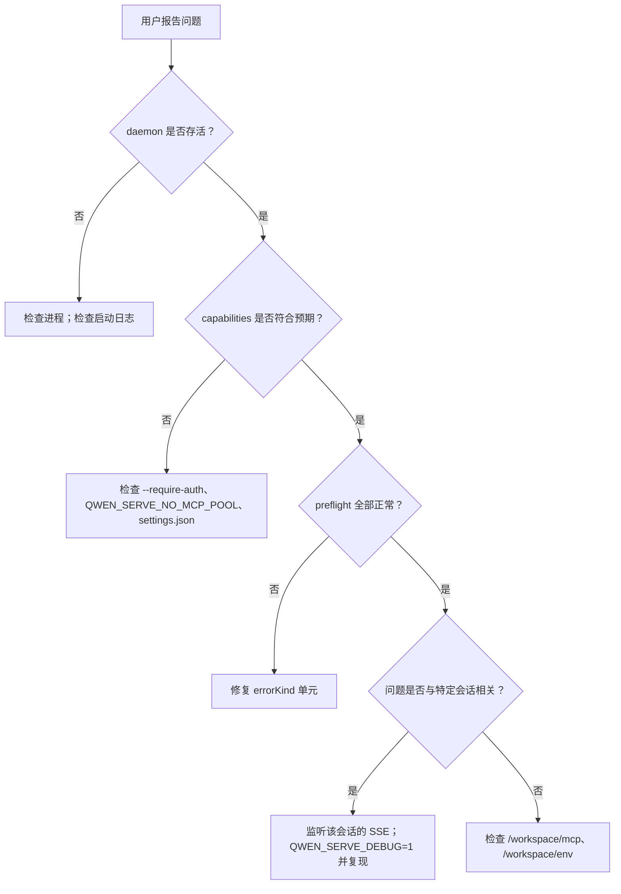

# 可观测性与调试

## 概述

`qwen serve` 目前内置了 **OpenTelemetry span 埋点**、**结构化文件日志**（`DaemonLogger`）、**每请求访问日志**、debug stderr 日志、结构化预检单元以及内存中的权限审计环。本页是当前可观测性功能的实用指南，并列出了排查问题时需要注意的空白点。

## 当前已有的能力

| 功能                                        | 位置                                           | 用途                                                                                                                                                                                                                                                                                       |
| ------------------------------------------- | ---------------------------------------------- | ------------------------------------------------------------------------------------------------------------------------------------------------------------------------------------------------------------------------------------------------------------------------------------------ |
| `QWEN_SERVE_DEBUG` stderr 日志              | `bridge.ts` 及各调用点                         | 环境变量值为 `1` / `true` / `on` / `yes`（不区分大小写）时，将 `qwen serve debug: ...` 行打印到 stderr。                                                                                                                                                                                  |
| OpenTelemetry span 埋点                     | `server.ts` `daemonTelemetryMiddleware`        | 每个 HTTP 请求都用 `withDaemonRequestSpan` 包裹；属性包含 route、sessionId、clientId 和 status code。权限路由有专属 span。Prompt 生命周期进行端到端追踪。配置位于 `settings.json` 的 `telemetry` 字段。                                                                                   |
| `DaemonLogger` 结构化文件日志               | `serve/daemon-logger.ts`                       | 结构化 JSON 格式日志行写入文件。启动时打印 `daemon log -> <path>`。支持 `info` / `warn` / `error` 级别，结构化字段包括 `route`、`sessionId`、`clientId`、`childPid` 和 `channelId`。                                                                                                       |
| 每请求访问日志中间件                        | `server.ts`，注册在 `bearerAuth` 之前          | 每次请求结束后记录 `method`、`path`、`status`、`durationMs`、`sessionId` 和 `clientId`。跳过 `GET /health` 和心跳请求。4xx 及以上使用 `warn`；成功使用 `info`。                                                                                                                             |
| `/health`                                   | `server.ts` 路由                               | 存活探针；`?deep=1` 返回扩展详情。                                                                                                                                                                                                                                                         |
| `/capabilities`                             | `server.ts` 路由                               | 预检能力发现。参见 [`11-capabilities-versioning.md`](./11-capabilities-versioning.md)。                                                                                                                                                                                                    |
| `/workspace/preflight`                      | 路由 -> `DaemonStatusProvider`                 | 结构化就绪单元：Node 版本、CLI 入口、ripgrep、git、npm，以及子进程启动后的 ACP 层单元。                                                                                                                                                                                                    |
| `/workspace/env`                            | 路由 -> `DaemonStatusProvider`                 | Daemon 进程环境变量快照。敏感环境变量仅报告是否存在；代理 URL 凭据会被脱敏。                                                                                                                                                                                                               |
| `/workspace/mcp`                            | 路由 -> bridge extMethod                       | Pool、budget 和 refusal 快照。                                                                                                                                                                                                                                                             |
| `/workspace/skills`、`/workspace/providers` | 路由                                           | ACP 侧实时快照；无活跃会话时返回空的空闲数据。                                                                                                                                                                                                                                             |
| 每会话 SSE                                  | `GET /session/:id/events`                      | 实时事件流。                                                                                                                                                                                                                                                                               |
| `/demo` 调试控制台                          | `GET /demo`（`packages/cli/src/serve/demo.ts`）| 可在浏览器访问的单页控制台：聊天、事件日志、工作区检查器和权限 UX。在回环地址上，`http://127.0.0.1:4170/demo` 是无需编写 SDK 代码的最快端到端验证路径。注册规则见 [`02-serve-runtime.md`](./02-serve-runtime.md)。 |
| `PermissionAuditRing`                       | `permission-audit.ts`                          | 内存中存储 512 条权限决策的 FIFO 环。                                                                                                                                                                                                                                                      |
| Mediator `decisionReason` 审计              | `permissionMediator.ts`                        | 内部结构化记录，说明权限请求为何以此方式解决。                                                                                                                                                                                                                                             |

## 当前尚不存在的能力

- **没有 Prometheus / metrics 端点。** 不存在 `process_cpu_seconds_total`、`http_requests_total` 或 `event_bus_queue_depth`。
- **`PermissionAuditRing` 没有外部审计输出。** 环本身存在，但向 SIEM 或外部存储的扇出 hook 尚未接入。

## 调试指南

### 1. Daemon 是否存活？

```bash
curl -s http://127.0.0.1:4170/health
# {"status":"ok"}

curl -s 'http://127.0.0.1:4170/health?deep=1' | jq
# {"status":"ok","workspaceCwd":"/path","sessions":N,...}
```

回环地址上收到 401 表示 `--require-auth` 可能已启用。启动时设置 `QWEN_SERVE_DEBUG=1` 可查看启动日志。

### 2. 当前广播了哪些功能？

```bash
curl -s http://127.0.0.1:4170/capabilities | jq
```

检查 `mcp_workspace_pool`（F2 pool 是否开启）、`require_auth`（是否加固）、`permission_mediation.modes`（支持的策略）以及 `policy.permission`（当前生效的策略）。

### 3. Daemon 主机就绪状态是否正常？

```bash
curl -s http://127.0.0.1:4170/workspace/preflight | jq
```

`status: 'not_started'` 的单元属于 ACP 层，仅在第一个会话接入后才会填充。`status: 'fail'` 的单元包含封闭的 `errorKind`；可根据 [`18-error-taxonomy.md`](./18-error-taxonomy.md) 渲染结构化修复建议。

### 4. 监听会话 SSE 流

```bash
curl -N -H 'Accept: text/event-stream' \
     -H 'Authorization: Bearer XYZ' \
     -H 'X-Qwen-Client-Id: debug-tail' \
     -H 'Last-Event-ID: 0' \
     'http://127.0.0.1:4170/session/<sid>/events'
```

`-N` 禁用 curl 的输出缓冲。`Last-Event-ID: 0` 请求重放 `id > 0` 的环中事件。

### 5. 权限请求为何以此方式解决？

`PermissionAuditRing` 在内存中，目前没有 HTTP 接口。启用 `QWEN_SERVE_DEBUG=1` 并复现问题；mediator 会为每次投票和决策打印结构化行，包括 `decisionReason.type`。后续 PR 可将该环通过 HTTP 暴露出来。

### 6. 哪个消费者变慢了？

当队列达到 75% 时，`slow_client_warning` 会在每次溢出事件中触发一次。订阅会话 SSE 流并查找合成帧；payload 包含 `queueSize`、`maxQueued` 和 `lastEventId`。反复出现警告说明有消费者卡住，通常是 SDK 中阻塞的 `for await` 循环。

### 7. MCP server 为何被拒绝？

结合 `/workspace/mcp` 中每个 cell 的 `disabledReason: 'budget'`、`refusedServerNames` 列表和 `mcp_child_refused_batch` SSE 事件，与 `/capabilities` 中的 `mcp_guardrails.modes`（`enforce` 是否生效）以及通过 `getReservedSlots()` 获取的实时 `--mcp-client-budget` 状态进行对比。

### 8. Daemon 无法关闭

第一个信号触发优雅关闭（参见 [`02-serve-runtime.md`](./02-serve-runtime.md)）。若超过 10s 仍挂起，检查：

- ACP 子进程未响应优雅关闭。
- 长连接 SSE 使 HTTP `server.close()` 超过 `SHUTDOWN_FORCE_CLOSE_MS`（5s）后仍保持打开。

**第二次** SIGTERM/SIGINT 会主动触发 `bridge.killAllSync()` + `process.exit(1)`。

## 流程

### 典型排查流程



## 状态与生命周期

- `QWEN_SERVE_DEBUG` 通过 `debug-mode.ts` 中的 `isServeDebugMode()` 在每次检查时读取；切换该变量无需重启。但启动日志只有在启动时已设置该环境变量才可获取。
- `PermissionAuditRing` 上限为 512 条 FIFO 记录；旧记录会被静默丢弃。
- `DaemonStatusProvider` 每次请求都重新构建单元，不做缓存；避免不必要的高频轮询。

## 依赖

- `process.stderr.write` 用于 debug stderr。
- `DaemonLogger` 用于结构化文件日志。
- 通过 `initializeTelemetry` 和 `createDaemonBridgeTelemetry` 使用 OpenTelemetry SDK。
- `node:process` 用于环境变量和信号检查。

## 配置

| 配置项                          | 效果                                                                                         |
| ------------------------------- | -------------------------------------------------------------------------------------------- |
| `QWEN_SERVE_DEBUG`              | 启用详细 stderr 日志。参见 [`17-configuration.md`](./17-configuration.md)。                  |
| `settings.json` `telemetry`     | 控制 OTel 行为：`enabled`、`otlpEndpoint`、`otlpProtocol` 及各信号端点。                    |
| `DaemonLogger` 日志路径         | 启动时生成并以 `daemon log -> <path>` 打印到 stderr。                                        |
| `PermissionAuditRing` 大小      | 当前硬编码为 512。                                                                           |
| `slow_client_warning` 阈值      | `0.75` / `0.375`，硬编码在 `eventBus.ts` 中。                                               |

## 注意事项与已知限制

- **DaemonLogger 文件日志为结构化格式**，可按 `route`、`sessionId` 和 `clientId` 过滤。`QWEN_SERVE_DEBUG` stderr 日志仍为非结构化文本。
- **OpenTelemetry span 包含每请求关联信息。** 每个 HTTP 请求 span 携带 route、sessionId 和 clientId 属性，可在追踪后端中进行关联。
- **ACP 层 `/workspace/preflight` 单元需要活跃会话。** 在空闲 daemon 上，auth / MCP / skills / providers 可能显示 `status: 'not_started'`，这是正常现象。
- **`/workspace/env` 仅报告敏感变量是否存在，不返回值。** 如果某个密钥的存在本身属于敏感信息，请勿暴露该响应。
- **审计环是进程本地的**，daemon 重启后历史记录丢失。
- **本文未记录负载测试方案。** 性能基线位于 `test/perf-daemon-baseline` 分支。

## 参考资料

- `packages/cli/src/serve/daemon-status-provider.ts`
- `packages/cli/src/serve/daemon-logger.ts`（`DaemonLogger`、`buildDaemonLogLine`）
- `packages/cli/src/serve/debug-mode.ts`（`isServeDebugMode`）
- `packages/acp-bridge/src/permissionMediator.ts`（`PermissionDecisionReason`）
- `packages/cli/src/serve/server.ts`（`daemonTelemetryMiddleware`、访问日志中间件）
- 配置：[`17-configuration.md`](./17-configuration.md)
- 错误分类：[`18-error-taxonomy.md`](./18-error-taxonomy.md)
- 用户操作指南：[`../../users/qwen-serve.md`](../../users/qwen-serve.md)
