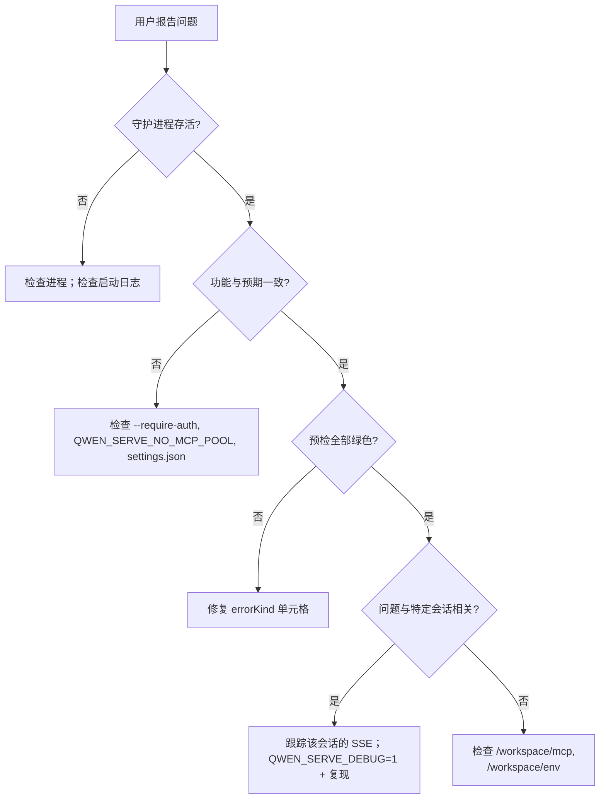

# 可观察性与调试

## 概述

`qwen serve` 目前内置了 **OpenTelemetry 跨度埋点**、**结构化文件日志** (`DaemonLogger`)、**每次请求的访问日志**、调试 stderr 日志、结构化预检单元格以及一个内存中的权限审计环（PermissionAuditRing）。本文档是当前可观测性面的实用指南，以及排查时需要留意的缺口。

## 现有功能

| 表面                                           | 位置                                          | 目的                                                                                                                                                                                                                                                                                           |
| ---------------------------------------------- | --------------------------------------------- | ---------------------------------------------------------------------------------------------------------------------------------------------------------------------------------------------------------------------------------------------------------------------------------------------- |
| `QWEN_SERVE_DEBUG` stderr 日志                 | `bridge.ts` 及调用点                         | 环境值为 `1` / `true` / `on` / `yes`（不区分大小写）时，向 stderr 打印 `qwen serve debug: ...` 行。                                                                                                                                                                                           |
| OpenTelemetry 跨度埋点                          | `server.ts` `daemonTelemetryMiddleware`       | 每个 HTTP 请求包裹在 `withDaemonRequestSpan` 中；属性包括 route、sessionId、clientId 及状态码。权限路由拥有专用跨度。提示生命周期实现端到端追踪。配置位于 `settings.json` `telemetry` 中。                                                                                                     |
| `DaemonLogger` 结构化文件日志                    | `serve/daemon-logger.ts`                     | 结构化的类 JSON 日志行写入文件。启动时打印 `daemon log -> <path>`。支持 `info` / `warn` / `error` 级别，结构化字段包括 `route`、`sessionId`、`clientId`、`childPid` 和 `channelId`。                                                                                                          |
| 每次请求的访问日志中间件                         | `server.ts`，在 `bearerAuth` 之前注册          | 每次请求后记录 `method`、`path`、`status`、`durationMs`、`sessionId` 和 `clientId`。跳过 `GET /health` 和心跳。4xx+ 使用 `warn`；成功使用 `info`。                                                                                                                                          |
| `/health`                                      | `server.ts` 路由                              | 存活性探针；`?deep=1` 返回扩展详情。                                                                                                                                                                                                                                                          |
| `/capabilities`                                | `server.ts` 路由                              | 预检功能发现。参见 [`11-capabilities-versioning.md`](./11-capabilities-versioning.md)。                                                                                                                                                                                                       |
| `/workspace/preflight`                         | 路由 → `DaemonStatusProvider`                 | 结构化就绪单元格：Node 版本、CLI 入口、ripgrep、git、npm，以及子进程存活后的 ACP 级别单元格。                                                                                                                                                                                               |
| `/workspace/env`                               | 路由 → `DaemonStatusProvider`                 | 守护进程环境变量快照。机密环境变量仅报告是否存在；代理 URL 的凭据会被剥离。                                                                                                                                                                                                                |
| `/workspace/mcp`                               | 路由 → bridge extMethod                      | 池、预算和拒绝快照。                                                                                                                                                                                                                                                                           |
| `/workspace/skills`、`/workspace/providers`    | 路由                                          | ACP 侧实时快照；无会话时返回空空闲数据。                                                                                                                                                                                                                                                         |
| 每会话 SSE                                     | `GET /session/:id/events`                     | 实时事件流。                                                                                                                                                                                                                                                                                   |
| `/demo` 调试控制台                              | `GET /demo` (`packages/cli/src/serve/demo.ts`) | 浏览器可访问的单页控制台：聊天、事件日志、工作区检查器和权限 UX。在回环地址上，`http://127.0.0.1:4170/demo` 是最快的端到端验证路径，无需编写 SDK 代码。注册规则见 [`02-serve-runtime.md`](./02-serve-runtime.md)。                                                                          |
| `PermissionAuditRing`                          | `permission-audit.ts`                         | 内存中的 FIFO 队列，存放 512 条权限决策记录。                                                                                                                                                                                                                                                |
| Mediator `decisionReason` 审计                 | `permissionMediator.ts`                      | 内部结构化记录，解释权限请求为何以该种方式解析。                                                                                                                                                                                                                                             |

## 目前缺失的功能

- **无 Prometheus / metrics 端点。** 没有 `process_cpu_seconds_total`、`http_requests_total` 或 `event_bus_queue_depth`。
- **无外部审计下沉（Audit Sink）用于 `PermissionAuditRing`。** 环存在，但未接入 SIEM 或外部存储的扇出钩子。

## 调试指南

### 1. 守护进程是否存活？

```bash
curl -s http://127.0.0.1:4170/health
# {"status":"ok"}

curl -s 'http://127.0.0.1:4170/health?deep=1' | jq
# {"status":"ok","workspaceCwd":"/path","sessions":N,...}
```

回环地址返回 401 表示可能启用了 `--require-auth`。启动时使用 `QWEN_SERVE_DEBUG=1` 查看启动日志。

### 2. 公布了哪些功能？

```bash
curl -s http://127.0.0.1:4170/capabilities | jq
```

检查 `mcp_workspace_pool`（F2 池是否开启）、`require_auth`（是否加固）、`permission_mediation.modes`（支持的策略）以及 `policy.permission`（活动策略）。

### 3. 守护进程主机的就绪状态是否健康？

```bash
curl -s http://127.0.0.1:4170/workspace/preflight | jq
```

`status: 'not_started'` 的单元格属于 ACP 级别，仅在第一个会话附加后才会填充。`status: 'fail'` 的单元格包含 closed 的 `errorKind`；从 [`18-error-taxonomy.md`](./18-error-taxonomy.md) 渲染结构化修复建议。

### 4. 跟踪会话 SSE 流

```bash
curl -N -H 'Accept: text/event-stream' \
     -H 'Authorization: Bearer XYZ' \
     -H 'X-Qwen-Client-Id: debug-tail' \
     -H 'Last-Event-ID: 0' \
     'http://127.0.0.1:4170/session/<sid>/events'
```

`-N` 禁用 curl 输出缓冲。`Last-Event-ID: 0` 请求重放 `id > 0` 的环事件。

### 5. 权限请求为何以该种方式解析？

`PermissionAuditRing` 位于内存中，目前没有 HTTP 接口。启用 `QWEN_SERVE_DEBUG=1` 并复现；调解器会为每次投票和决策打印结构化行，包括 `decisionReason.type`。后续 PR 可通过 HTTP 暴露该环。

### 6. 哪个消费者拖慢了速度？

当队列达到 75% 时，`slow_client_warning` 每次超限阶段触发一次。订阅会话 SSE 流并查找合成帧；负载包含 `queueSize`、`maxQueued` 和 `lastEventId`。重复警告表明消费者卡住，通常是由于阻塞的 SDK `for await` 循环。

### 7. 为什么 MCP 服务器被拒绝？

结合 `/workspace/mcp` 每个单元格的 `disabledReason: 'budget'`、`refusedServerNames` 列表以及 `mcp_child_refused_batch` SSE 事件。与 `/capabilities` 的 `mcp_guardrails.modes`（`enforce` 是否启用？）以及通过 `getReservedSlots()` 可见的实时 `--mcp-client-budget` 状态进行比较。

### 8. 守护进程无法关闭

首次信号触发优雅关闭（见 [`02-serve-runtime.md`](./02-serve-runtime.md)）。如果卡住超过 10 秒，请检查：

- ACP 子进程未响应优雅关闭。
- 长 SSE 连接使 HTTP `server.close()` 在 `SHUTDOWN_FORCE_CLOSE_MS`（5 秒）之后仍保持打开。

**第二次** SIGTERM/SIGINT 会强制触发 `bridge.killAllSync()` + `process.exit(1)`。

## 流程

### 典型排查流程



## 状态与生命周期

- `QWEN_SERVE_DEBUG` 每次检查都会通过 `debug-mode.ts` 中的 `isServeDebugMode()` 读取；无需重启即可切换。启动日志仅在启动时设置了该环境变量才可用。
- `PermissionAuditRing` 限制为 512 个 FIFO 条目；更早的记录会被静默丢弃。
- `DaemonStatusProvider` 每次请求重建单元格，不缓存；避免不必要的高频轮询。

## 依赖项

- `process.stderr.write` 用于调试 stderr。
- `DaemonLogger` 用于结构化文件日志。
- OpenTelemetry SDK，通过 `initializeTelemetry` 和 `createDaemonBridgeTelemetry`。
- `node:process` 用于环境和信号检查。

## 配置

| 配置项                         | 效果                                                                                             |
| ------------------------------ | ------------------------------------------------------------------------------------------------ |
| `QWEN_SERVE_DEBUG`             | 启用详细的 stderr 日志。见 [`17-configuration.md`](./17-configuration.md)。                       |
| `settings.json` `telemetry`    | 控制 OTel 行为：`enabled`、`otlpEndpoint`、`otlpProtocol` 以及每信号端点。                      |
| `DaemonLogger` 日志路径        | 启动时生成并作为 `daemon log -> <path>` 打印到 stderr。                                           |
| `PermissionAuditRing` 大小     | 目前硬编码为 512。                                                                               |
| `slow_client_warning` 阈值     | `0.75` / `0.375`，在 `eventBus.ts` 中硬编码。                                                   |

## 注意事项与已知限制

- **DaemonLogger 文件日志是结构化的**，可按 `route`、`sessionId` 和 `clientId` 过滤。`QWEN_SERVE_DEBUG` stderr 日志仍为未结构化文本。
- **OpenTelemetry 跨度包含每次请求的关联信息。** 每个 HTTP 请求跨度携带 route、sessionId 和 clientId 属性，可在追踪后端中关联。
- **ACP 级别的 `/workspace/preflight` 单元格需要活跃会话。** 在空闲守护进程上，auth / MCP / skills / providers 可能显示 `status: 'not_started'`；这是预期行为。
- **`/workspace/env` 仅报告机密是否存在，而非值。** 请勿公开响应，因为仅仅存在某机密就可能属于敏感信息。
- **审计环是进程本地的**，守护进程重启后历史丢失。
- **本文档未记录负载测试方案。** 性能基准位于 `test/perf-daemon-baseline` 分支。

## 参考

- `packages/cli/src/serve/daemon-status-provider.ts`
- `packages/cli/src/serve/daemon-logger.ts` (`DaemonLogger`, `buildDaemonLogLine`)
- `packages/cli/src/serve/debug-mode.ts` (`isServeDebugMode`)
- `packages/acp-bridge/src/permissionMediator.ts` (`PermissionDecisionReason`)
- `packages/cli/src/serve/server.ts` (`daemonTelemetryMiddleware`, 访问日志中间件)
- 配置：[`17-configuration.md`](./17-configuration.md)
- 错误分类：[`18-error-taxonomy.md`](./18-error-taxonomy.md)
- 用户操作指南：[`../../users/qwen-serve.md`](../../users/qwen-serve.md)