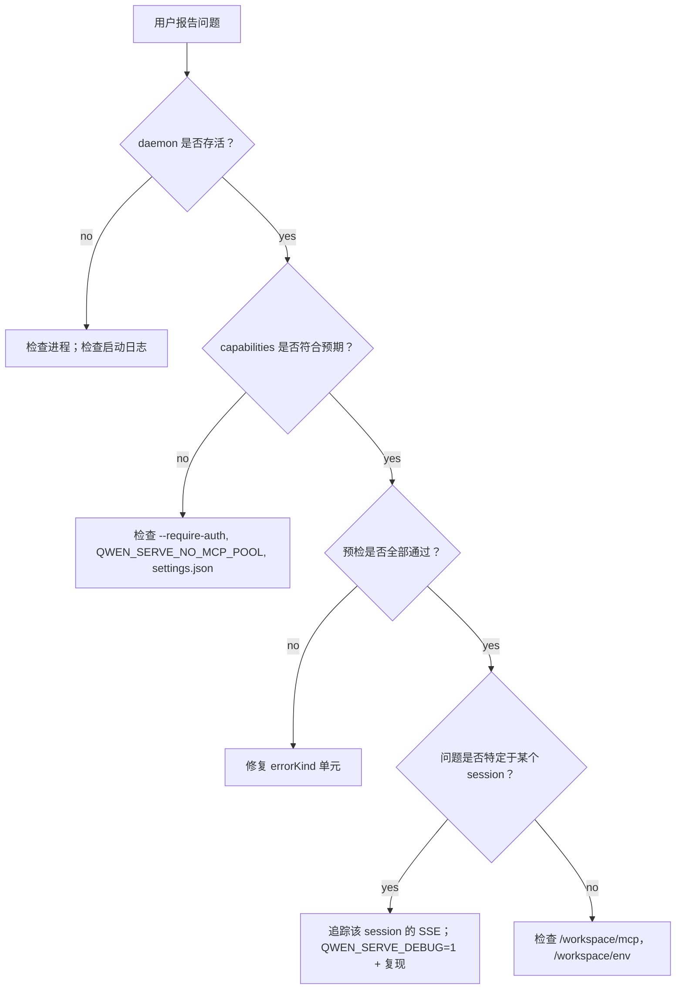

# 可观测性与调试

## 概述

`qwen serve` 目前内置了 **OpenTelemetry span 插桩**、**结构化文件日志**（`DaemonLogger`）、**按请求的访问日志**、调试 stderr 日志、结构化预检单元（preflight cells）以及内存中的权限审计环（permission audit ring）。本页是关于当前可观测性能力以及排查问题时需注意的盲区的实用指南。

## 当前已有的能力

| 观测点                                     | 位置                                       | 用途                                                                                                                                                                                                                                                                                   |
| ------------------------------------------- | ---------------------------------------------- | ----------------------------------------------------------------------------------------------------------------------------------------------------------------------------------------------------------------------------------------------------------------------------------------- |
| `QWEN_SERVE_DEBUG` stderr 日志              | `bridge.ts` 及调用点                     | 环境变量值为 `1` / `true` / `on` / `yes`（不区分大小写）时，会将 `qwen serve debug: ...` 行打印到 stderr。                                                                                                                                                                                  |
| OpenTelemetry span 插桩          | `server.ts` `daemonTelemetryMiddleware`        | 每个 HTTP 请求都被包裹在 `withDaemonRequestSpan` 中；属性包括 route、sessionId、clientId 和状态码。权限路由有专属的 span。Prompt 生命周期被端到端追踪。配置位于 `settings.json` 的 `telemetry` 中。                               |
| OpenTelemetry daemon 性能指标           | `telemetry/*event-loop-lag*`, `daemon-metrics` | daemon 和 ACP 子进程的事件循环延迟 gauge，以及 daemon 与子进程管道消息字节数的 histogram。                                                                                                                                                                                 |
| `DaemonLogger` 结构化文件日志         | `serve/daemon-logger.ts`                       | 结构化的类 JSON 日志行被写入文件。启动时打印 `daemon log -> <path>`。支持 `info` / `warn` / `error` 级别，包含 `route`、`sessionId`、`clientId`、`childPid` 和 `channelId` 等结构化字段。                                                        |
| 按请求的访问日志中间件           | `server.ts`，注册在 `bearerAuth` 之前    | 在每个请求后记录 `method`、`path`、`status`、`durationMs`、`sessionId` 和 `clientId`。跳过 `GET /health` 和心跳请求。4xx 及以上使用 `warn`；成功使用 `info`。                                                                                                                  |
| `/health`                                   | `server.ts` 路由                              | 存活探针；`?deep=1` 返回扩展详情。                                                                                                                                                                                                                                       |
| `/capabilities`                             | `server.ts` 路由                              | 预检功能发现。参见 [`11-capabilities-versioning.md`](./11-capabilities-versioning.md)。                                                                                                                                                                                      |
| `/workspace/preflight`                      | 路由 -> `DaemonStatusProvider`                | 结构化就绪单元（readiness cells）：Node 版本、CLI 入口、ripgrep、git、npm，以及子进程存活后的 ACP 级别单元。                                                                                                                                                                       |
| `/workspace/env`                            | 路由 -> `DaemonStatusProvider`                | Daemon 进程环境变量快照。Secret 环境变量仅报告其存在；代理 URL 凭据会被剥离。                                                                                                                                                                                    |
| `/workspace/mcp`                            | 路由 -> bridge extMethod                      | 池、预算和拒绝快照。                                                                                                                                                                                                                                                       |
| `/workspace/skills`, `/workspace/providers` | 路由                                         | ACP 侧的实时快照；当不存在 session 时返回空的空闲数据。                                                                                                                                                                                                                   |
| 按 session 的 SSE                             | `GET /session/:id/events`                      | 实时事件流。                                                                                                                                                                                                                                                                   |
| `/demo` 调试控制台                       | `GET /demo` (`packages/cli/src/serve/demo.ts`) | 浏览器可访问的单页控制台：聊天、事件日志、workspace 检查器和权限 UX。在环回地址上，`http://127.0.0.1:4170/demo` 是无需编写 SDK 代码即可进行最快端到端验证的路径。注册规则在 [`02-serve-runtime.md`](./02-serve-runtime.md) 中。 |
| `PermissionAuditRing`                       | `permission-audit.ts`                          | 包含 512 个权限决策的内存 FIFO 队列。                                                                                                                                                                                                                                               |
| Mediator `decisionReason` 审计             | `permissionMediator.ts`                        | 内部结构化记录，解释权限请求为何以该方式解析。                                                                                                                                                                                                   |

## 当前尚不支持的能力

- **无 Prometheus / metrics 端点。** OTel 指标可以导出，但 daemon 不暴露 Prometheus 抓取端点。
- **`PermissionAuditRing` 无外部审计 sink。** 环存在，但未连接向 SIEM 或外部存储扇出的 hook。

## 调试指南

### 1. daemon 是否存活？

```bash
curl -s http://127.0.0.1:4170/health
# {"status":"ok"}

curl -s 'http://127.0.0.1:4170/health?deep=1' | jq
# {"status":"ok","workspaceCwd":"/path","sessions":N,...}
```

在环回地址上收到 401 意味着可能启用了 `--require-auth`。在启动时使用 `QWEN_SERVE_DEBUG=1` 以查看启动日志。

### 2. 宣告了哪些功能？

```bash
curl -s http://127.0.0.1:4170/capabilities | jq
```

检查 `mcp_workspace_pool`（F2 pool 是否开启？）、`require_auth`（是否加固？）、`permission_mediation.modes`（支持的策略）以及 `policy.permission`（当前生效的策略）。

### 3. daemon 宿主就绪状态是否健康？

```bash
curl -s http://127.0.0.1:4170/workspace/preflight | jq
```

`status: 'not_started'` 的单元是 ACP 级别的，仅在第一个 session 附加后才会填充。`status: 'fail'` 的单元包含一个闭合的 `errorKind`；请根据 [`18-error-taxonomy.md`](./18-error-taxonomy.md) 渲染结构化修复方案。

### 4. 实时查看 session SSE 流

```bash
curl -N -H 'Accept: text/event-stream' \
     -H 'Authorization: Bearer XYZ' \
     -H 'X-Qwen-Client-Id: debug-tail' \
     -H 'Last-Event-ID: 0' \
     'http://127.0.0.1:4170/session/<sid>/events'
```

`-N` 禁用 curl 输出缓冲。`Last-Event-ID: 0` 请求重放 `id > 0` 的环事件。

### 5. 为什么权限请求会这样解析？

`PermissionAuditRing` 存在于内存中，目前没有 HTTP 接口。启用 `QWEN_SERVE_DEBUG=1` 并复现问题；mediator 会为每次投票和决策打印结构化日志，包括 `decisionReason.type`。后续的 PR 可以通过 HTTP 暴露该环。

### 6. 哪个消费者较慢？

当队列达到 75% 时，每次溢出事件会触发一次 `slow_client_warning`。订阅 session SSE 流并查找合成帧；payload 包含 `queueSize`、`maxQueued` 和 `lastEventId`。重复的警告表明消费者卡住，通常是阻塞的 SDK `for await` 循环。

### 7. 为什么 MCP server 被拒绝？

结合 `/workspace/mcp` 中每个单元的 `disabledReason: 'budget'`、`refusedServerNames` 列表以及 `mcp_child_refused_batch` SSE 事件。将它们与 `/capabilities` 中的 `mcp_guardrails.modes`（`enforce` 是否激活？）以及通过 `getReservedSlots()` 可见的实时 `--mcp-client-budget` 状态进行比较。

### 8. daemon 无法关闭

第一个信号触发优雅关闭（参见 [`02-serve-runtime.md`](./02-serve-runtime.md)）。如果挂起超过 10 秒，请检查：

- ACP 子进程未响应优雅关闭。
- 长 SSE 连接导致 HTTP `server.close()` 在 `SHUTDOWN_FORCE_CLOSE_MS`（5 秒）后仍处于打开状态。

**第二个** SIGTERM/SIGINT 会故意触发 `bridge.killAllSync()` + `process.exit(1)`。

### 9. daemon 事件循环、prompt 队列或 ACP 管道是否过载？

当生产环境 daemon 运行时注入性能快照 provider 时，`GET /daemon/status` 可能包含 `runtime.perf`：

```json
{
  "runtime": {
    "perf": {
      "eventLoop": { "meanMs": 1.2, "p50Ms": 1.0, "p99Ms": 9.5, "maxMs": 25 },
      "promptQueueWait": { "count": 3, "meanMs": 12.5, "maxMs": 35, "lastMs": 4 },
      "pipe": {
        "inbound": { "count": 42, "totalBytes": 100000, "maxBytes": 12000 },
        "outbound": { "count": 41, "totalBytes": 90000, "maxBytes": 11000 }
      }
    }
  }
}
```

状态 payload 仅限 daemon。`promptQueueWait` 汇总了在 daemon 进程中观察到的 prompt FIFO 队列等待样本。ACP 子进程事件循环延迟故意不聚合到 `/daemon/status` 中；它可以通过 OTel gauge `qwen-code.acp.event_loop.lag` 以及转发到 daemon 日志的 stderr 停顿行来查看。

新的 OTel 指标名称：

- `qwen-code.daemon.event_loop.lag`，以毫秒为单位的 gauge，包含 `stat=mean|p50|p99|max`。
- `qwen-code.acp.event_loop.lag`，以毫秒为单位的 gauge，包含 `stat=mean|p50|p99|max`。
- `qwen-code.daemon.prompt.queue_wait`，以毫秒为单位的 histogram。
- `qwen-code.daemon.pipe.message_bytes`，以字节为单位的 histogram，包含 `direction=inbound|outbound`。

## 流程

### 典型排查流程


```mermaid
flowchart TD
    A[用户报告问题] --> B{daemon 是否存活？}
    B -->|no| BD[检查进程；检查启动日志]
    B -->|yes| C{capabilities 是否符合预期？}
    C -->|no| CD["检查 --require-auth, QWEN_SERVE_NO_MCP_POOL, settings.json"]
    C -->|yes| D{预检是否全部通过？}
    D -->|no| DD["修复 errorKind 单元"]
    D -->|yes| E{问题是否特定于某个 session？}
    E -->|yes| ES["追踪该 session 的 SSE；<br/>QWEN_SERVE_DEBUG=1 + 复现"]
    E -->|no| EW["检查 /workspace/mcp，<br/>/workspace/env"]
```

## 状态与生命周期

- `QWEN_SERVE_DEBUG` 在每次检查时通过 `debug-mode.ts` 中的 `isServeDebugMode()` 读取；切换它不需要重启。除非在启动时设置了该环境变量，否则无法获取启动日志。
- `PermissionAuditRing` 限制为 512 个 FIFO 条目；较旧的记录会被静默丢弃。
- `DaemonStatusProvider` 按请求重建单元且不做缓存；避免不必要的高频轮询。
## 依赖

- 使用 `process.stderr.write` 进行调试 stderr 输出。
- 使用 `DaemonLogger` 生成结构化文件日志。
- 通过 `initializeTelemetry` 和 `createDaemonBridgeTelemetry` 使用 OpenTelemetry SDK。
- 使用 `node:perf_hooks.monitorEventLoopDelay` 监控 daemon 和 ACP 的事件循环延迟指标。
- 使用 `node:process` 检查环境变量和信号。

## 配置

| 配置项                            | 作用                                                                                       |
| ------------------------------- | -------------------------------------------------------------------------------------------- |
| `QWEN_SERVE_DEBUG`              | 启用详细的 stderr 日志。请参阅 [`17-configuration.md`](./17-configuration.md)。             |
| `settings.json` `telemetry`     | 控制 OTel 行为：`enabled`、`otlpEndpoint`、`otlpProtocol` 以及各信号的端点。 |
| `DaemonLogger` 日志路径         | 在启动时生成，并作为 `daemon log -> <path>` 打印到 stderr。                           |
| `PermissionAuditRing` 大小      | 目前硬编码为 512。                                                                     |
| `slow_client_warning` 阈值 | `0.75` / `0.375`，在 `eventBus.ts` 中硬编码。                                               |

## 注意事项与已知限制

- **DaemonLogger 文件日志是结构化的**，可通过 `route`、`sessionId` 和 `clientId` 进行过滤。`QWEN_SERVE_DEBUG` 的 stderr 日志仍为非结构化文本。
- **OpenTelemetry span 包含按请求关联的信息。** 每个 HTTP 请求 span 都携带 route、sessionId 和 clientId 属性，可在追踪后端中进行关联查询。
- **`runtime.perf` 仅适用于 daemon。** 设计上不在此处报告子进程的事件循环延迟；对于 ACP 子进程卡顿，请使用 OTel 或转发的 stderr 卡顿警告。
- **ACP 级别的 `/workspace/preflight` 单元格需要活跃会话。** 在空闲的 daemon 上，auth / MCP / skills / providers 可能会显示 `status: 'not_started'`；这是预期行为。
- **`/workspace/env` 仅报告 secret 是否存在，不报告具体值。** 如果 secret 的存在本身属于敏感信息，请勿暴露该响应。
- **审计环是进程本地的**，daemon 重启时历史记录会丢失。
- **此处未记录负载测试方案。** 性能基线位于 `test/perf-daemon-baseline` 分支。

## 参考资料

- `packages/cli/src/serve/daemon-status-provider.ts`
- `packages/cli/src/serve/daemon-logger.ts`（`DaemonLogger`、`buildDaemonLogLine`）
- `packages/cli/src/serve/debug-mode.ts`（`isServeDebugMode`）
- `packages/acp-bridge/src/permissionMediator.ts`（`PermissionDecisionReason`）
- `packages/cli/src/serve/server.ts`（`daemonTelemetryMiddleware`、access-log 中间件）
- 配置：[`17-configuration.md`](./17-configuration.md)
- 错误分类：[`18-error-taxonomy.md`](./18-error-taxonomy.md)
- 用户操作指南：[`../../users/qwen-serve.md`](../../users/qwen-serve.md)