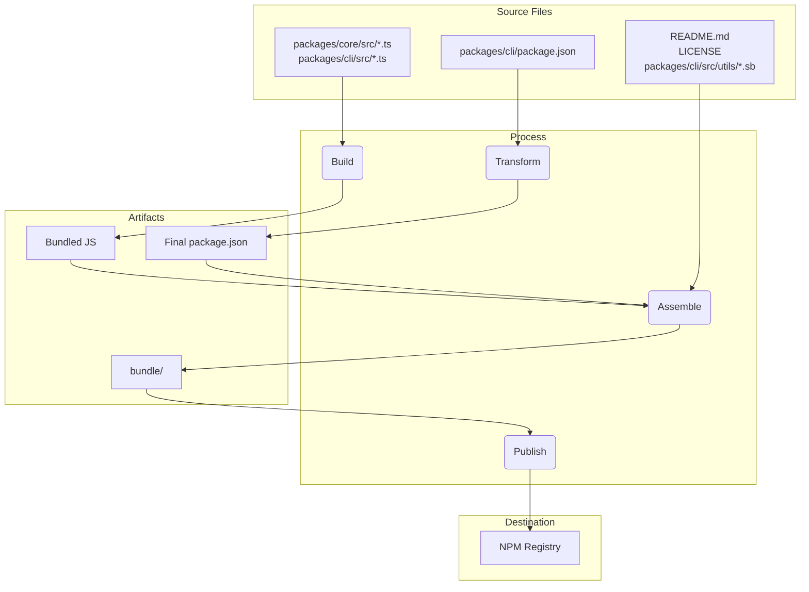

# Package 概览

这个 monorepo 包含两个主要的包：`@qwen-code/qwen-code` 和 `@qwen-code/qwen-code-core`。

## `@qwen-code/qwen-code`

这是 Qwen Code 的主包。它负责用户界面、命令解析以及所有面向用户的其他功能。

当这个包发布时，会被打包成一个单独的可执行文件。这个 bundle 包含了包的所有依赖，包括 `@qwen-code/qwen-code-core`。这意味着无论用户是通过 `npm install -g @qwen-code/qwen-code` 安装包，还是直接使用 `npx @qwen-code/qwen-code` 运行，他们使用的都是这个单一的、自包含的可执行文件。

## `@qwen-code/qwen-code-core`

这个 package 包含了 CLI 的核心逻辑。它负责向已配置的 providers 发起 API 请求、处理认证以及管理本地缓存。

这个 package 不会被打包（bundled）。发布时，它会作为一个标准的 Node.js package 进行发布，并带有其自身的依赖项。这使得它可以在其他项目中作为独立 package 使用（如果需要的话）。所有在 `dist` 文件夹中的转译后的 js 代码都会包含在这个 package 中。

# 发布流程

本项目遵循结构化的发布流程，以确保所有 packages 都能被正确地版本化和发布。该流程的设计目标是尽可能实现自动化。

## 如何发布版本

版本发布通过 [release.yml](https://github.com/QwenLM/qwen-code/actions/workflows/release.yml) GitHub Actions 工作流进行管理。要手动发布一个补丁或热修复版本：

1.  进入仓库的 **Actions** 标签页。
2.  在列表中选择 **Release** 工作流。
3.  点击 **Run workflow** 下拉按钮。
4.  填写所需的输入项：
    - **Version**：要发布的具体版本号（例如 `v0.2.1`）。
    - **Ref**：要发布的目标分支或 commit SHA（默认为 `main`）。
    - **Dry Run**：保留为 `true` 可在不实际发布的情况下测试工作流，设置为 `false` 则执行真实发布。
5.  点击 **Run workflow**。

## 每日构建版本（Nightly Releases）

除了手动发布外，该项目还包含自动化的每日构建发布流程，用于提供最新的“前沿”版本，供测试和开发使用。

### 流程

每天午夜 UTC 时间，[Release workflow](https://github.com/QwenLM/qwen-code/actions/workflows/release.yml) 会按计划自动运行。它执行以下步骤：

1.  检出 `main` 分支的最新代码。
2.  安装所有依赖项。
3.  运行完整的 `preflight` 检查和集成测试套件。
4.  如果所有测试都通过，它会计算下一个 nightly 版本号（例如，`v0.2.1-nightly.20230101`）。
5.  然后构建并使用 `nightly` dist-tag 将包发布到 npm。
6.  最后，为该 nightly 版本创建一个 GitHub Release。

### 故障处理

如果 nightly workflow 中的任何步骤失败，它将自动在仓库中创建一个新 issue，并打上 `bug` 和 `nightly-failure` 标签。该 issue 将包含指向失败 workflow 运行的链接，方便调试。

### 如何使用 Nightly Build

要安装最新的 nightly build，可以使用 `@nightly` tag：

```bash
npm install -g @qwen-code/qwen-code@nightly
```

我们还运行了一个名为 [release-docker.yml](../.gcp/release-docker.yml) 的 Google Cloud Build，它会发布与你 release 版本对应的 sandbox Docker 镜像。一旦 service account 权限问题解决后，这部分也会迁移到 GitHub，并与主 release 文件合并。

### 发布之后的操作

当工作流成功完成后，你可以在 [GitHub Actions tab](https://github.com/QwenLM/qwen-code/actions/workflows/release.yml) 中监控进度。完成后，请执行以下操作：

1.  前往仓库的 [pull requests 页面](https://github.com/QwenLM/qwen-code/pulls)。
2.  从 `release/vX.Y.Z` 分支向 `main` 分支创建一个新的 pull request。
3.  审查该 pull request（应该只包含 `package.json` 文件中的版本更新），然后将其合并。这样可以保持 `main` 分支中的版本为最新。

## 发布验证

推送新版本后，应进行冒烟测试以确保包按预期工作。可以通过本地安装包并运行一组测试来验证其功能是否正常。

- `npx -y @qwen-code/qwen-code@latest --version` 用于验证推送是否成功（如果不使用 rc 或 dev 标签）
- `npx -y @qwen-code/qwen-code@<release tag> --version` 用于验证标签是否正确推送
- _此操作会在本地产生破坏性影响_：`npm uninstall @qwen-code/qwen-code && npm uninstall -g @qwen-code/qwen-code && npm cache clean --force && npm install @qwen-code/qwen-code@<version>`
- 建议对几个 LLM 命令和工具进行基本的运行流程测试，以确保包按预期工作。我们未来会进一步规范这一过程。

## 何时合并版本变更，何时不合并？

从当前或较旧的 commit 创建 patch 或 hotfix 版本的上述模式会使 repository 处于以下状态：

1.  Tag (`vX.Y.Z-patch.1`)：这个 tag 正确指向 main 分支上包含你打算发布的稳定代码的原始 commit。这一点至关重要。任何人检出这个 tag 都能得到确切的已发布代码。
2.  Branch (`release-vX.Y.Z-patch.1`)：这个分支在 tagged commit 的基础上包含一个新 commit。这个新 commit 只包含 package.json 中的版本号变更（以及其他相关文件如 package-lock.json）。

这种分离是很好的做法。它让你的 main 分支历史保持干净，不会包含发布特定的版本号提升，直到你决定合并它们。

这是关键的决策点，完全取决于发布的性质。

### 合并回 main 分支以更新稳定补丁和热修复

对于任何稳定补丁或热修复版本，你几乎总是需要将 `release-<tag>` 分支合并回 `main` 分支。

- **为什么？** 主要原因是为了更新 main 分支中 package.json 的版本号。如果你从一个较旧的 commit 发布了 v1.2.1 版本，但从未将版本号更新合并回主分支，那么 main 分支中的 package.json 仍然会显示 `"version": "1.2.0"`。下一个为下一个功能版本（如 v1.3.0）开始工作的开发者将会基于一个版本号不正确、过时的代码库进行开发。这会导致混乱，并且后续还需要手动升级版本号。
- **流程：** 在 release-v1.2.1 分支创建完成并且包发布成功后，你应该发起一个 pull request 将 release-v1.2.1 合并到 main 分支。这个 PR 只包含一个 commit："chore: bump version to v1.2.1"。这是一种干净、简单的集成方式，可以让你的 main 分支与最新发布的版本保持同步。

### 预发布版本（RC、Beta、Dev）不要合并回主分支

通常情况下，你不应该将预发布版本的 release branch 合并回 `main` 分支。

- 为什么？预发布版本（例如 v1.3.0-rc.1、v1.3.0-rc.2）本质上就是不稳定的临时版本。你不希望用一系列的 RC 版本号更新来污染 main 分支的历史记录。main 分支中的 package.json 应该反映最新的稳定版本，而不是 RC 版本。
- 流程：创建 release-v1.3.0-rc.1 分支，执行 `npm publish --tag rc`，然后...这个分支就完成了它的使命。你可以直接删除它。RC 版本的代码已经在 main 分支（或 feature branch）上了，所以不会丢失任何功能代码。release branch 只是版本号的一个临时载体。

## 本地测试与验证：打包和发布流程的变更

如果你需要在不实际发布到 NPM 或创建公开 GitHub release 的情况下测试发布流程，你可以通过 GitHub UI 手动触发 workflow。

1. 进入仓库的 [Actions tab](https://github.com/QwenLM/qwen-code/actions/workflows/release.yml)。
2. 点击 "Run workflow" 下拉菜单。
3. 保持 `dry_run` 选项为勾选状态（即 `true`）。
4. 点击 "Run workflow" 按钮。

这将运行完整的发布流程，但会跳过 `npm publish` 和 `gh release create` 步骤。你可以查看 workflow 日志以确保一切按预期工作。

在提交任何对打包和发布流程的更改之前，在本地进行测试是至关重要的。这样可以确保包能被正确发布，并且用户安装后能够正常工作。

要验证你的修改，可以执行一次发布流程的 dry run。这会模拟整个发布过程，而不会真正把包上传到 npm registry。

```bash
npm_package_version=9.9.9 SANDBOX_IMAGE_REGISTRY="registry" SANDBOX_IMAGE_NAME="thename" npm run publish:npm --dry-run
```

该命令将会执行以下操作：

1. 构建所有包。
2. 运行所有的 prepublish 脚本。
3. 创建将要发布到 npm 的 tarball 包。
4. 输出即将发布的包的摘要信息。

然后你可以检查生成的 tarball 文件，确认它们包含正确的文件，并且 `package.json` 已经被正确更新。这些 tarball 文件会被创建在每个 package 目录的根路径下（例如：`packages/cli/qwen-code-0.1.6.tgz`）。

通过执行 dry run，你可以确信你对打包流程所做的修改是正确的，并且包可以成功发布。

## Release Deep Dive

发布流程的主要目标是从 `packages/` 目录中获取源代码，进行构建，并在项目根目录下的临时 `bundle` 文件夹中组装一个干净、自包含的包。这个 `bundle` 目录就是最终发布到 NPM 的内容。

以下是关键阶段：

### 阶段 1：发布前检查与版本更新

- **发生了什么**：在移动任何文件之前，流程会确保项目处于良好状态。这包括运行测试、linting 和类型检查（`npm run preflight`）。同时，根目录下的 `package.json` 和 `packages/cli/package.json` 中的版本号会被更新为新的发布版本。
- **为什么这么做**：这确保只有高质量、可运行的代码才会被发布。版本更新是新发布的第一个标志。

### 阶段 2：构建源代码

- **发生了什么**：将 `packages/core/src` 和 `packages/cli/src` 中的 TypeScript 源代码编译为 JavaScript。
- **文件移动**：
  - `packages/core/src/**/*.ts` -> 编译到 -> `packages/core/dist/`
  - `packages/cli/src/**/*.ts` -> 编译到 -> `packages/cli/dist/`
- **为什么这么做**：开发时编写的 TypeScript 需要转换为 Node.js 可执行的纯 JavaScript。core 包优先构建，因为 cli 包依赖它。

### 阶段 3：组装最终可发布的包

这是最关键的一个阶段，文件在此阶段被移动并转换为最终用于发布的状态。项目根目录会创建一个临时的 `bundle` 文件夹，用于存放最终的包内容。

#### 1. 转换 `package.json`

- **发生了什么**：读取 `packages/cli/package.json`，进行修改后写入项目根目录的 `bundle/` 文件夹中。
- **文件移动**：`packages/cli/package.json` ->（内存中转换）-> `bundle/package.json`
- **为什么这么做**：最终的 `package.json` 必须与开发时使用的不同。关键变更包括：
  - 移除 `devDependencies`。
  - 移除 workspace 特定的依赖项：`{ "@qwen-code/core": "workspace:*" }`，并确保 core 代码直接打包进最终的 JavaScript 文件中。
  - 确保 `bin`、`main` 和 `files` 字段指向最终包结构中的正确位置。

#### 2. 创建 JavaScript Bundle

- **发生了什么**：将 `packages/core/dist` 和 `packages/cli/dist` 中构建好的 JavaScript 代码打包成一个可执行的 JavaScript 文件。
- **文件移动**：`packages/cli/dist/index.js` + `packages/core/dist/index.js` ->（通过 esbuild 打包）-> `bundle/gemini.js`（或类似名称）。
- **为什么这么做**：生成一个包含所有必要应用代码的单一优化文件。这简化了包结构，不再需要将 core 包作为单独依赖发布，因为其代码已直接包含在内。

#### 3. 复制静态和支持文件

- **发生了什么**：将不属于源代码但对包的正常运行或描述必要的文件复制到 `bundle` 目录中。
- **文件移动**：
  - `README.md` -> `bundle/README.md`
  - `LICENSE` -> `bundle/LICENSE`
  - `packages/cli/src/utils/*.sb`（沙箱配置文件）-> `bundle/`
- **为什么这么做**：
  - `README.md` 和 `LICENSE` 是任何 NPM 包都应包含的标准文件。
  - 沙箱配置文件（.sb 文件）是 CLI 沙箱功能运行所必需的关键运行时资源，必须与最终可执行文件位于同一目录。

### 阶段 4：发布到 NPM

- **发生了什么**：在项目根目录的 `bundle` 文件夹中执行 `npm publish` 命令。
- **为什么这么做**：通过在 `bundle` 目录中执行 `npm publish`，只有我们在阶段 3 中精心组装的文件会被上传到 NPM registry。这样可以避免意外发布源代码、测试文件或开发配置，确保用户获得的是一个干净、精简的包。

### 文件流转概览



这个流程确保最终发布的产物是一个专为发布而构建的、干净且高效的项目表示，而不是开发工作区的直接拷贝。

## NPM Workspaces

本项目使用 [NPM Workspaces](https://docs.npmjs.com/cli/v10/using-npm/workspaces) 来管理 monorepo 中的各个 packages。这简化了开发流程，使我们能够从项目根目录统一管理依赖和运行多个 packages 的 scripts。

### 工作原理

根目录下的 `package.json` 文件定义了本项目的 workspaces：

```json
{
  "workspaces": ["packages/*"]
}
```

这告诉 NPM，`packages` 目录下的任何文件夹都是一个独立的 package，应该作为 workspace 的一部分进行管理。

### Workspaces 的优势

- **简化的依赖管理**：从项目根目录运行 `npm install` 将会为 workspace 中的所有包安装依赖并相互链接。这意味着你不需要在每个包的目录中分别运行 `npm install`。
- **自动链接**：workspace 内部的包可以互相依赖。当你运行 `npm install` 时，NPM 会自动在这些包之间创建符号链接（symlinks）。也就是说，当你修改某个包时，依赖它的其他包会立即获取到最新的更改。
- **简化的脚本执行**：你可以使用 `--workspace` 参数从项目根目录运行任意包中的脚本。例如，要运行 `cli` 包中的 `build` 脚本，可以执行命令：`npm run build --workspace @qwen-code/qwen-code`。